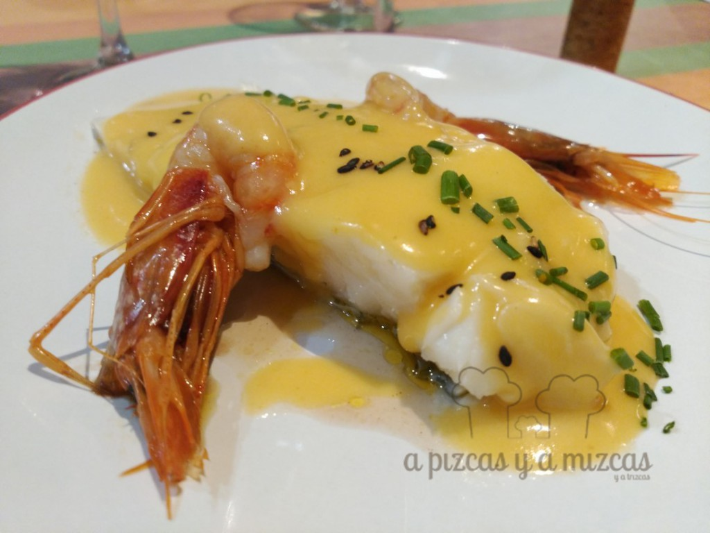

Que una empresa, cualquiera, cumpla 20 años es como para celebrarlo. Si la casa que cumple dos décadas de vida se dedica a la restauración, entonces ya el tema empieza a tomar un cariz épico. El [Restaurante Castillo de Godella](https://www.facebook.com/pages/restaurante-castillo-CUINA-VALENCIANA-CREATIVA/110051672344395), en l'Horta Nord, a 10 minutos de Valencia (c/Major 90, Godella; 963 64 02 42), celebra estos días esta efeméride y qué mejor forma de hacerlo que dando muy bien de comer y haciendo que nos divirtamos en la mesa. Os contamos todo lo que ha preparado el chef Eduardo Frechina para conmemorar el 20 aniversario del Restaurante Castillo de Godella.

## Cena en el Restaurante Castillo de Godella

Eduardo es consciente de su hito (ya la lio de forma interesante hace 10 años con su primera década) y ha organizado actividades, tanto lúdicas como (fundamentalmente) gastronómicas. El pasado 5 de abril tuvimos el privilegio de participar en la cena de presentación del 20 aniversario del Restaurante Castillo de Godella y probamos uno de los dos menús que ha preparado. Estos menús especiales estarán en funcionamiento hasta la primera semana de mayo y, os los recomendamos encarecidamente.

El primer menú que ha ingeniado Eduardo Frechina consta de tres entrantes, plato a elegir y postre, por 20 euros con dos copas de vino de la Bodega Sebirán. Este menú lo integran los siguientes platos:

- Tataki de atún con encurtidos y berenjena a la llama
- Ravioli de habitas, tocineta y crema de morcilla
- Huevo poché con setas y mouse de patata trufada
- Pescado, carne o arroz a elegir
- crema de naranja con helado de turrón y sopa de chocolate

Todo por 20 euros.

El segundo menú (el que probamos nosotros) constará de cuatro entrantes, pescado, carne o arroz y postre, al mismo precio, pero con las bebidas no incluidas.

Este pedazo de menú del 20 aniversario del Restaurante Castillo de Godella incluye:

- Tataki de atún con encurtidos y berenjena a la llama (fantástica combinación, el atún en su punto y la berenjena identificable y aportando una personalidad muy curiosa al plato)

- Ravioli de habitas, tocineta y crema de morcilla (una finísima lámina de tocino que guarda un tesoro de habitas, sobre una crema de morcilla. El clásico plato valenciano de habas con embutido pero revisitado por Frechina)

- Huevo poché con setas y mouse de patata trufada (rompe el huevo y disfruta de una explosión de sabor)

- Crema de alcachofa con mermelada de jenjibre, manzana y foie (espectacular, la mermelada de jengibre de Eduardo es todo un descubrimiento y realza todo el sabor de las últimas alcachofas de la temporada y el lujo del foie)

- Bacalao a la crema de all i pebre (pura tradición)

- Solomillo ibérico ahumado con parmentier de patata con salsa hoisin (elegante ahumado con haya y carne cocinada a baja temperatura, jugoso, desearás que no termine)

- De postre, crema de naranaja con helado de turrón y sopa de chocolate

Nosotros tuvimos la fortuna de que Eduardo nos agasajara con tres entrantes más, un original aperitivo de aceitunas rellenas de gelatina de martini, que hay que tomar dosificándose antes con un spray martini en la boca para activar las papilas gustativas, crema de setas y un cornete de bacalao. Todo un festín.

El menú lo acompañamos con los vinos de Sebirán (el nuevo T de Tardana, el "c" Minúscula, el J de Sebirán y el cava Coto d'Arcís.

Además, todos los clientes que opten por los menús aniversario serán invitados a una copa de cava y se ha montado un fotocall para que los amigos se hagan fotos y las suban a las redes sociales.

Sorteos de esculturas, música... un menú gastronómico inspirado en los años 80 con música de versiones de los éxitos ochenteros y una cena maridaje con ls vinos de Sebirán fijada para el 29 de abril.

Si tenéis la oportunidad de acercaros a Godella, no lo dudéis. Eduardo cree en lo que hace y maneja como nadie los sabores más ancestrales y anclados en la memoria de los comensales. Ah, y si cuando váis podéis pasar por el horno de su familia (Confitería Castillo, con más de un siglo de vida), muy cerca del restaurante, no dejéis de probar sus pastelitos de boniato ni sus angelets.

Solo nos queda brindar de nuevo con el por, al menos, otros 20 años en la brecha.
