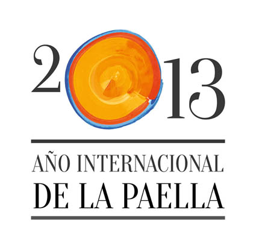

##  ¿Qué es “2013 Año Internacional de la Paella”

Se trata de un proyecto sin ánimo de lucro abierto a todos los ciudadanos, empresas, entidades, asociaciones e instituciones de la Comunidad Valenciana, cuyo fin es la defensa y promoción de la paella, junto a sus valores culturales, gastronómicos y de producto.

Es una iniciativa que nace a través de las redes sociales para proteger la paella valenciana como tesoro gastronómico, que es de todos los ciudadanos y de nadie.

1. La necesidad de explicar qué es la paella, una obligación como valencianos portadores del conocimiento en su elaboración, preservando el espíritu que nos han trasmitido nuestros mayores, junto con el valor de la tradición y el producto.

2. Mejorar la imagen de la paella en Valencia, principalmente en el centro histórico de la ciudad, donde se ofrecen productos engañosos de baja calidad y versiones adulteradas de la paella valenciana a los turistas que nos visitan. También es cierto que son hechos aislados pero que desgraciadamente ocurren en el corazón de la ciudad. Circunstancia que no sucede en Alicante y Castellón.

3. Aprovechar la presencia de cocineros valencianos en todo el mundo para promocionar la paella y los arroces bajo unos criterios de uniformidad y calidad.

## ¿Qué hay que hacer para formar parte del proyecto?

El proyecto consta de dos fases. Al nacer en internet, a través de las redes sociales, esta primera parte se desarrolla exclusivamente ON LINE. Es la fase que está en curso y consiste en:

Primera fase: Aceptar el **decálogo de buenas prácticas** y compromiso.

1.  La paella tiene su origen en la Comunidad Valenciana, es patrimonio de todos los que la amamos y de nadie.
2.  Defender los valores y la receta aprendida de nuestros mayores, así como la tradición de cada pueblo y comarca de nuestra tierra.
3.  Denunciar públicamente las transgresiones y despropósitos que se cometen con la paella muy especialmente en Valencia.
4.  Promocionar los establecimientos que son respetuosos con la paella.
5.  Respetar la máxima: “Todas las paellas son arroz, pero no todos los arroces son paella”
6.  Para cocinar paella hay que estar habilitado por formación o por tradición.
7.  La calidad óptima de la paella se alcanza cuando son cocinadas a leña, con productos valencianos.
8.  Promover el hábito social de la paella como plato festivo y solemne.
9.  Utilizar la paella como vehículo de promoción de nuestros productos y de la propia Comunidad Valenciana.
10. Llevar la paella en el corazón y viajar con ella lo más lejos posible. Porque no hay lugar en el mundo donde no se pueda cocinar y disfrutar de ella. SER EMBAJADORES DE LA PAELLA VALENCIANA.
