Estos últimos días muchos aprovechamos para hacer balance del año que ha pasado y pensando que el próximo año sea mucho mejor. Para A Pizcas y a Mizcas este año ha sido bueno hemos conocido nuevos amigos a través del mundo 2.0, hemos actualizado nuestro diseño con el #nuevopizcas y parece que poco a poco vamos encontrando nuestro hueco. Así que decimos adiós al 2014 y damos la bienvenida por todo lo alto al 2015.

Hemos hecho un resumen por cada mes del 2014 de todo aquello que hemos hecho que os ha gustado más... y éste ha sido el resultado.

De todo lo que hicimos en el mes de enero lo que más os gustó fue la [cocinita infantil handmade,](/cocinita-infantil-handmade/ "Cocinita") fue el encargo que nos hizo Papá Noel en las pasadas navidades y que encantó a Trizcas

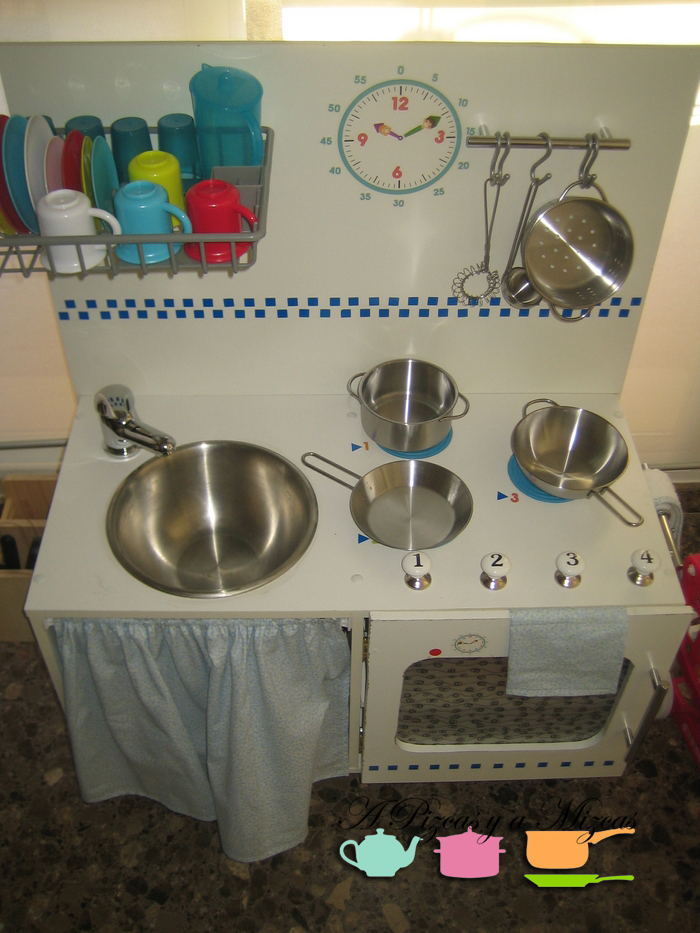

En febrero nos invitaron a un [showcooking de monas de pascuas](/showcooking-de-monas-de-pascua-en-el-gremio-de-confiteros-de-valencia/ "Showcooking monas de pascua") el Gremio de Confiteros de Valencia, para nosotros fue una dulce experiencia que nos enseñó un montón de trucos de repostería

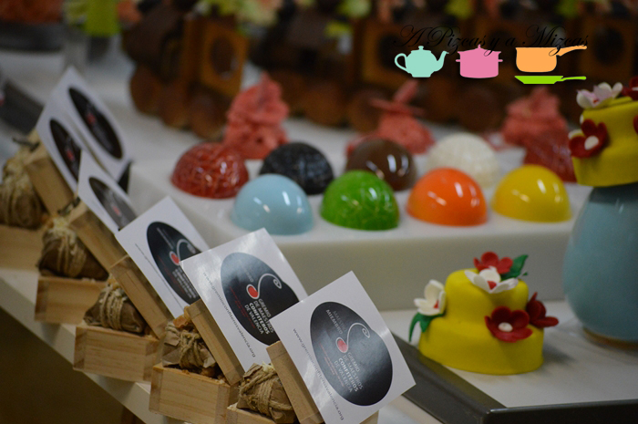

En marzo llegaron las fallas y nos estrenamos con nuestra propia [guía de las fallas](/fallas/ "Guía para aprovechar las fallas 2014"). Que sabemos que a algunos de vosotros os ayudó a seguir el ritmo fallero.

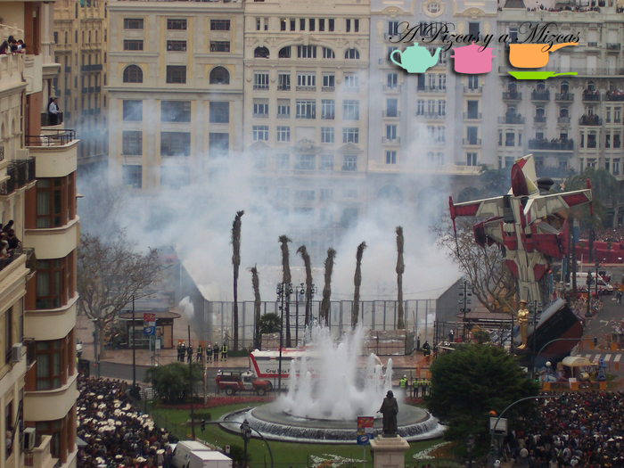]

Y llegó abril y la pascua y con ésta la [repostería pascuera](/reposteria-pascuera-2/ "Repostería pascuera")... se nos hace la boca agua sólo con pensar en las monas, pan quemados, torrijas... y a vosotros os encanta año tras año. Mil gracias

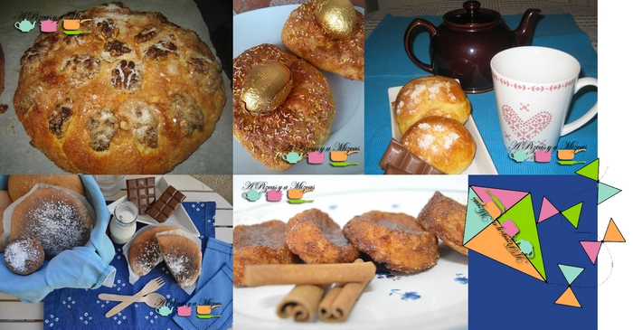

Y con la primavera llegó mayo, uno de nuestros meses favoritos y la súper [fiesta de los indios](/fiesta-de-cumpleanos-de-indios/ "Fiesta de los indios") de Trizcas. En la que preparamos un [tipi](/tipi-indio/ "tipi") que fue protagonista de la fiesta y una [corona india](/corona-india/ "Corona india") para Trizcas. Hicimos bien el indio.

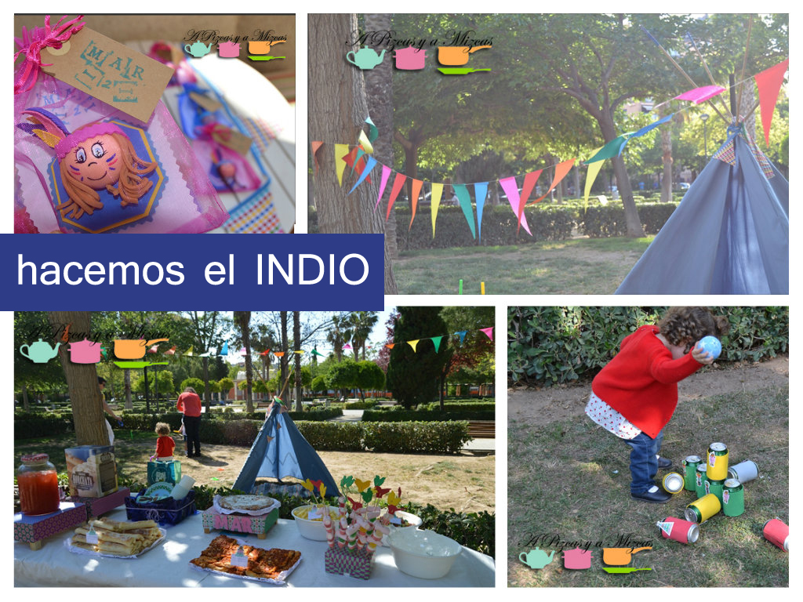

Con el buen tiempo apetecía salir más a la calle y fuímos a descubrir nuevos lugares. La verdad que [Cocotte & Co](/restaurante-cocotte-co-en-valencia/ "Cocotte and Co") fue un gran descubrimiento.

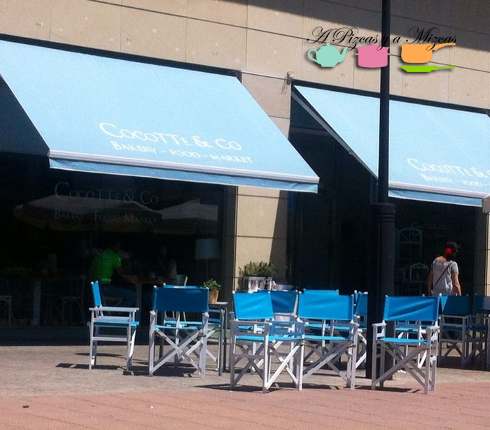]

Este verano empezamos a experimentar con los [polos de frutas](/polos-helados-de-frutas/ "Polos de fruta"), nos atrevimos con el de sandía, melón, fresa, naranja... este nuevo año seguiremos probando.

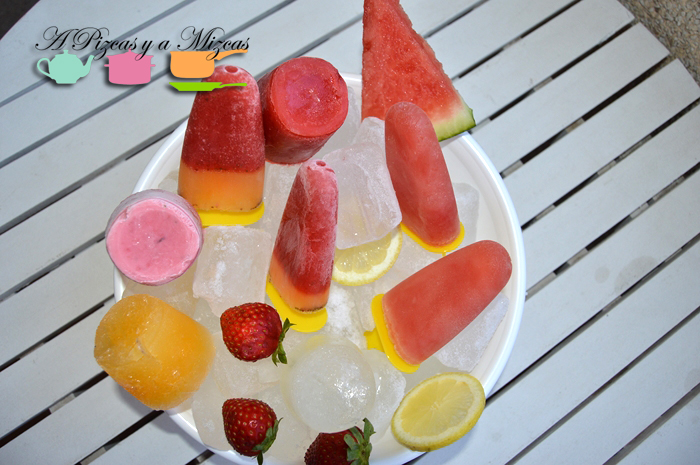

Y para el mes más caluroso del año no se nos ocurre mejor acompañamiento que los [fartons hojaldrados](/fartons-hojaldrados-caseros/ "fartons hojaldrados") caseros con la exquisita horchata.... mmm manjar de dioses.

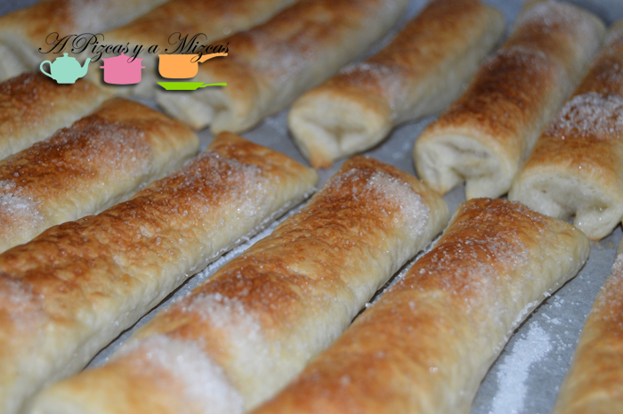]

Para el regreso al trabajo y a la normalidad...lo mejor es refrecarse con un vasito de [agua de la fuente agria](/agua-de-la-fuente-agria-de-puertollano/ "Agua de la fuente agria"). La iaia Mizcas nos trajo una botellita desde Puertollano para que la probaramos... otra experiencia más.

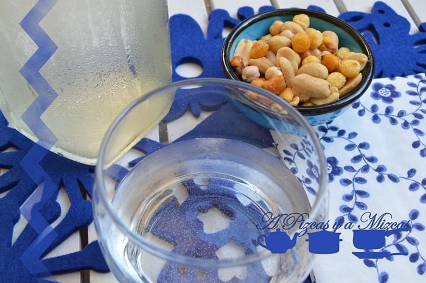]

En octubre nos fuímos a dar un paseo por el [rastro de Valencia](/una-vuelta-por-el-rastro-de-valencia/ "Rastro de Valencia"). Una actividad que tenemos pendiente de repetir en más ocasiones, nos encantó!

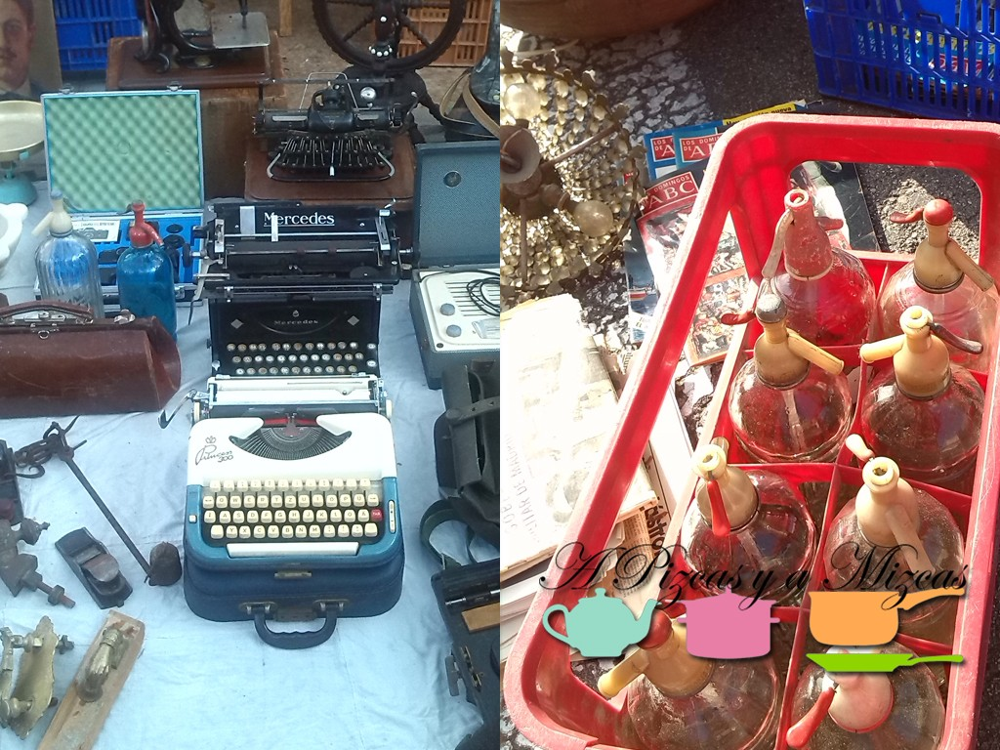]

Y en noviembre nos fuímos con Trizcas a descubrir el [Bioparc](/trizcas-hace-su-primera-visita-al-bioparc-de-valencia/ "Bioparc de Valencia")... y lo que más le gustó a nuestro peque ser fue ver a todos los personajes del Rey León en vivo y en directo...En el nuevo año también repetimos.

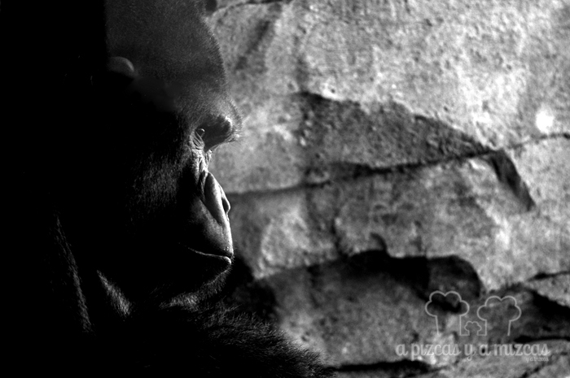

Y ya hemos hecho repaso a todo el año... sólo nos queda diciembre. Y lo que ha triunfado este mes ha sido la tarta de [caqui persimon](/tarta-de-caqui-persimon/ "Tarta de caqui persimon"). Es que los caquis del iaio están de muerteeee.

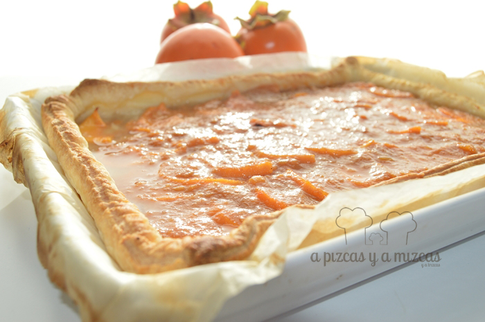

Nos vemos en el 2015. Os dejamos con la canción de Mecano de Un Año Más

En la puerta del sol como el año que fue otra vez el champagne y las uvas y el alquitrán, de alfombra están. Los petardos que borran sonidos de ayer y acaloran el ánimo para aceptar que ya, pasó uno más. Y en el reloj de antaño como de año en año cinco minutos más para la cuenta atrás. hacemos el balance de lo bueno y malo cinco minutos antes de la cuenta atrás. Marineros, soldados, solteros, casados, amantes, andantes y alguno que otro cura despistao. entre gritos y pitos los españolitos enormes, bajitos hacemos por una vez, algo a la vez. Y en el reloj de antaño como de año en año cinco minutos más para la cuenta atrás. hacemos el balance de lo bueno y malo cinco minutos antes de la cuenta atrás. Y aunque para las uvas hay algunos nuevos a los que ya no están le echaremos de menos y a ver si espabilamos los que estamos vivos y en el año que viene nos reímos. 1, 2, 3 y 4 y empieza otra vez que la quinta es la una y la sexta es la dos y así el siete es tres. Y decimos adiós y pedimos a dios que en el año que viene, a ver si en vez de un millón pueden ser dos. En la puerta del sol como el año que fue otra vez el champagne y las uvas y el alquitrán, de alfombra están.
