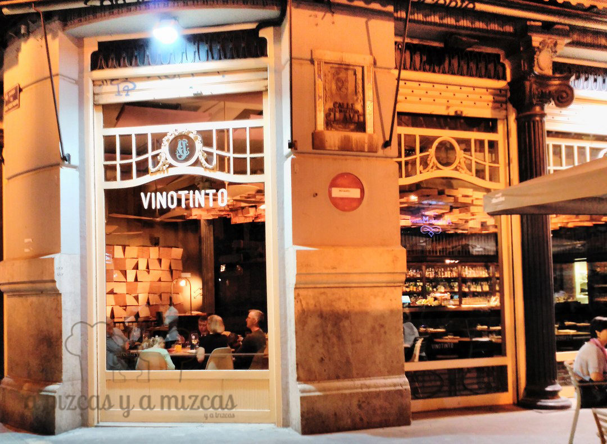
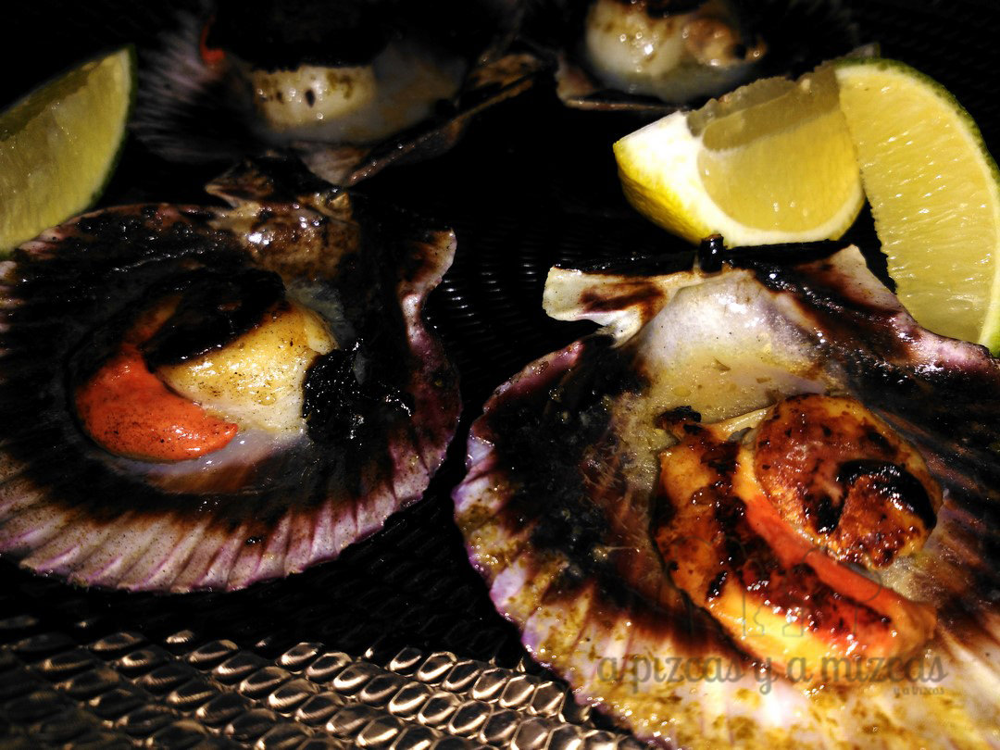
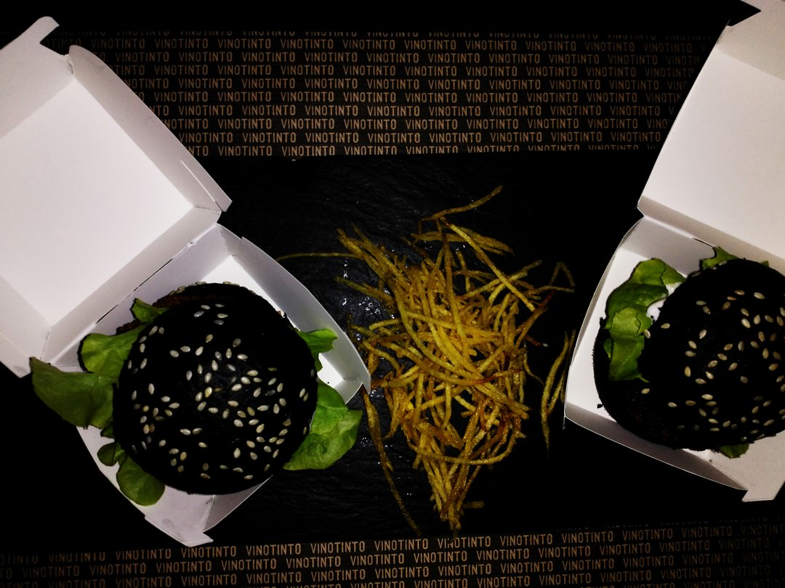

Habíamos visto el local del [Restaurante Vinotinto Valencia](http://vinotintovalencia.com/) en numerosas ocasiones. Su emplazamiento es ideal, junto al Teatro Olympia, en lo que era una antigua y conocida casa de ropa para hogar, muy cerquita de otra tienda histórica que ha acabado desapareciendo (nos referimos a Mañacos, que nos encantaba). Lo dicho, habíamos pasado por su puerta muchas veces, pero nunca habíamos probado su comida. El otro día lo hicimos y salimos gratamente sorprendidos. Ahora os lo contamos.

Acudimos a cenar, Pizcas y Mizcas, un sábado pues pudimos "colocar" a Trizcas con los iaios. Fuimos en el primer turno a las 21.00 horas y menos mal que teníamos reserva, pues al entrar, mientras esperábamos a que nos acompañaran a la mesa, la camarera informó a un cliente de que estaban completos. Buena señal.

El restaurante Vinotinto Valencia empezó su andadura hace unos años bajo un modelo de franquicia, que no cuajó. Sus responsabales, no obstante, conscientes de que tenían una joya de sitio y que el potencial era mucho, decidieron hace dos años quedarse con el nombre, pero actuar ya como restaurante no franquiciado. Mucha gente no lo sabe, pero Vinotinto Valencia ya no es franquicia, su carta no es de franquicia y su atención tampoco. Es un Restaurante, en mayúscula.

Y antes de entrar en su comida, merece la pena una mención al espacio. Los que conocimos el comercio original de ropa de hogar que ocupaba el número 44 de la calle San Vicente Martir de Valencia, aún reconocemos el mostrador (ahora barra), los suelos de madera, las columnas blancas y las barandillas originales. Junto a ello, una simpática luminaria hecha a base de cajas de vino y un coqueto recibidor.

Vinotinto por fuera

Nos atendió el jefe de cocina, Javier, y nos pusimos en sus manos para que nos sacará a la mesa lo que quisiera. No pudimos estar en mejores manos.

- **Comida**: ⭐⭐⭐⭐
- **Local**: ⭐⭐⭐⭐
- **Servicio**: ⭐⭐⭐⭐

## Nuestra cena en Restaurante Vinotinto Valencia

- Ensaladilla rusa
- Croquetas de boletus y croquetas de jamón
- Zamburiñas a la plancha
- Yema de huevo trufada, con espuma de patata y polvo de jamón iberico
- Black Sepionet (mini hamburguesa de sepionet encebollado, con allioli de lima y pan de tinta)
- Pulpo braseado con crema de patata al pimentón
- Tarta de queso

Acompañamos toda la cena con un refrescante vino blanco de la D.O.P. Somontano y para el postre optamos por un vino Néctar Pedro Ximénez.

Nos sorprendió la diversidad de la carta del Restaurante Vinotinto Valencia, que es muy extensa, y donde es imposible no encontrar algo que te guste.

A pesar de que llegamos con unos minutos de adelanto sobre la hora de la reserva, nos atendieron de maravilla. Nos sorprendió la calidad de los ingredientes y no es fácil encontrar unas zamburiñas en Valencia tan sabrosas como las que nos ofreció Javier, con la sencillez como clave. Zamburiñas de primera, plancha y algo de vino blanco. Producto, producto y producto. Nos encantaron.

Las zamburiñas espectaculares

Con el pulpo también es dificil recordar que estás en Valencia. Lo preparan dándole una cocción a baja temperatura, para brasearlo a continuación. Tierno y sabroso.

Lo del black sepionet es de nota. Con esta tapa el Restaurante Vinotinto Valencia ganó el quinto Certamen de la Tapa de Valencia celebrado en 2014. Una tierna hamburguesa de sepionet encebollado, rebozado con panko, en un pan de hamburguesa de tinta de calamar y con un aromático allioli de lima. Un bocado exquisito.

Black sepionet

El trato fue exquisito, con los responsables del restaurante atendiendo directamente a los comensales y preocupándose de que todo estuviera a su gusto y un servicio de camareros bien dirigido y coordinado. Nos hicieron estar como en casa.

Tenemos pendiente volver a Restaurante Vinotinto Valencia con Trizcas para que pruebe las minihamburguesas (en realidad es una excusa para recorrer lo que nos queda de carta).

Os lo recomendamos (abre todos los días de 12.00 a 1.30 horas -cierra la noche del domingo) (y si vais a cenar en fin de semana, aconsejamos que reservéis previamente). Podéis hacerlo en el teléfono 963 94 24 42 o a través del correo [reservas@vinotintovalencia.com](mailto:reservas@vinotintovalencia.com)
