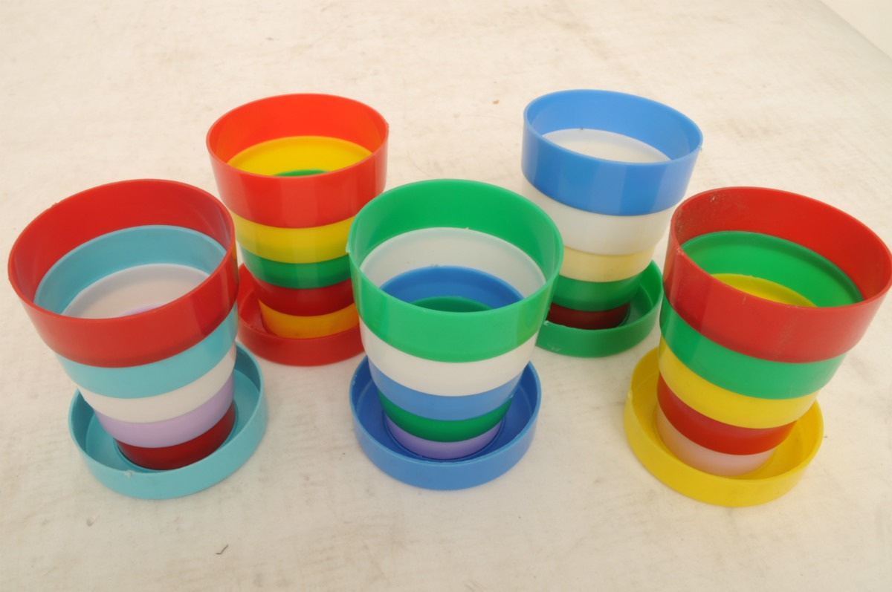
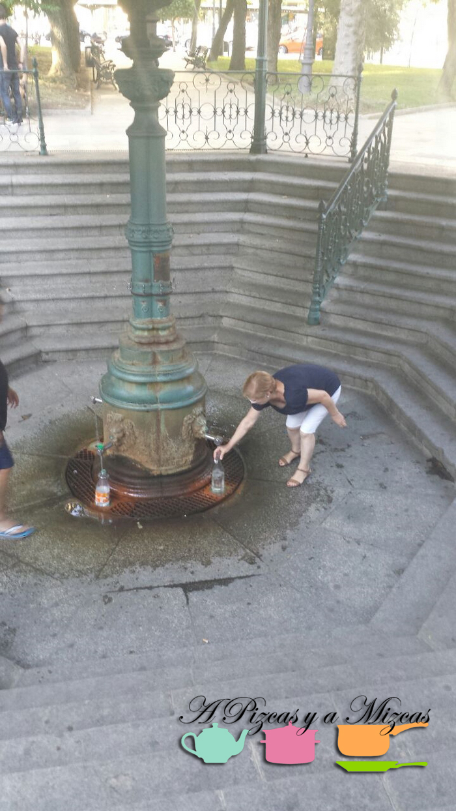
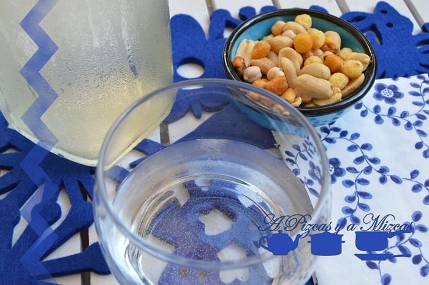

Este verano se presentaron los yayos Mizcas con una botella de agua de la Fuente Agria de Puertollano... claro como somos los cocinillas de la familia nos toca probar todo. Mizcas tenía algunos recuerdos de su infancia de la famosa agua de la Fuente Agria. Me acuerdo de mi vasito plegable que la yaya Mizcas llevaba en el bolso y cuando llegábamos a la altura de la fuente teníamos que llenar. Es una agua con un sabor peculiar... ahora os contamos más...

## Agua de la Fuente Agria de Puertollano

Seguro que todos conoceís el agua con gas, agua de sabores... pero ¿habeís probado alguna vez el agua agria? Nosotros nos hemos atrevido. Es una agua con un sabor férrico bien fría es refrescante que tiene algo de gas. Dice la yaya Mizcas que hace años que este agua salía con mucha más fuerza... hasta el agua acusa el paso del tiempo... je je je. Os contamos algunas cositas sobre los [beneficios](http://es.wikipedia.org/wiki/Puertollano "Fuente Agria Puertollano") y [curiosidades](/granizado-de-melon/ "Fuente Agria Puertollano") sobre las aguas de la Fuente Agria de Puertollano.

Es el monumento más representativo de Puertollano. La referencia documental más antigua de la fuente data de 1575, bajo el reinado de Felipe II, «esta villa tiene agua dentro della, la que ha menester para su gasto y beber, en moderada cantidad de pozos y que tiene junto a la dicha villa una fuente que se llama la Fuente Aceda porque el agua della es agria y sale la dicha agua encima de tierra hirviendo hacia arriba ordinariamente sin cesar». No fue hasta 1676 cuando el doctor Alfonso Limón Montero diera a conocer las propiedades beneficiosas del agua agria para diversas afecciones mediante la obra literaria "Espejo cristalino de las aguas de España". Desde entonces su uso se generalizó, llegando a conocerse en todo el contexto nacional. El prestigio alcanzado por el agua agria hizo que se llegara a embotellar con la etiqueta de "agua aciduloalcalino-ferruginosa de Puertollano", al precio de 38 céntimos la botella en 1894.

Al agua agria se le hicieron varios estudios y siempre la han considerado los expertos de alto valor minero-medicinal. Hace años la usaban para fines terapéuticos, para hacer baños, era uno de los mejores remedios para las enfermedades cutáneas, para afecciones crónicas o crisis intestinales.

