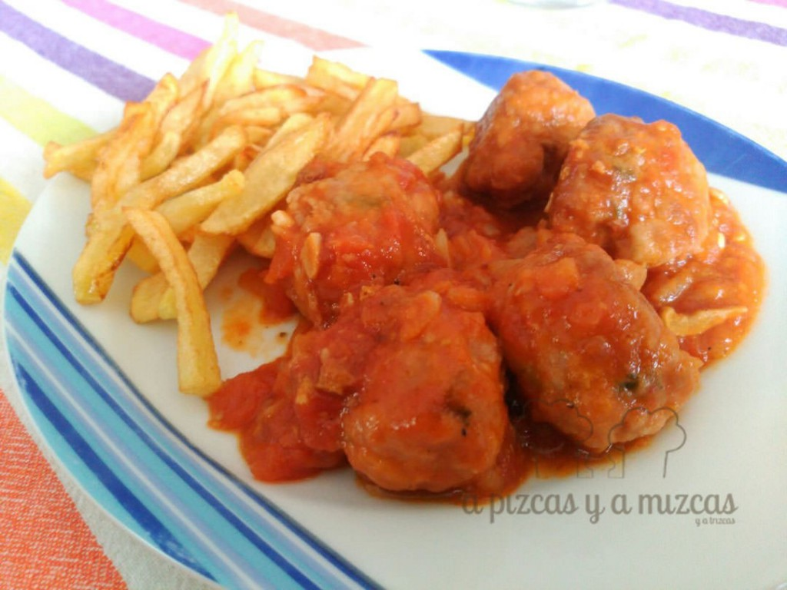

Las albóndigas dicen que vuelven a estar de moda ([tendencia gastronómica de 2015](http://smoda.elpais.com/placeres/las-albondigas-la-tendencia-gastronomica-de-2015/))... aunque en nuestra casa siempre han estado presentes. Sobretodo las albóndigas que prepara la iaia Mizcas... que cuando se pone, prepara para toda la familia... ji ji... Esta vez hemos preparado unas albóndigas con tomate que están para chuparse los dedos

## Ingredientes para preparar las albóndigas  con tomate

- medo kilo de carne picada de ternera y cerdo
- una cebolla
- 1 diente de ajo
- una cucharada sopera de aceite de oliva virgen extra
- un huevo
- dos cucharadas soperas de perejil picado
- dos cucharadas soperas de harina
- sal
- pimienta negra molida

Ingredientes para preparar la salsa de tomate:

- una cebolla
- un diente de ajo
- un cuarto de de cuchara de café de comino en polvo
- una cuchara de café de pimentón dulce
- 50 ml de vino moscatel
- 500 gramos de tomate pera
- una hoja de laurel
- sal
- pimienta negra molida

Preparados para la lluvia de albóndigas? Pues allá vamos...

Doramos la  cebolla en una sartén con aceite de oliva virgen extra, a fuego lento, hasta que esté transparente.

En un bol mezclamos la carne picada, la cebolla, el huevo, el ajo picado, el perejil, un chorrito de moscatel y la sal y la pimienta. Y ahora es cuando empiezan las manualidades.... empezamos a hacer bolitas y enharinarlas.

Sofreímos en una sartén con aceite a fuego fuerte, hasta que se doren y reservamos.

Y ahora vamos a preparar la salsa de tomate:

Rehogamos la cebolla picada y el ajo picado en el mismo aceite que hemos frito las albóndigas, a fuego lento durante unos 10 minutos aproximadamente. A continuación, añadimos el comino y el pimentón dulce. Agregamos el moscatel, el tomate (sin piel y troceado) y el laurel. Cocinamos hasta que rompa a hervir e incorporaremos las albóndigas. Bajamos el fuego y cocinamos durante 25 minutos. Salpimentamos al gusto.

Nosotros las acompañamos con unas patatas fritas... porque a Trizcas le encantan... pero con un buen pan de acompañante es más que suficiente!

Ah! y no te preocupes si te salen un montón de albóndigas, se pueden congelar y tienes las comida lista para otro día.

Por cierto, esta receta la hemos visto en [L´Exquisit](http://blogexquisit.blogs.ar-revista.com/) aunque la hemos modificado a nuestro gusto.
