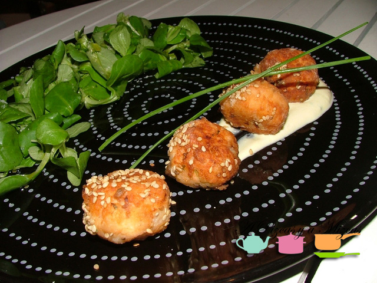
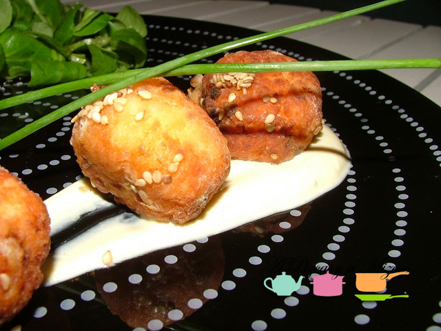

Al final hemos sacado tiempo para volver a la cocina y hemos empezado por una receta sencilla, albóndigas de salmón. Seguro que lo incorporáis a vuestro recetario.

El salmón es uno de los pescados que más nos gusta preparar en la cocina de A Pizcas y a Mizcas. Asi que decidimos preparar unas albóndigas. Ya veréis que lo más costoso es preparar las bolitas.

## Ingredientes para preparar las bolitas de salmón (para 4 personas)

- 2 lomos de salmón fresco
- una cebolla pequeña
- unas ramitas de cebollino
- 1 huevo
- 3 cucharadas de pan rallado
- 100 gramos de harina
- ajónjoli o sésamo
- sal
- pimienta
- aceite de oliva virgen extra
- canónigos
- un yogur griego
- mostaza

Lo primero que tenéis que preparar es el pescado. Aunque a nosotros nos lo dejaron bien limpito y listo en la pescadería. Así que ese paso nos lo hemos ahorrado.

Una vez limpio el salmón lo troceamos junto a la cebolla. Lo mismo haremos con el cebollino, lo lavamos y lo picamos. Introducimos el salmón, la cebolla y el cebollino en la picadora añadimos el huevo, sal y pimienta y mezclamos todo. A continuación, agregamos el pan rallado poco a poco hasta conseguir una masa homogénea.

Ahora vamos con la parte "difícil".... a formar bolitas y posteriormente las pasamos por harina. Las freímos y las dejamos escurrir en un plato forrado con papel de cocina. Y las espolvoreamos con ajónjoli o sésamo

Nosotros acompañamos las albóndigas de salmón con una ensalada de canónigos y una salsa que hicimos con yogur griego, tres cucharadas de mostaza y cebollino picado.

Llegó la hora del emplatado... en la base del plato ponemos una fina capa de la salsa de yogur y encima las albóndigas de salmón. Y al lado un poquito de ensalada de canónigos.

Las albóndigas que nos sobraron las congelamos y ya tenemos la cena o la comida lista para otro día. ¿Qué os ha parecido la receta? Fácil, rápida y están buenísimas. Además puede ser una opción para aquellos que nos les apasiona el pescado.

