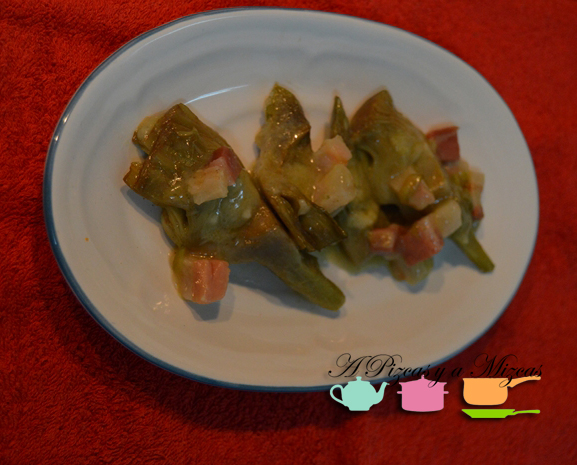
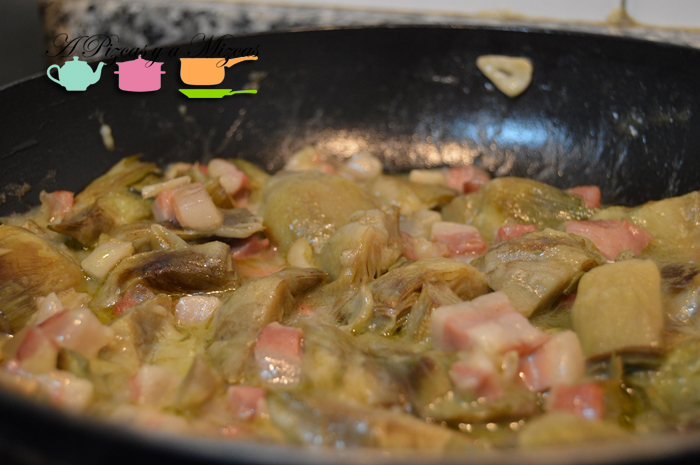
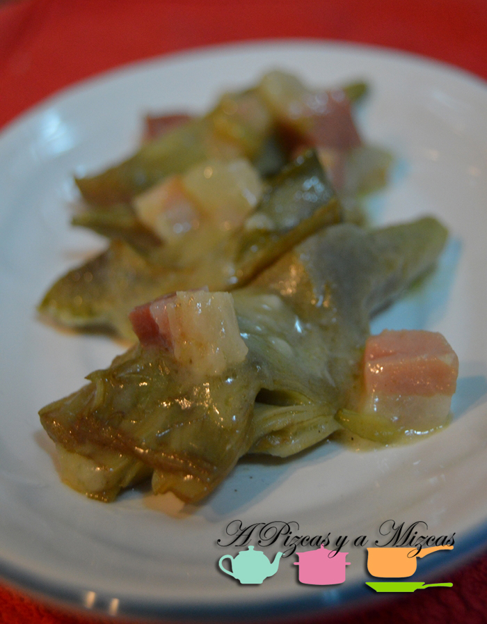
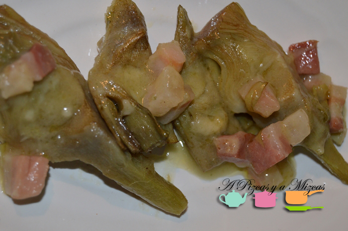

Este año 2014 las alcachofas han llegado a la C. Valenciana un poco más tarde de lo habitual, cosas de la climatología, pero han llegado que es lo que importa. Es una de las verduras que más nos gustan en A Pizcas y a Mizcas. Hoy ponemos en nuestro escaparate unas riquísimas alcachofas con jamón a la crema. No os llevarán más de 40 minutos, pero no tenéis que prestarle mucha atención, vamos que casi estas alcachofas con jamón a la crema se hacen solas.

## Ingredientes para las alcachofas con jamón a la crema (3/4 raciones)

- 6 alcachofas frescas
- 200 gramos de jamón serrano en tacos
- Un diente de ajo (pueden ser dos si os gusta el sabor más intenso)
- Aceite de oliva virgen extra
- Harina
- Sal

El primer paso para de la receta de alcachofas con jamón a la crema es preparar las alcachofas. Proveeros de un bol amplio, con agua fría y el zumo de un limón (así evitaréis que se ennegrezcan). Retiramos las hojas exteriores hasta llegar a los corazones, cortamos las puntas de las alcachofas y pelamos los tallos. Las cortamos en cuartos o en octavos, según sea el tamaño de la verdura, y quitamos la pelusilla interior. Rápidamente las ponemos en el agua con ácido cítrico.

Una vez las tengamos todas listas, escurrimos el agua y las pasamos a una olla con agua y sal y las ponemos a hervir, es conveniente que hiervan unos 15 minutos a un ritmo moderado.

Mientras, tomamos el jamón (nosotros teníamos un taco grande) y lo partimos en daditos pequeños. Laminamos el ajo.

Cuando falte poco para que hayan transcurrido los 15 minutos de semicocción de las alcachofas, en una sartén amplia calentamos aceite de oliva virgen extra y doramos en él los ajos. Es importante que queden dorados, pero no fritos del todo ni mucho menos quemados. Los retiramos del fuego y salteamos el jamón.

Agregamos los ajos y un par de cucharadas de harina y removemos rápidamente, para cocinarla y que no sepa a crudo. A continuación, añadimos unos tres o cuatro cucharones del agua de cocción de las alcachofas y removemos hasta que se ligue la salsa. Rectificamos de sal si es necesario (tened en cuenta que el jamón salará el guiso). Bajamos el fuego e incorporamos las alcachofas y las dejamos cocer unos 10 minutos, removiendo de vez en cuando e incluso haciendo movimientos circulares con la sartén (como para ligar el pilpil).

Servimos las alcachofas con jamón a la crema, con los taquitos de jamón por encima y regadas con la salsa. Están exquisitas.
