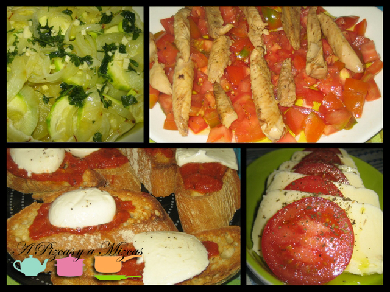

Los antipasti son una pieza esencial en la gastronomía italiana. Sería el equivalente a los aperitivos o los entrantes y han de combinar la cualidad de ser apetecibles, sencillos de elaborar y con la capacidad de abrir el apetito sin saciar. Suelen servirse fríos, pero en esta ocasión hemos introducido un par de ellos que pueden presentarse calientes, templados y también fríos. No hay que olvidar que los antipasti por excelencia son los fiambres y embutidos fríos y de eso, en España, tenemos una gran variedad.

## Cuatro modalidades de antipasti

- Patata y calabacín al microondas
- Tomate con filetes de melva
- Bruscheta napolitana
- Mozzarela con tomate

La entrada de **patata y calabacín al microondas** es muy sencilla de hacer y forma parte de nuestros antipasti preferidos. Los ingredientes que necesitamos son:

- Un calabacín
- Una patata pequeña
- Media cebolla
- Un diente de ajo
- Perejil picado
- Sal
- Aceite de oliva virgen extra

Veréis como os animáis a preparar estos antipasti. Pelamos el calabacín (si os gusta con piel, podéis dejarlo) y lo cortamos en discos finos. Hacemos lo mismo con la patata. La cebolla la cortamos en aros. Picamos el ajo, no demasiado fino. Untamos una fuente apta para microondas con aceite de oliva virgen extra, colocamos los ingredientes (calabacín, patata y cebolla) y los salamos. Cocinamos en el micro a potencia máxima durante 6 minutos.

Mientras, preparamos una picada con el ajo, el perejil y aceite de oliva virgen extra. Una vez salte la campaña del micro, regamos las verduras con la picada y ya está. Lo podemos tomar así, o dejar entibiar.

La **ensalada de tomate y filetes de melva** es exquisita y la tendréis lista en un pispás. Los ingredientes que necesitamos son éstos:

- Dos tomates de ensalada maduros
- Filetes de melva (podéis reemplazarlos por caballa, o tacos de atún)
- Aceite de oliva virgen extra
- Sal y pimienta

Cortamos el tomate en dados pequeños y los extendemos sobre la fuente en la que vayamos a servir la ensalada (que será la parte más fresca de nuestros antipasti). Salamos ligeramente. Sacamos con cuidado los filetes de melva para que no se rompan y los disponemos sobre el tomate de la forma más armoniosa posible. Lo regamos todo con aceite de oliva virgen extra y espolvoreamos un poco de pimienta. Otro plato listo.

Vamos ahora con el tercero de nuestros antipasti: la **bruscheta napolitana**. Para ello necesitamos:

- Rodajas de pan de pueblo gruesas
- Aceite de oliva virgen extra
- Ajo
- Salsa napolitana (salsa de tomate y verduras). Nosotros en este caso empleamos una salsa preparada de calidad.
- Queso mozzarella

Tostamos el pan en el horno. A media cocción lo sacamos, frotamos el diente de ajo pelado por las rodajas de pan, añadimos un generoso chorro de aceite de oliva virgen extra, una cucharada de salsa napolitana y el queso. Lo volvemos a meter al horno unos minutos. Lo justo para que el queso empiece a ablandarse pero sin fundirse.

Es la parte más caliente de nuestros antipasti. Seguro que os gusta.

Y por último un clásico: el **tomate con mozzarella**. Básico:

- Mozzarella
- Tomate
- Sal
- Hierbas (orégano y albahaca)
- Aceite de oliva virgen extra

Cortamos en discos el tomate y el queso. Los alternamos. Los salamos y regamos con aceite de oliva virgen extra. Espolvoreamos las hierbas a discreción.

Cuatro recetas en una, gracias a nuestros antipasti!

