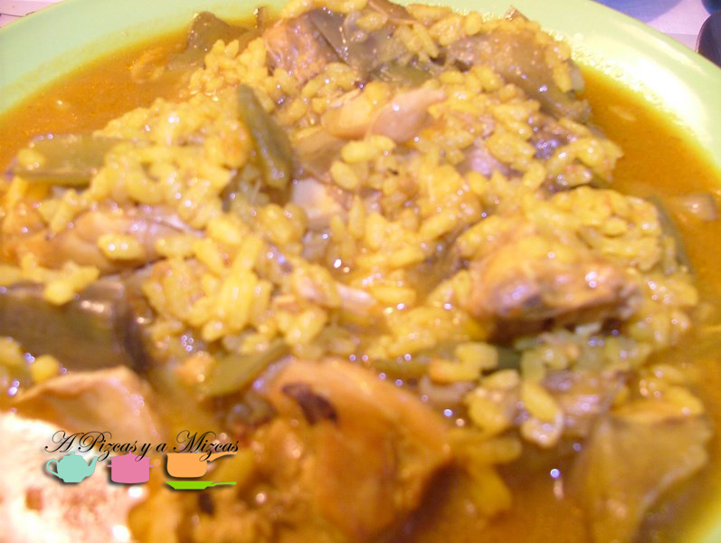
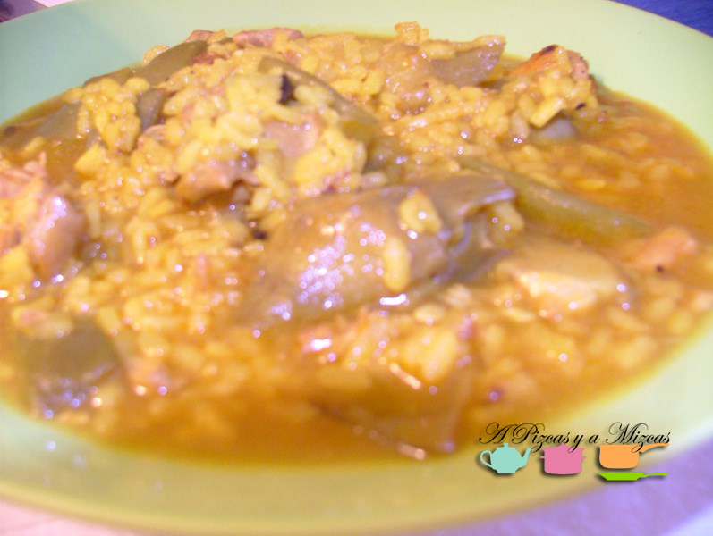

Mientras el frío se decide o no a llegar a nuestras vidas... a nosotros ya nos apetecen los platos de cuchara como el arroz caldoso de pollo y conejo aunque vayamos en manga corta.

Esta semana hemos aprovechado la visitia que nos han hecho los yayos Mizcas y le pedidmos la yaya nos preparara un estupendo arroz caldoso... los platos quedaron limpios.... pero es que está buenísimo.... "Como mamá no cocina nadie"... je je je je

Os dejamos su receta...

## Ingredientes para preparar el arroz caldoso (para 4 personas)

- 5 tacitas (de las de café) de arroz
- 200 gramos de conejo
- 500 gramos de pollo
- 2oo gramos de judías verdes
- 5 alcachofas
- 1 litro de caldo de puchero
- 2 tomates de pera maduros rallados
- 2 dientes de ajo picados
- 1 cebolla pequeña rallada
- aceite de oliva
- azafrán
- pimentón dulce
- sal

En una cacerola se pone el aceite y cuando esté bien caliente sofreíremos la carne hasta que esté bien dorada, a continuación, añadiremos el tomate rallado, el ajo picado la cebolla rallada que también sofreíremos.

Después añadiremos las judías verdes y las alcachoras limpias y troceadas (un truco: si las pasáis por limón evitaréis que se ennegrezcan). Rehogamos las verduras junto a la carne durante 5 minutos y añadimos media cucharadita de pimentón dulce y removemos. Seguidamente echaremos el caldo del puchero y rectificamos de sal y agregamos el azafrán.

Añadimos el arroz y lo dejaremos aproximadamente 20 minutos... y ya tenemos listo nuestro arroz caldoso.

Preparad las cucharas!

