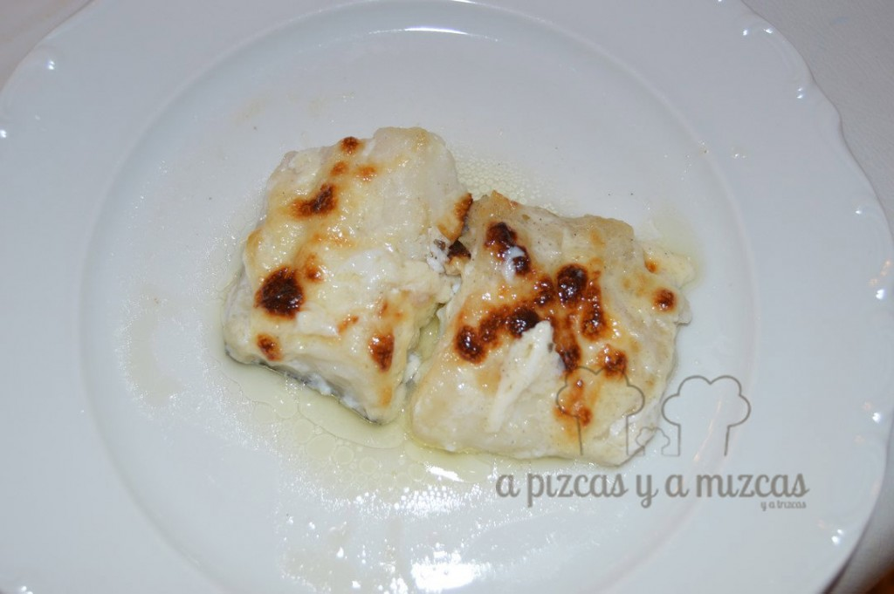

Hoy toca una receta de pescadito fresco que ya hacía tiempo...Esta es otra de las recetas que la iaia Mizcas nos prepara y que hace las delicias de todos los comensales, y es que la iaia Mizcas es inspiración en la cocina. Además el bacalao con alioli es muy fácil de preparar y cuando lo pruebas por primera vez.... os aseguramos que repites!

## Ingredientes para preparar el bacalao con alioli

- tres o cuatro lomos de bacalao
- aceite de oliva virgen extra
- alioli
- sal

Este plato lo podéis preparar con el bacalao desalado o fresco. Nosotros utilizamos una salsa all i oli comprada pero podéis hacerla vosotros mismos. Aquí os dejamos la [receta de alioli rápida](/ajoaceite-allioli-express/).

Si optais por un bacalao que sea saladao, tendras que desalarlo. El bacalao lo tendrás que tener desalando al menos 24 horas cambiando el agua varias veces durante este tiempo.

Nosotros utilizamos bacalao fresco. Engrasaremos una fuente apta para el horno y colocaremos los lomos de bacalao. Precalentamos el horno a unos 200ºC. Mientras agregamos el alioli sobre los lomos de bacalao, tiene que quedar una capa gruesa de alioli. Hornearemos durante unos 10 minutos aproximadamente para que el pescado se haga bien. Luego gratinaremos unos cinco minutos más.

Ya tenemos listo el bacalao con alioli listo para disfrutar, una receta muy fácil de preparar.... corre a la mesa!!
