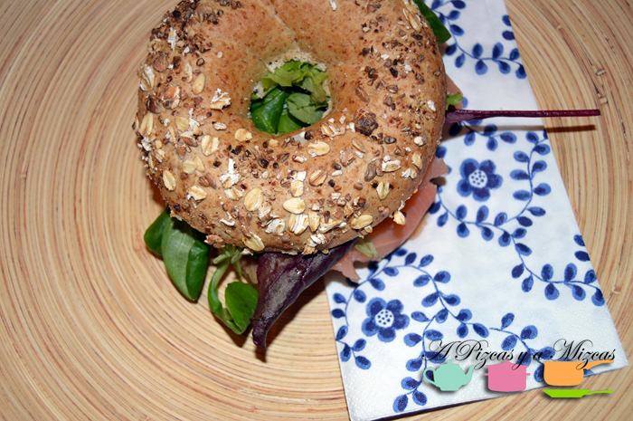
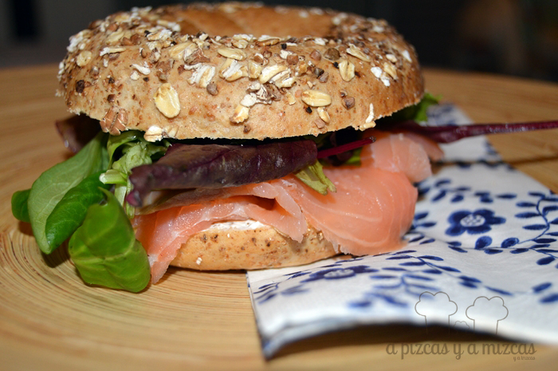

Ahora que está tan de moda lo del "brunch" os traemos una propuesta con este bagel de salmón. A nosotros nos está convenciendo esto del "brunch" aunque adaptado a nuestras "circunstancias". Al seguir el ritmo de Trizcas muchos fines de semana cuando estamos en casita comemos a la misma hora que la peque (sobre las 13:00) y claro a esa hora no nos apetece una gran comilona así que hacemos una comida más ligera. De esta forma, podemos aprovechar para descansar un poquito más durante el tiempo de la siesta de nuestra pequeña torbellino...

## Ingredientes para preparar el bagel de salmón

- un paquetito pequeño de salmón ahumado
- crema de queso estilo philadelphia
- mostaza
- hoja de brotes tiernos
- eneldo
- bagels

Realizando la compra en el supermercado encontramos unos paquetes con 4 bagels con cereales (estaba el clásico y con semillas de amapola)  y los cogimos con la idea de preparar un "bocadillo" especial. Gastamos dos y el resto lo congelamos para otra ocasión.

Aunque si os animáis podeís preparar vosotros mismos los bagels: El [bagel tradicional](http://es.wikipedia.org/wiki/Bagel "Bagel wikipedia") es un pan elaborado tradicionalmente de harina de trigo y que suele tener un agujero en el centro. Antes de ser horneado se cocina en agua brevemente, dando como resultado un pan denso con una cubierta exterior ligeramente crujiente. Existen variantes de la receta que le añaden un toque dulce (normalmente malta, azúcar o miel) al bagel durante la elaboración.

Normalmente se mezclan los ingredientes para formar una masa. A partir de la masa se van haciendo los bagel según la forma tradicional con un agujero en el medio. Después se dejan levar durante 12 horas a baja temperatura, y luego se cuecen en agua que no contenga aditivos. Finalmente, se meten al horno a temperatura alta.

Ahora vamos con la preparación de nuestros bagel de salmón. En una mitad del bagel pondremos la crema de queso y un poco de eneldo, a continuación el salmón ahumado, después unas hojas de brotes tiernos y por último un toque de mostaza.

Nosotros preferimos el pan sin tostar pero si lo preferís podeís darle un toque de calor antes. Cerramos el bagel y listo para disfrutar.

¿Y vosotros os gusta esto del brunch?
