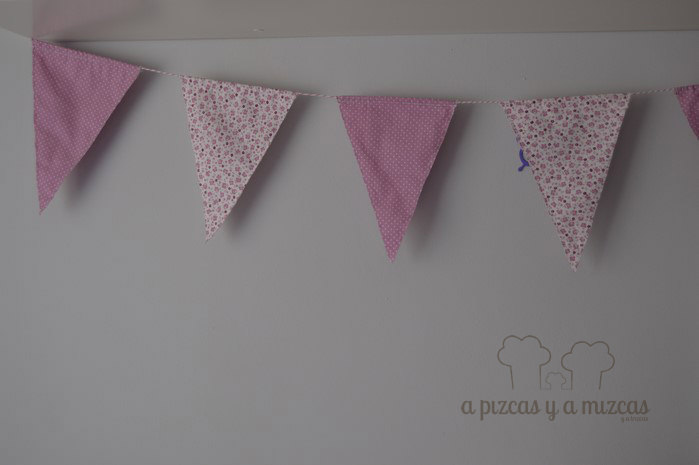
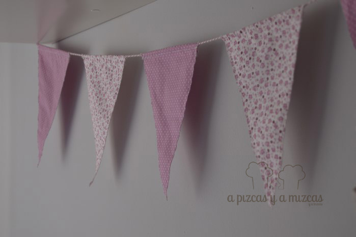
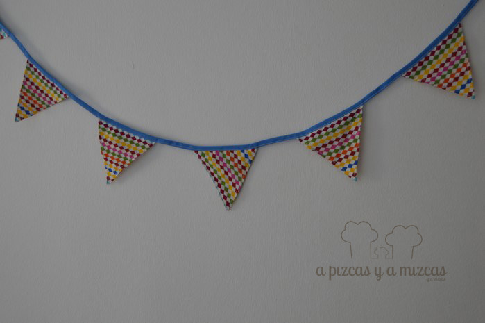
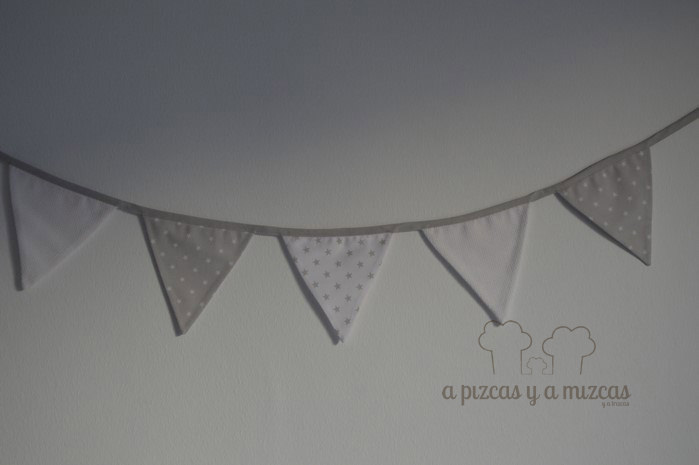
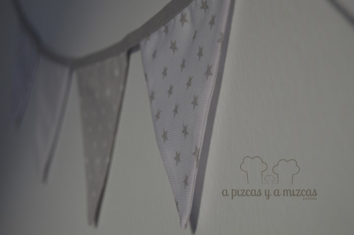

Esto de llenar las fiestas, habitaciones o cualquier rinconcito con banderines es una cosa que en casa nos encanta ya que llenas de alegría y fiestaaaa. Hoy os enseñamos algunos de los banderines handmade que hemos hecho nosotros #connuestrasmanitas ultimamente y cada uno tiene una pequeña historia detrás... si quieres conocer nuestras historias, sigue leyendo

La primera guirnalda de banderines que preparamos tiene un significado especial para nosotros porque la hicimos para el [primer cumple de Trizcas](/fiesta-de-primer-cumpleanos/) y tanto nos gustó que forma parte de la decoración del cuarto de Trizcas. Para esa ocasión elegimos una combinación de telas en rosa (no podía ser otro color para la princesa de la casa).

Banderines en rosa para la habitación de una princesa

Banderines que alegran habitaciones

Los otros banderines que hicimos (esta vez con la ayuda de la iaia Mizcas) fue para la [súper fiesta de los indios](/fiesta-de-cumpleanos-de-indios/) para el segundo cumple de Trizcas. Estos banderines handmade son los que más colorido tienen de todos los que hemos preparado y alegran cualquier rincón. Y estuvo decorando el tipi indio durante toda la fiesta. Y tenemos que confesar que más de una vez hemos tenido que sacar los banderines para montar fiestas en cualquier lugar. Trizcas es muy festera... ji ji ji

Banderines a todo color

Y los últimos banderines que hemos hecho con muchísimo amor se han ido un poco lejos y estamos seguros que a su pequeño dueño le van a encantar. Hemos elegido una combinación de telas con estampado de estrellitas que desprende muchísima dulzura y amor y que va a quedar genial en su nueva habitación.

Banderines hechos con mucho amor

Nos encantan las estrellitas :)

Ha quedado claro nos encantan los banderines, y si encima tienen una historia detrás más. Así que ya sabéis pon un banderín en tu vida.... y alegría!!

Si os gusta lo que hacemos y queréis unos banderines como estos o tenéis otra idea o queréis preguntarnos o contarnos cualquier cosa podéis poneros en contacto con nosotros a través de nuestro [formulario de contacto](/contacto/ "Contacto A Pizcas y a Mizcas"). Nos gusta mucho que nos contéis cosas. Vamos a llenar de banderines nuestras vidas... yuhuuu! :)
