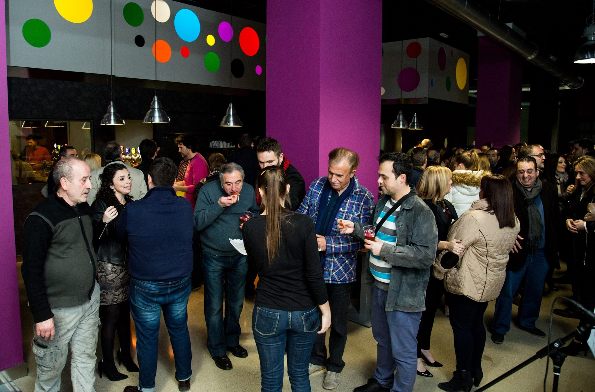
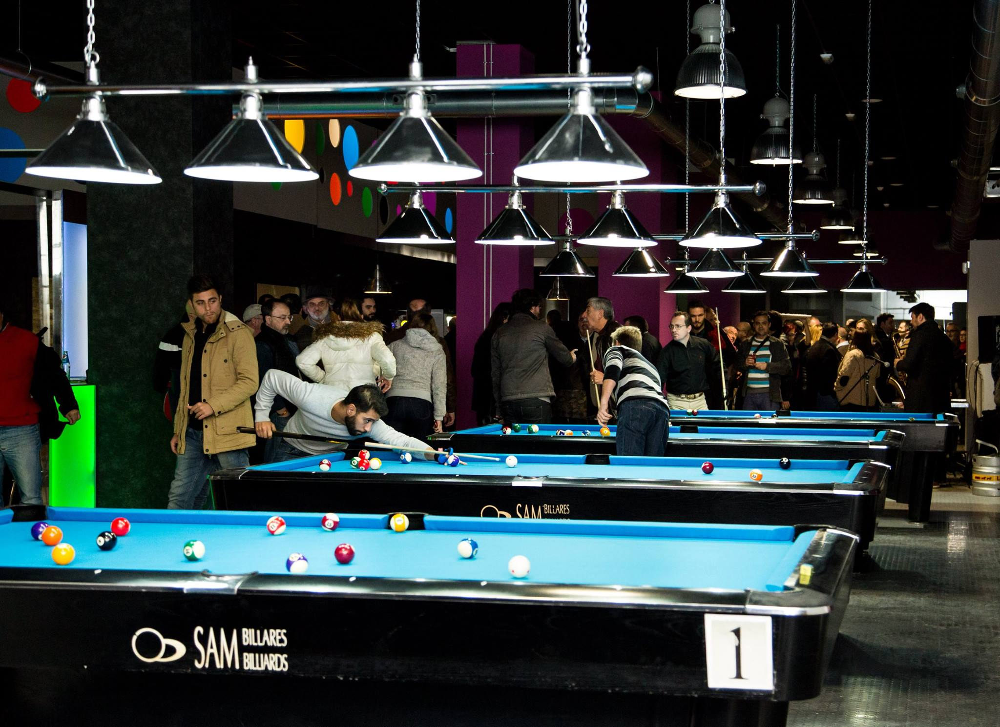
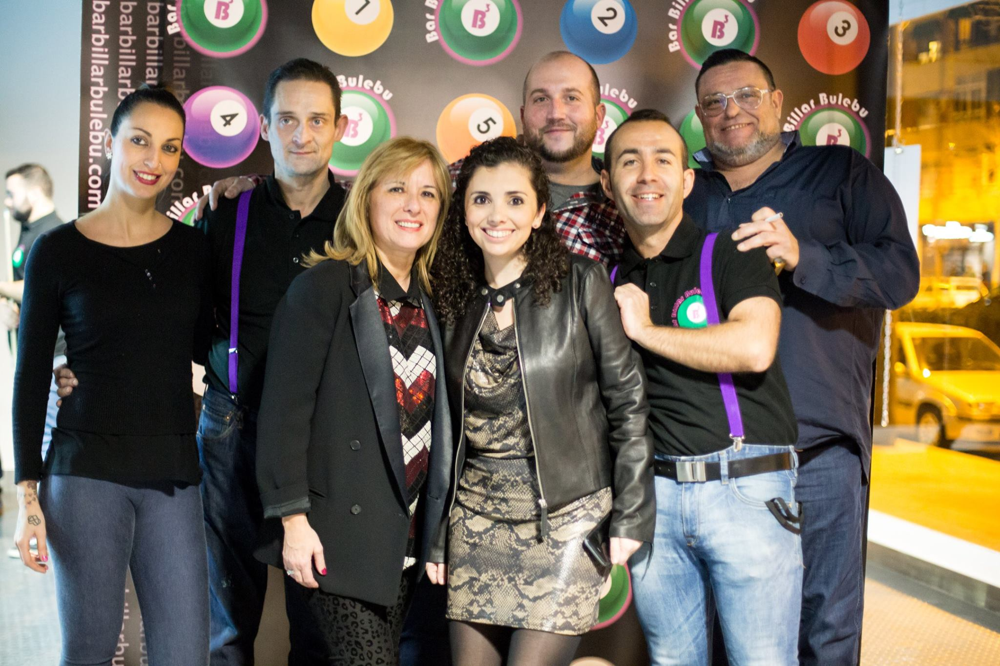

La verdad es que hacía falta un local en Valencia como el [Bar Billar Bulebú](https://www.facebook.com/barbillarbulebu/?fref=ts) (a la altura del número 86 del Camino de Moncada, junto a la gasolinera BP). Está destinado a convertirse en un templo para los amantes del billar (en cualquiera de sus disciplinas), del futbolín, los dardos y... de la más sabrosa gastronomía. Se inauguró el pasado 14 de enero y pronto os contaremos más cosas sobre su carta.

De momento, os ampliamos el novedoso concepto de Bar Billar Bulebú: ocio y gastronomía que agrupa el juego del billar, (un deporte de precisión que cada vez gana más adeptos y que no tenía espacio destacable en la ciudad) y el estilo Street Food.

Tras cortar la cinta inaugural que envolvía seis mesas (de un total de 12) de este juego, los asistentes disfrutamos de una tarde entre tapas, música en directo, exhibición por parte de profesionales, y unas divertidas partidas de futbolín, algo que encantó a los presentes de todas las edades.

Carolina Bayer, responsable empresarial del Bar Billar Bulebú , destacaba su intención de “crear un espacio único en la ciudad y en España, que sea punto de encuentro para profesionales, aficionados y todo tipo de personas, que quieran disfrutar de un ambiente de ocio diferente, sano y único, acompañado de una buena comida”.

De la parte gastronómica se ha encargado el chef valenciano Juan Casamayor, ganador del Concurso de Bocadillos de Autor Madrid Fusión 2014, que ha diseñado una carta de Street Food. Una oferta gastro que está en perfecta consonancia con el espiritu del local: "comida callejera, de comer con las manos, compartir, poder transportar mientras uno juega u observa una partida, pero siempre con un buen producto y un toque valenciano”. Tenemos pendiente ir a probar con más tranquilidad la carta, pero el día de la inauguración nos encantó el tartar de atún, los bocadillos siempre geniales y nos hablaron maravillas de unos calamarcitos... Juan siempre apuesta por la honestidad en los sabores y las referencias a la comida "de toda la vida" hacen de cada bocado una delicia.

 La inauguración del Bulebú causó gran expectación. Foto: María Selva.

Un inmenso lineal de cervezas y vino valenciano por copas acompañan a tapas como la tradicional ensaladilla, ceviches, hummus de berenjena a la brasa, guacamole o costillas a la miel, entre otros. Bocadillos como el galardonado “Tierra Magra” (una reinterpretación del tradicional “Blanc i Negre”), Codillo Fácil o Gosset Calentet (la versión valenciana del Hot Dog), acompañan a hamburguesas de Black Angus o de Pelota de Cocido, todo ello rematado con postres caseros.

No faltan los cócteles en un ambiente nocturno diferente y agradable en el que se podrá disfrutar de actuaciones, torneos profesionales y clases particulares de la mano de Diego Pedro Simón Parra, subcampeón de Billar en España, que entrenará a amateurs, aficionados y a cualquiera que quiera introducirse en este deporte, pues estará presente en el local como formador. Además, sus responsables tienen la intención de que suela haber música en vivo. Como véis, una oferta de lo más completa. Perfecta para entrar a echar unas partidas por la tarde y acabar con un cóctel en la mano tras una cena fantástica comentando las mejores jugadas...

 El Bar Billar Bulebú es todo un "templo" del billar y de la gastronomía. Foto: María Selva.

Una nueva opción de ocio y gastronomía en nuestra ciudad, un punto de encuentro para todos los públicos y todos los momentos del día, ya que abre sus puertas con horario ininterrumpido hasta las 3 de la madrugada y pretende posicionarse como referente en España.

 Parte del equipo del Bar Billar Bulebú. Foto: María Selva.
