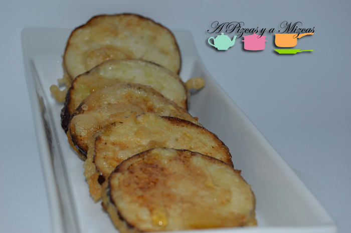
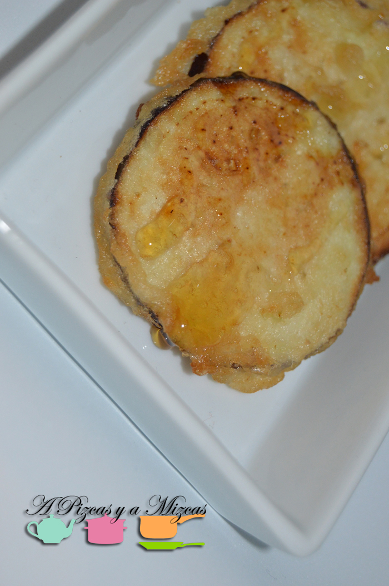

Hace unos meses que Pizcas estuvo por cuestiones laborales en Jerez. De allí volvió con una receta que le encantó: unas berenjenas en tempura con miel que solían servirles como tapa en las comidas. Así que aquí os dejamos nuestra versión de las **berenjenas con miel en tempura ligera**. Nos gustan porque se comen con los dedos, además combinan a la perfección el contraste salado y dulce; y el contrapunto crujiente de la tempura ligera con la textura cremosa de las berenjenas. Un éxito seguro.

## Berenjenas con miel en tempura ligera (aperitivo para cuatro personas)

- Una berenjena grande
- Tres cucharadas soperas colmadas de harina de trigo
- Una cucharada sopera colmada de harina de maíz
- Una cucharadita rasa de levadura
- Agua
- Sal
- Miel

En el viaje de Pizcas vio estas berenjenas con miel presentadas de dos formas, bien en rodajas o en palitos. De ambas formas están riquísimas, pero nosotros apostamos por los discos.

El primer paso para nuestrs berenjenas con miel es lavar bien la berenjena. Luego, con un cuchillo afilado cortamos rodajas de unos cinco milímetros de grosor. Las salamos y las dejamos en un escurridor mientras preparamos la tempura.

En un bol colocamos 200 ml de agua bien fría, cuanto más fría, mejor. Luego añadimos la harina de trigo, la de maíz y la levadura. Lo mezclamos bien hasta que nos quede como una melaza sin grumos. No debe quedar excesivamente trabada, pero sí con un espesor suficiente.

Ponemos un poco de aceite de oliva virgen a calentar en una sartén. Pasamos las rodajas de berenjenas por la tempura y, cuando el aceite esté bien caliente, las freímos vivamente por ambos lados. Las retiramos y las colocamos sobre papel absorbente para quitar el exceso de aceite.

Ahora, echamos un chorrito de miel sobre las berenjenas y las comemos bien calentitas. Nos encantan las berenjenas con miel!!

