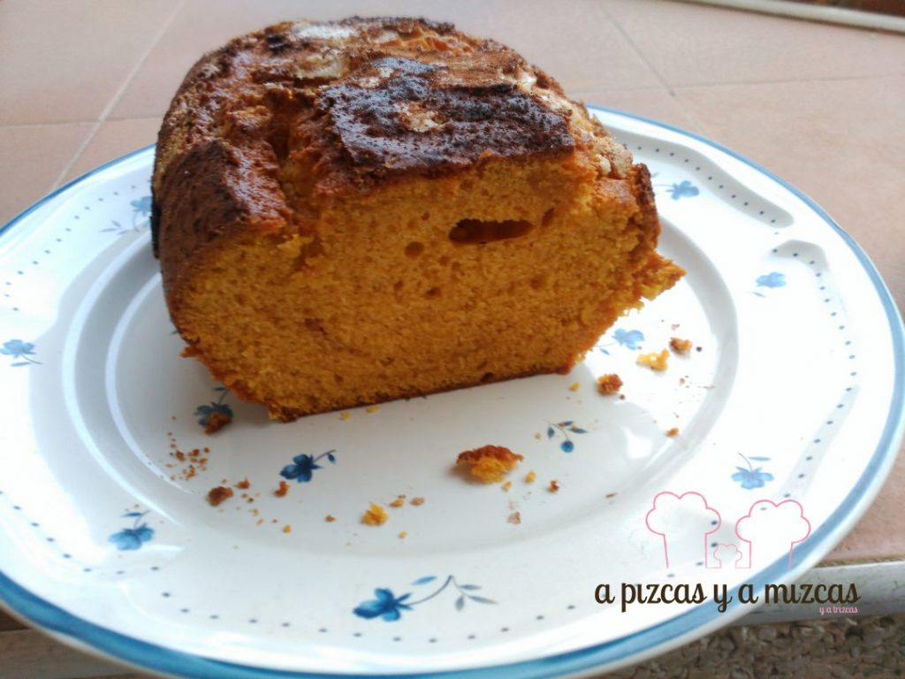
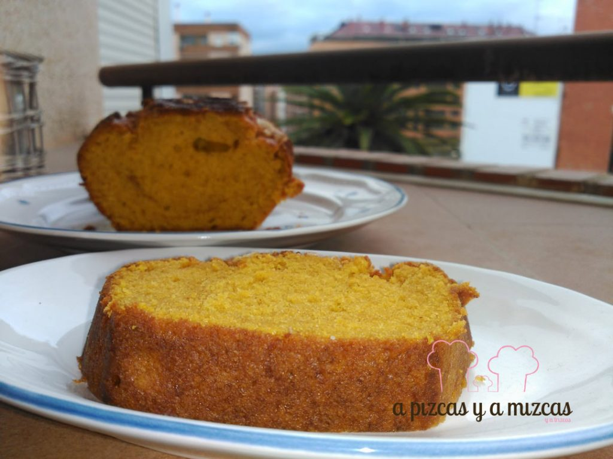

Ha pasado casi un año sin noovedades por aquí... y la verdad es que hemos tenido el próposito de escribir unos cientos de veces... Muchos de vosotros pensaréis que esto no es serio y tenéis razón... pero cuando la familia aumenta también aumentan las faenas y a veces es difícil sacar tiempo para cocinar. Después de muchos intentos que se han quedado por el camino, esperamos volver para quedarnos... Muchas gracias a todos los que nos habéis preguntado y nos habéis acompañado en las redes sociales. Hemos vuelto!! Y volvemos con una nueva versión de una de nuestras primeras recetas: bizcocho de calabaza. Con la misma filosofía de siempre: fácil de preparar y rico, rico.

Aprovechando que las calabazas ahora están en su punto, en la cesta de la compra de A Pizcas y a Mizcas es un obligado todas las semanas. Y nos gusta prepararla tanto en salado como en dulce. Os recuerdo algunas recetas que seguimos preparando porque son muy rápidas:

[Calabaza asada](/calabaza-asada/)

[Crema de calabaza](/crema-de-calabaza/)

[Cous-cous de calabaza y zanahoria](/couscous-con-calabaza-y-zanahoria/)

[Buñuelos de calabaza](/bunuelos-de-calabaza/) (que seguro que muchos ya estáis pensando en las Fallas)

Vamos con nuestro bizcocho de calabaza asada que nos encanta por lo esponjoso que queda y ese saborcito que deja la calabaza tan bueno... mmmmm

## Ingredientes para preparar el bizcocho de calabaza asada

- 250 gramos de calabaza asada
- 200 gramos de azúcar
- 2 huevos medianos
- 140 gramos de aceite de girasol
- 200 gramos de harina
- 1 pellizco de sal
- Levadura (un sobre de 15 gramos)
- 1 cucharadita de canela molida

Echamos en un bol el azúcar y los dos huevos y batimos  hasta que empiece a blanquear. A continuación, añadiremos la calabaza asada y el aceite de girasol y batiremos hasta que esté todo bien mezclado. Después agregamos la harina (acordaros de tamizarla con la ayuda de un colador, así evitaremos grumitos), la sal y la levadura y lo mezclamos todo.

Engrasamos un molde apto para el horno y agregamos la masa del bizcocho de calabaza. Metemos el  molde en el horno y espolvoreamos con un poquito de azúcar y canela. Dejaremos hornear entre 30-45 minutos a 180º. Es aconsejable que vayáis pinchando el bizcocho con un cuchillo o varilla para comprobar que sale totalmente limpio. Si sale con restos de la mezcla del bizcocho, dejad 5 minutos más y volved a comprobar.

Ya os la había dicho... facilísimo! Nos haría mucha ilusión poder ver vuestros bizcochos de calabaza. Nos vemos prontito!!
