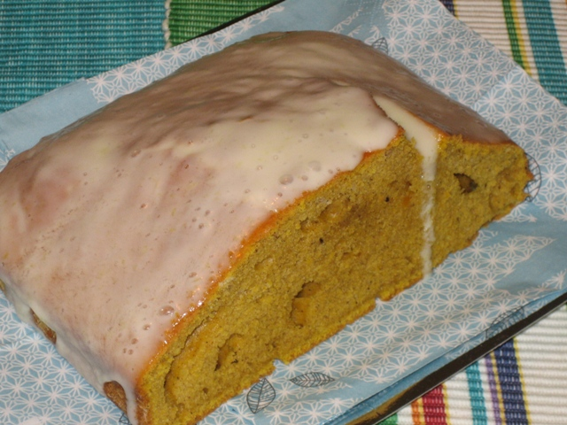
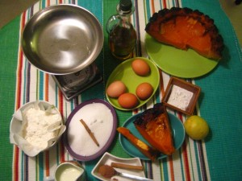
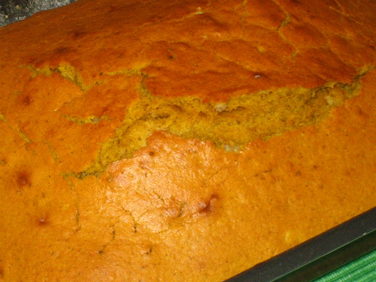
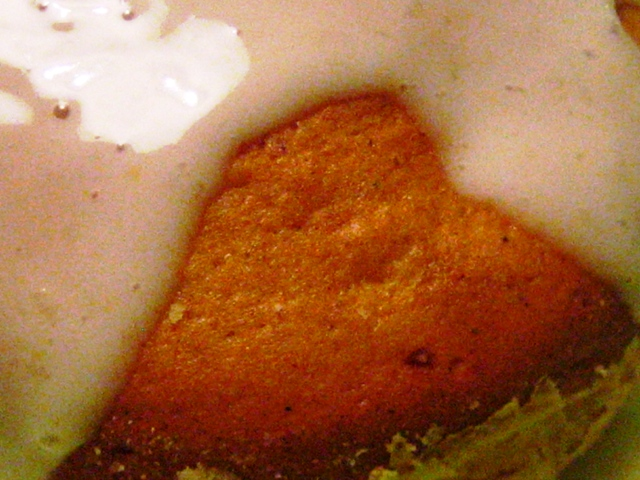

 

Nos han regalado una calabaza grande. Y después de asarla y comernos algunos trocitos con miel… decidimos hacer un bizcocho de calabaza, para aprovercharlo todo y, de paso, llevar un trocito a una amiga a la que sabemos que le pirra.

Ingredientes:

- 400 gr de calabaza
- 4 huevos
- 350 gr de azúcar
- 300 gr de harina
- 1 sobre de levadura
- 1 cucharadita de canela en polvo
- 1.5 dl de aceite de oliva
- 1.5 dl de nata líquida
- 1 limón
- Mantequilla
- Sal

Nosotros ya teníamos la calabaza asada. La hicimos entera, pues nos pareció más cómodo. Sin embargo, para asar la calabaza de una forma más rápida: precalentar el horno a 180º. Cortar la calabaza en trozos finos sin quitarle la piel. Untar la bandeja del horno con un poco de aceite de oliva y asar la calabaza durante 30 minutos, hasta que esté blanda. Cuando se enfríe quitarle la piel y picar la pulpa.

Untar ligeramente con mantequilla un molde (apto para el horno) y espolvorearlo con harina. En un cuenco grande poner los huevos, la mitad del azúcar, el aceite, la calabaza, la canela, la harina tamizada con la levadura y un pellizco de sal. Batir bien con la batidora.

Precalentar el horno a 180ª. Verter la mezcla anterior en el molde y meterlo al horno. Dejar unos 25 minutos hasta que el bizcocho esté bien cuajado. Sacar del horno y dejar enfriar sobre una rejilla. Poner en el vaso de la batidora el resto del azúcar, la ralladura y el zumo del limón, la nata líquida hasta que la mezcla esté homogénea y fina. Extender el glaseado sobre el bizcocho, dejar que se solidifique ligeramente y servir.

