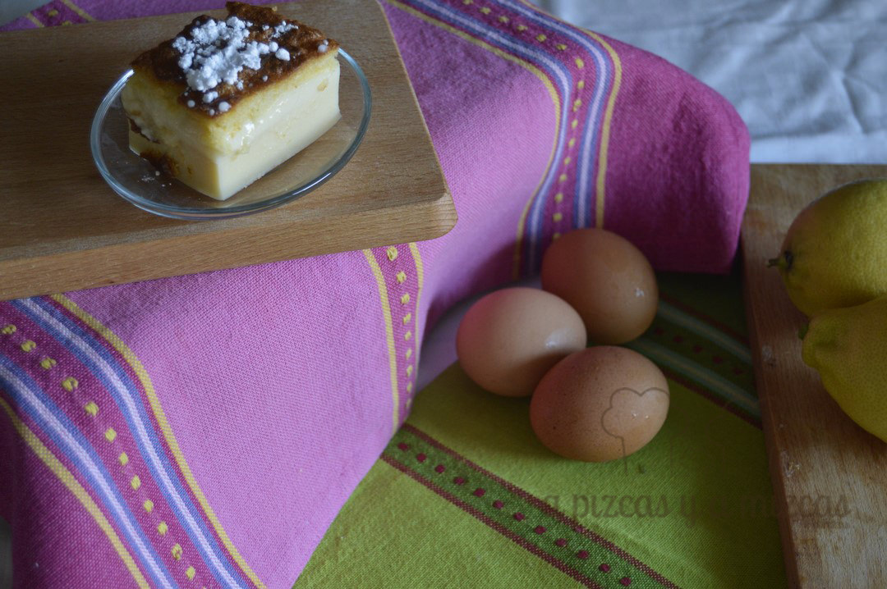
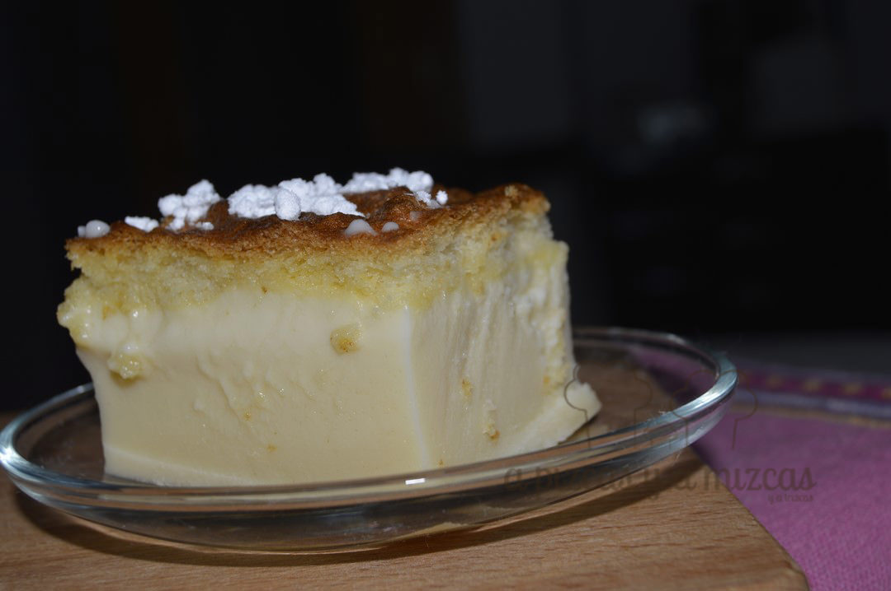
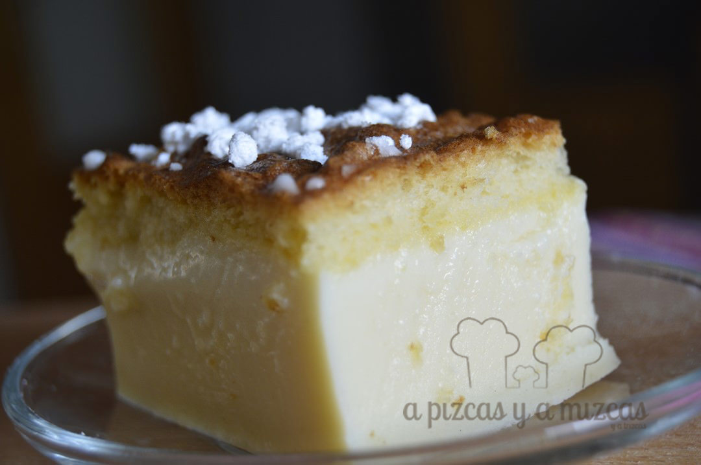

Este dulce lo teníamos fichado desde hace un tiempo. Lo vimos en el blog de [Kanela y Limón](http://kanelaylimon.blogspot.com.es/), que si no lo conocéis os recomendamos que lo visistéis. Cristina hace unas recetas impresionantes y las fotos son una pasada. Y este bizcocho inteligente nos pareció un postre mágico... si queréis saber por qué quedaros por aquí y os contamos...

 Este bizcocho es inteligente y magíco porque aunque lo preparamos con una sola masa, en el horno se divide en tres texturas distintas. La capa superior un bizcocho esponjoso, la segunda que nos recuerda a un flan y la última capa en un pudín. Tres postres en un solo bocadito!!

## Ingredientes para preparar el bizcocho inteligente

- 4 yemas
- 4 claras a punto de nieve
- 1/2 litro de leche tibia
- 125 gramos de mantequilla derretida y fría
- 140 gramos de azúcar
- 100 gramos de harina
- La ralladura de un limón
- 1 cucharada de azúcar avainillado

En primer lugar batimos las yemas junto al azúcar y la azúcar avainillada hasta que se quede espumosa. Agregaremos la mantequilla, la leche y la harina (acordaros de tamizarla para evitar posibles grumos) y la ralladura de un limón. Removemos y mezclamos para que se integren todos los ingredientes. Ahora incorporamos las claras a punto de nieve con movimientos suaves y envolventes.

Volcamos la mezcla en un molde hondo (cuadrado o rectangular) untado de mantequilla y espolvoreado de harina. Precalentamos el horno a 180ºC durante diez minutos e introducimos el bizcocho inteligente y rebajaremos a 160ºC durante 50 minutos más. Para comprobar si está cocido: (el viejo truco del cuchillo) pinchamos en el centro, si sale limpio, el bizcocho está listo. Sino dejaremos unos minutos más hasta que esté listo!

Dejamos enfriar y cortamos en porciones... y rápido a la mesa que desaparece!! Nosotros ya somos fans del bizcocho inteligente... si lo pruebas, repetirás! ;)

Mmmmmm

Nos vamos a difrutar de nuestro bizcocho inteligente.... ñam ñam
