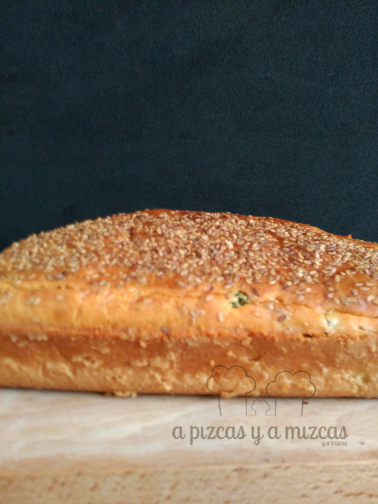
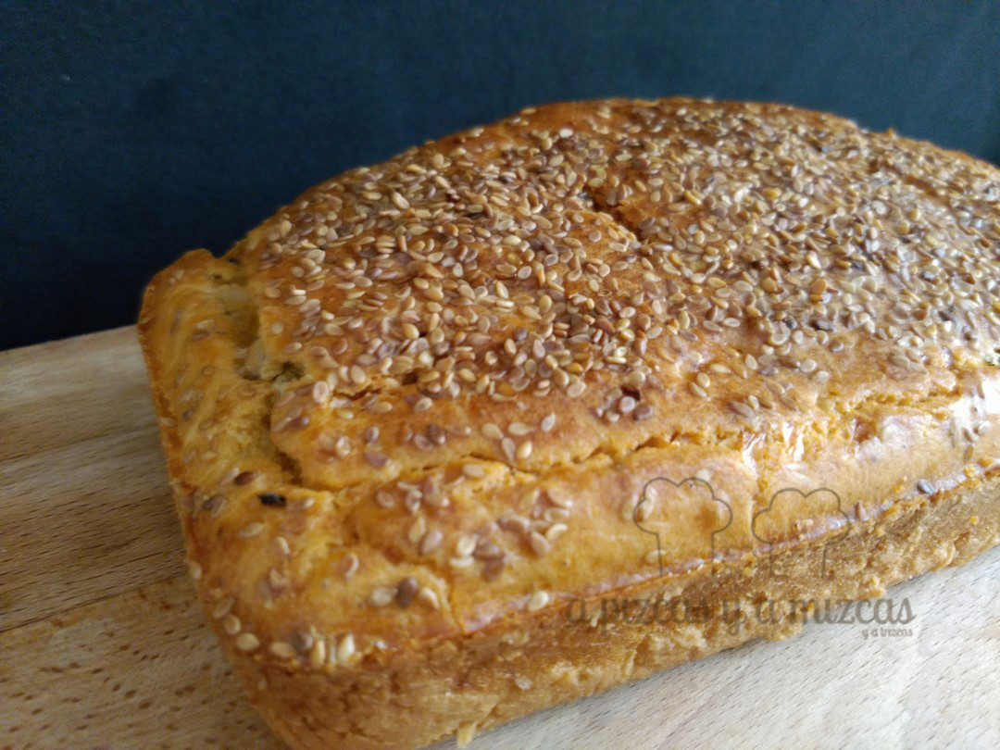

El fin de semana pasado nos fuimos al Grand Opening de [Mr. Nudo](http://mrnudo.com/) y para la ocasión los encargados de preparar la merendola fuímos nosotros. Y preparamos dos bizcochos salados. Un bizcocho salado de aceitunas y cebolla y otro de bacon y queso (tranquis que pondremos la receta en breve) que desaparecieron en nada. En la fiesta muchos nos preguntaron por la receta... así que seguid leyendo

## Ingredientes para preparar el bizcocho salado de aceitunas y cebolla

- tres huevos
- 75 gramos de aceite de oliva virgen extra
- 125 ml de leche desnatada
- 175 gramos de harina
- un sobre de levadura
- una cucharadita de sal
- 100 gramos de aceitunas verdes sin hueso
- 50 gramos de pepinillos
- una cebolla tierna pequeña
- 80 gramos de queso rallado
- pimienta
- sésamo
- tomate frito

Precalentamos el horno a 180º.

En un bol batimos los huevos. Añadimos la leche, el aceite, la sal y una pizca de pimienta. Batimos todo bien. A continuación agregamos la harina y la levadura (acordaros de tamizarla, lo podeís hacer con la ayuda de un colador) y mezclamos todo bien.

En una sartén pocharemos la cebolla durante dos o tres minutos.

Después añadimos la aceitunas verdes y los pepinillos a trocitos y la cebolla pochada, el queso rallado y por último tres cucharadas de tomate frito. Removemos para que se mezclen todos los ingredientes.  Y espolvoreamos por encima con sésamo.

Engrasamos con unas gotas de aceite un molde rectangular y vertemos la mezcla. Horneamos durante unos 35 minutos. Comprobaremos (con la ayuda de un cuchillo) si está cocido, si no, hornearemos otros cinco minutos más. Cuando se enfríe lo cortamos a cuadraditos y servimos.

Recién sacado del horno

El picoteo del grand opening de Mr. Nudo

Un bizcocho muy fácil de preparar y que está más que bueno. Y ya veis... los bizcocho también pueden ser salados. Anímate a prepararlo y cuéntanoslo

La merienda está preparada!
