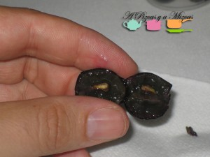

El equipo de A Pizcas y A Mizcas (con Trizcas y todo) abandonamos por una mañana los fogones y nos desplazamos a El Pontón (Requena, Valencia) para la presentación social de Bobos Finca Casa La Borracha 2011, de [Bodegas Hispano+Suizas](http://www.bodegashispanosuizas.com/ing/home.html "Bodegas Hispano+Suizas"). Se trata del primer vino Bobal 100% de esta bodega valenciana (D.O. Utiel-Requena), responsable de, entre otros, los vinos Impromptu (blanco), Bassus (tinto), Quod Superius (tinto), o los cavas Tantum Ergo (blanco, rosé y el fantástico vintage).

## Bobos Finca Casa La Borracha

El vino Bobos Finca Casa La Borracha es, a la vez, un homenaje a la variedad Bobal, largo tiempo denostada en el "club" de variedades tintas nobles (Cabernet Sauvignon, Pinot Noir, Merlot, Tempranillo...); y un reto: "domar" a las cepas y a sus racimos, sacrificando producción en aras de la concentración y de la calidad.

Nos recibió el equipo de la bodega, con Pablo Ossorio, enólogo, ejerciendo de anfitrión y de maestro de ceremonias (pero no podemos dejar de nombrar a Rafa, a Vicente, a Borja... a todos y cada uno de l@s miembros de Hispano+Suizas). Con vistas a los viñedos de la finca y una copa de cava en la mano, la bienvenida fue perfecta y un anticipo de lo que vendría a cotinuación. Los invitados éramos una treintena de blogueros y prensa especializada. Tras las presentaciones de rigor, tocó entrar en clase para descubrir las claves de la Bobal, origen de Bobos Finca Casa La Borracha.

Para ello, Pablo Ossorio explicó que, de entre todos los sinónimos que se utilizan para la variedad Bobal, la bodega Hispano+Suizas eligió el de Bobos para denominar su apuesta enológica. Bobos Finca Casa La Borracha retoma el nombre del paraje y antigua venta que se restauró para albergar la bodega actual.

Antes de catar el vino probamos las uvas de Bobal (todavía no habían completado su maduración total, pues este año 2013 la vendimia viene algo retrasada). Además, hicimos una clarificatoria comparativa entre uvas de Bobal de producción media en la zona, con las uvas que Hispano+Suizas cultiva para su Bobos Finca Casa La Borracha. La diferencia es clara: si de una cepa media se obtiene un rendimiento en uva de 7 a 8 kilos, las prácticas de cultivo de Hispano+Suizas la reducen a 2/3 kilos por cepa. El resultado, una mayor concentración y calidad de la uva, que se traslada al vino resultante.

Hispano+Suizas lleva elaborando bobales para sus vinos desde su creación en el 2006, y forma parte del coupage de tintos tan celebrados como el Quod Superius, o en el propio Bassus Premium. En ambos casos aporta su carácter a variedades foráneas. El otro Bobal que elabora la bodega es más exótico, ya que se trata de un vino dulce (Bassus dulce).

Otra de las claves es el empleo del frío en el proceso de vinificación (en todos los vinos de la bodega). Así, las uvas, una vez vendimiadas, pasan a una cámara frigorífica, donde se mantienen tres días a -10 grados. Luego, se selecciona la uva que va a formar parte del Bobos Finca Casa La Borracha, se despalilla (se retira el raspón y las partes vegetales que pudiera haber entre los racimos) y se encuban en barricas de roble americano nuevo, de 400 litros de capacidad, abiertas. Introducen una placa de acero inoxidable que, mediante un circuito de agua, refrigera el contenido. La uva macera en frío a 8 grados durante cuatro días. Cada jornada se hunde el sombrero (hollejos que flotan) de forma manual. Cuando se inicia la fermentación (la transformación de azúcares en alcohol gracias a las levaduras), cierran el agua refrigerante y dejan que fermente a un máximo de 26 grados.

Tras quince días, la uva pasa a la prensa neumática, donde se prensa muy suavemente. El resultado pasa a barricas nuevas de roble francés, donde envejece un mínimo de 10 meses. Luego, Bobos Finca Casa La Borracha pasa a su peculiar botella. Decimos peculiar porque también es diferente a las convencionales, recuerda a las botellas de vinos de Oporto, baja, "chata" y de hombros anchos.

La primera añada de Bobos Finca Casa La Borracha es la de 2011, un vino de color rojo intenso, con gran extracción de color. De aroma medio/intenso, muy equilibrado. Madera muy elegante, especias, fruta madura. Llena rápidamente la boca, con una fantástica acidez. Un tanino muy bien trabajado, presente pero sin ser dominante. Elegante y muy agradable de beber.

También pudimos probar una muestra de barrica de lo que será Bobos Finca Casa La Borracha de la añada 2012. A nuesto juicio más complejo que el anterior, con un gran potencial. Será un gran "hermano" del Bobos 2011.

Según nos indicaron, Bobos Finca Casa La Borracha tendrá un precio de venta al público que oscilará alrededor de los 20 euros.

La visita incluyó una cata de los mostos que serán el vino base de los cavas de Hispano+Suizas y finalizó con una comida campestre típica de Requena, con el bollo de Requena, el embutido, las carnes a la brasa, los tomates (qué tomates los que cultiva Rafa), el ajoarriero. Todo ello con los fantásticos vinos de Hispano+Suizas y el buen ambiente que se fraguó en este maravilloso paraje de El Pontón (la bodega tiene un encantador hotel con cinco habitaciones).

Toda la presentación se publicó en Twitter con el hastag #boboshs
