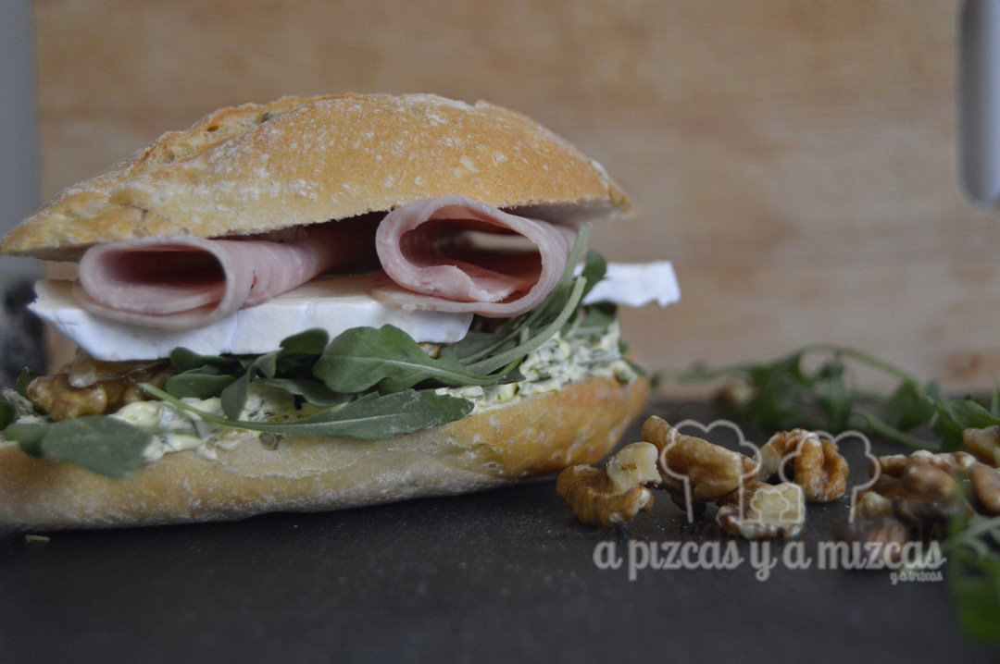
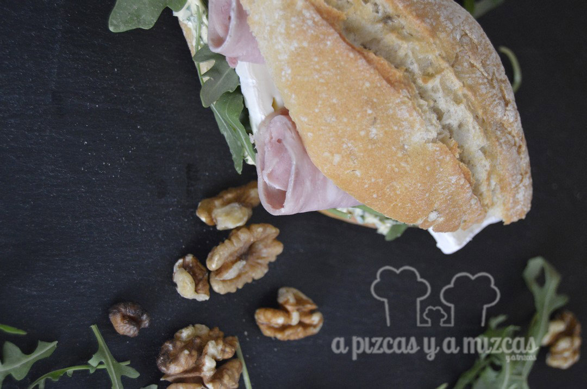

Lo que nos gusta un bocadillo! Y en estos días de verano en los que los día se alargan siempre es un buen aliado para los mil planes que pueden surgir. Elegimos unos cuantos ingredientes y nos salió un bocadillo de rucula, york y feta de diez que ya hemos incorporado a nuestro recetario.

## Ingredientes para preparar el bocadillo de rucula, york y feta (para dos bocadillos)

- dos panecillos
- 4 lonchas de jamón york
- 2 trozos de queso feta
- mantequilla
- nueces
- brotes de rúcula

Trituramos las nueces junto a la rúcula. Mezclamos con la mantequilla y untamos en un lado de los panecillos. Cortamos unas lonchas de queso feta y las ponemos encima de la mantequilla, a continuación las lonchas de jamón york y por último unos cuantos brotes de rúcula. Si os apetece podéis añadir unas cuantos trocitos de nueces y ya está listo para disfrutar.

Nos encantan los bocadillos... ñam

Ya véis en un pis pas ya tenemos preparados los bocadillos y a disfrutar de los mil planes del verano. Si queréis más ideas de bocadillos visitar el siguiente enlace de ["Los mejores bocadillos de A Pizcas y a Mizcas"](/los-mejores-bocadillos-de-pizcas-y-mizcas/)

Lo mires por donde lo mires... dan ganas de hincarle el diente

¿Cuál es tu bocadillo favorito? hoy nos quedamos con el bocadillo de rucula, york y feta. Cuéntanoslo!
