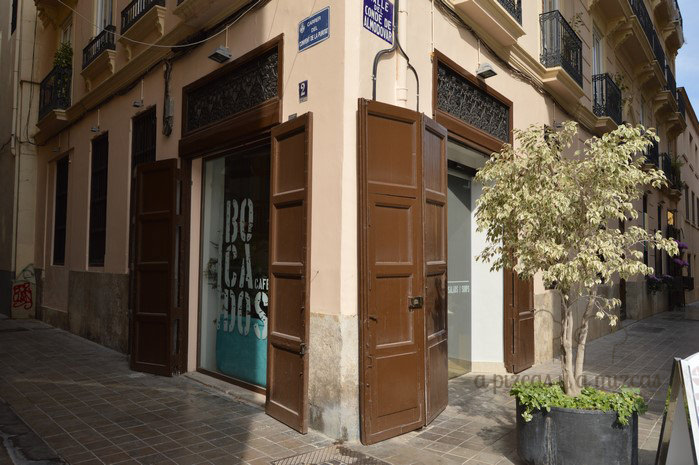
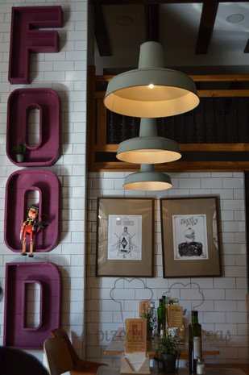
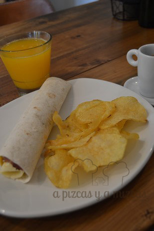
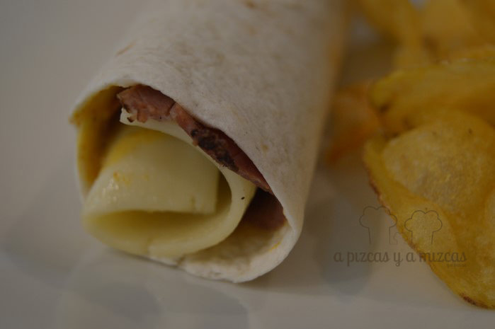
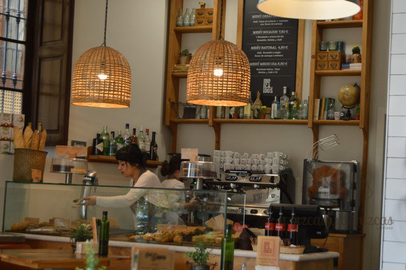
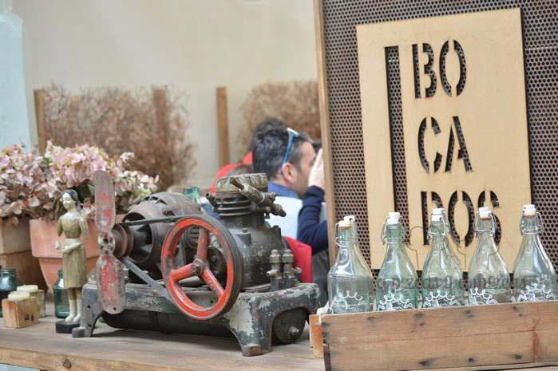

En uno de nuestros paseos hacia el centro de Valencia, antes de Fallas, descubrimos un café en una esquinita muy cerca de la Plaza de la Virgen que nos encantó. Se trata de [Bocados Cafe Valencia](https://www.facebook.com/bocadoscafe "Facebook de Bocados Cafe Valencia"), en la calle del Conde de Almodóvar (esquina con Convent de la Puritat), prácticamente en la plaza, pero con la ventaja de que queda un poco escondido. Nosotros hemos convertido Bocados Cafe Valencia en un sitio estratégico para hacer una rica parada. ¿Quieres saber más?

Como hemos dicho, descubrimos este sitio antes de las Fallas y lo cierto es que durante las fiestas lo utilizamos como lugar de parada y fonda, tanto a la ida como a la vuelta a casa. Es un espacio de cafetería y panadería, pero sirven comidas ligeras también y ricos desayunos y almuerzos.

## Nuestros preferidos de Bocados Cafe Valencia

Teniendo en cuenta que es una cafetería, nuestra valoración es la siguiente:

- **Comida**: ⭐⭐⭐
- **Local**: ⭐⭐⭐⭐⭐
- **Servicio**: ⭐⭐⭐⭐

Destaca el buen nivel del café que preparan. Intenso y agradable. Gustará a los más cafeteros (pero no tienen carta de cafés (Arábiga, Blue Montain...)).

Valentín siempre acompaña a Trizcas

El desayuno popular en Bocados Cafe Valencia incluye café, tostadas o pieza de bollería y zumo de naranja natural (parece una obviedad indica esto en Valencia, pero todavía hay lugares en que los zumos de naranja son industriales). Las tostadas las puedes elegir de pan de multicereales o pan rústico y las puedes tomar con mantequilla y mermelada (para los más golosos) o aceite y sal o con tomate. Siempre optamos por las tostadas, son ricas y crujientes y de buen tamaño.

Si algún día paramos a la hora del almuerzo, nuestros favoritos y que os recomendamos que probéis son:

- Wrap de pastrami
- Pulguita de brie con sobrasada
- Wrap de pollo

Los almuerzos incluyen el bocadillo, zumo o refresco y café y los sirven junto con patatas fritas.

Bocados Cafe Valencia está decorado siguiendo las tendencias actuales y es un espacio relajado y cómodo. Tienen otro local en el [Mercado de Colón de Valencia](http://www.mercadocolon.es/ "Mercado de Colón de Valencia"), pero nosotros no lo hemos probado, pues éste nos pilla más de paso

