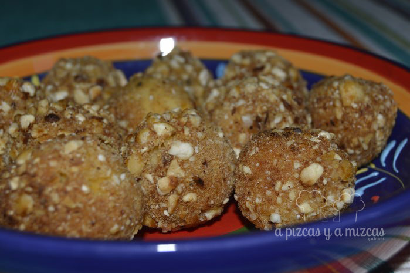

Nos gusta mucho la mezcla de sabores y las croquetas y de esta unión surgen estas bolitas de garbanzos y queso. Vimos como las preparaba [Sergio Fernandez](http://www.rtve.es/television/cocina-con-sergio/) en el programa de [España Directo](http://www.rtve.es/television/espana-directo/) casi por casualidad haciendo zapping y decidimos incorporarla a nuestro recetario.

En otras ocasiones hemos preparado [croquetitas de falafel](/una-cena-desde-la-otra-orilla-del-mediterraneo-kebab-y-falafel-caseros/) que es otra opción para comer garbanzos y que están buenísimas. En casa no sólo se comen garbanzos en el cocido... ji ji ji

## Ingredientes para preparar las bolitas de garbanzos y queso

- un bote pequeño de garbanos cocidos
- queso de cabra
- un huevo
- perejil
- albahaca
- aceite de girasol
- sal
- quicos

Escurrimos bien los garbanzos y los lavamos. A continuación los echamos al vaso de la batidora y trituramos hasta conseguir una mezcla uniforme.

Ponemos los garbanzos triturados en un bol y añadimos el perejil picado, la albahaca y sal al gusto. Mezclamos para que se integren bien todos los ingredientes.

Ahora toca la parte más divertida...vamos formando bolitas. Cortamos el queso a cuadraditos e introduciremos un trocito de queso en cada bolita.

Trituramos un puñadito de quicos y batimos un huevo. Pasaremos las bolitas por el huevo y después la rebozaremos con los quicos triturados.

Ponemos una sartén a fuego fuerte con aceite de girasol y freímos la bolitas de garbanzos y queso hasta que estén bien doraditas todas las bolitas.

Es hora de aperitivear

Un aperitivo diferente con ese toque oriental que tanto nos gusta en casa.
