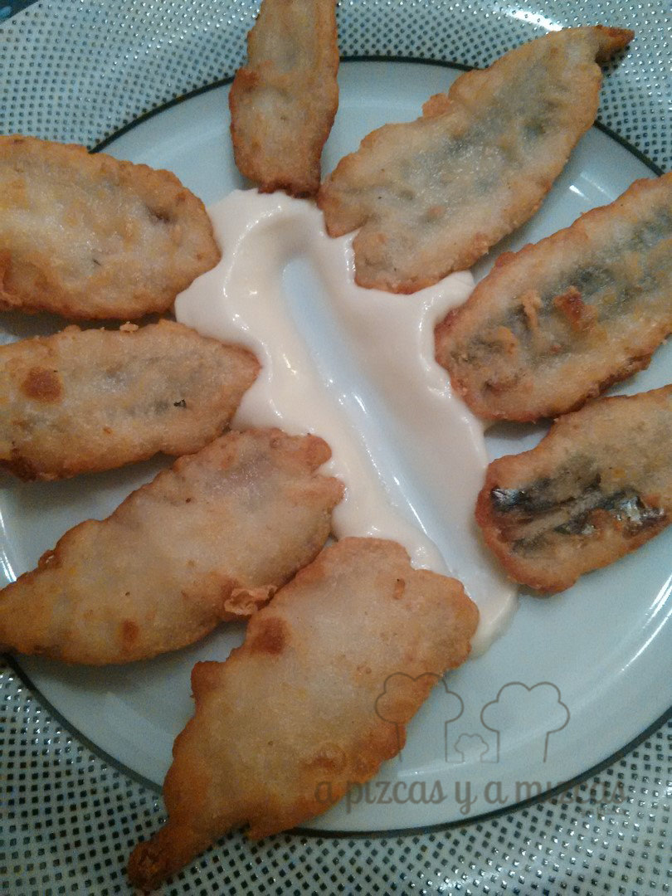

Este verano descubrimos un restaurante fantástico en La Vila Joiosa, [El Pósit](/el-posit-en-villajoyosa/). Allí nos conquistó una de sus tapas, unos riquísimos boquerones rebozados acompañados de un suave ajoaceite (allioli) de miel. Ahora que estamos un poquito más lejos de ese paraíso, nos hemos animado a hacerlos en casa y, la verdad, es que nos han quedado muy buenos.

## Ingredientes para los boquerones en tempura con ajoaceite de miel

- Boquerones
- Harina
- Agua mineral o agua con gas muy fría
- Un huevo
- Un vaso de aceite de girasol
- Dos buenas cucharadas de miel
- Un diente de ajo pequeño
- Sal

El primer paso es limpiar los boquerones, quitándoles los intestinos y la cabeza. Los dejamos abiertos en mariposa. Nosotros los salamos ligeramente por la parte interior y los reservamos en la nevera.

Mientras, vamos a elaborar el ajoaceite de miel. Es súper sencillo. En el vaso de la batidora ponemos un vaso de aceite de girasol, un huevo entero, un ajo pequeño pelado (o medio si es muy grande), miel y sal. Introducimos el brazo batidor en el fondo del vaso y empezamos a turbinar, sin mover la batidora, hasta que emulsione. Luego ya podemos subir y bajar la batidora hasta obtener la consistencia deseada. Probamos y rectificamos de miel y de sal. Dejamos en la nevera. Os saldrá bastante cantidad, pero si la guardáis en el frigo, os puede aguantar un día y es genial para acompañar cualquier otro pescado, carnes blancas o sobre una tosta de pan.

Para preparar nuestra tempura. Para ello, en un bol añadimos harina y agua bien fría (queda muy bien con agua con gas), hasta tener una masa fina, no demasiado mazacote. Añadimos algo de sal.

Calentamos una generosa cantidad de aceite de girasol en una sartén, pasamos los boquerones por la tempura y rápidamente a la sartén bien caliente. Esperamos a que se doren y los retiramos a un plato con papel de cocina para escurrir el exceso de aceite.

Presentamos nuestros boquerones en tempura con ajoaceite de miel de la siguiente manera: Manchamos el plato con el ajoaceite de miel y colocamos los boquerones en tempura sobre la mancha.

Comer con las manos...molaaa!

A comer con los dedos se ha dicho!
