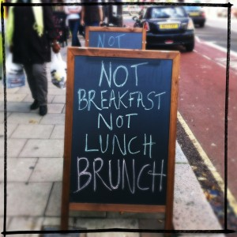
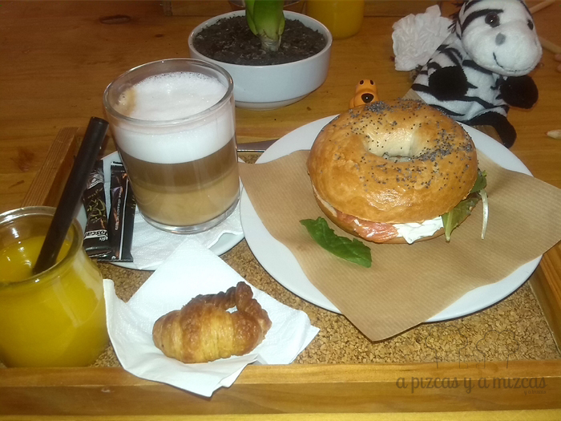
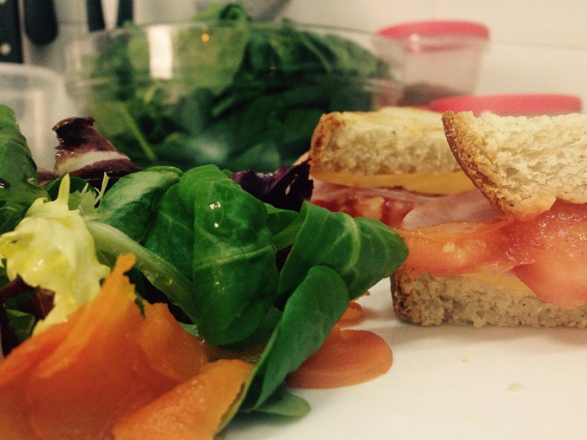
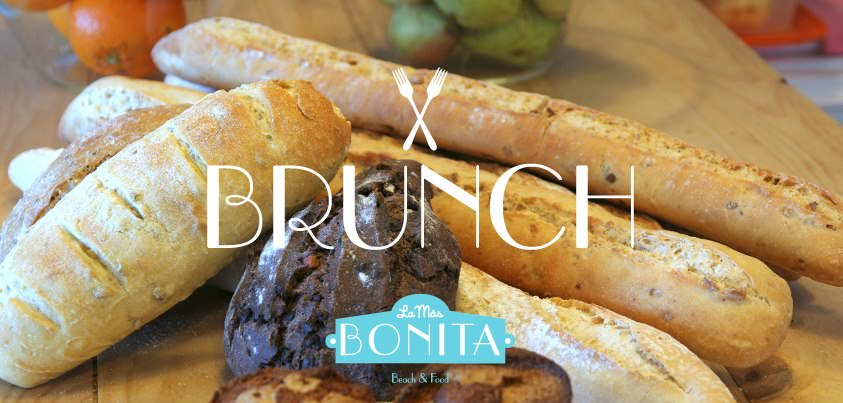
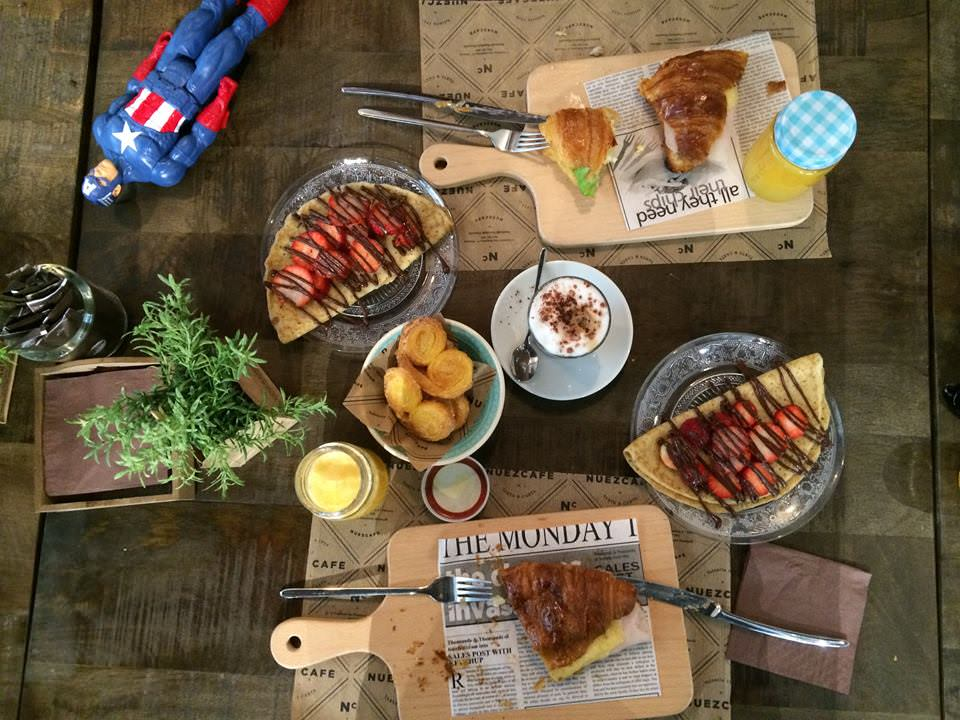
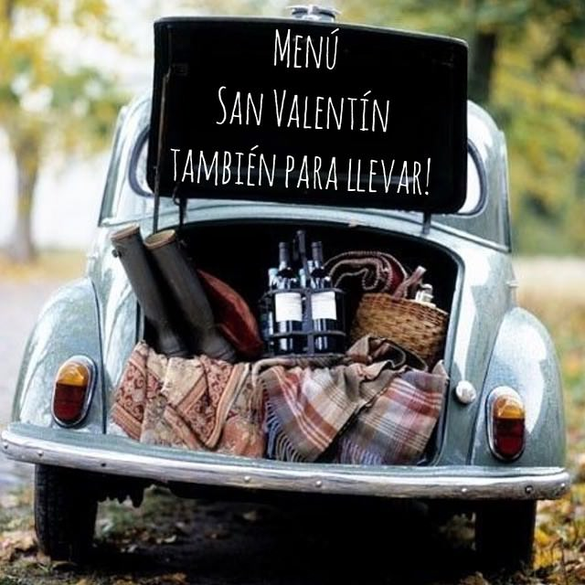
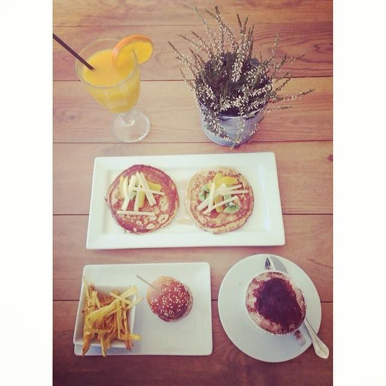
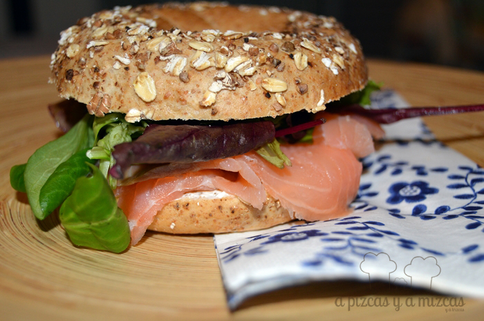

El próximo sábado llega San Valentín y aunque mucha gente dice que es un invento en favor del consumismo (y seguramente tienen razón), lo cierto es que es un día en el que nos gusta hacer cosas especiales. Aprovechando que este año la celebración coincide con el fin de semana, os proponemos que empecéis el día con un brunch de San Valentín en Valencia.

Empezar este día con un [brunch](/tag/brunch/ "Brunch") tiene infinitas ventajas. La primera es que arrancas el día de la mejor manera posible y te obliga a aprovechar más si cabe la jornada. También es una forma de [salir a comer fuera de casa](/restaurantes/ "Restaurantes") con tu pareja pero sin realizar un gasto muy elevado.

 Brunch. Foto: Louise McLaren.

Os planteamos aquí algunos de los [brunch](/tag/brunch/ "Brunch") de San Valentín en Valencia que más nos gustan.

Arrancamos con el brunch de [Dulce de Leche](https://www.facebook.com/DulceDeLecheRuzafa?fref=ts "Facebook Dulce de Leche Ruzafa"), uno de los pioneros en esto de poner de moda el brunch estilo neoyorkino en nuestra ciudad. [Ya os contamos](/el-brunch-de-dulce-de-leche-en-ruzafa/ "Brunch en Dulce de Leche") cómo es un brunch en este establecimiento. Seguro que os encanta el local, con su decoración y el ambiente que se respira.

Siguiendo en el [barrio de Ruzafa](/tag/ruzafa/ "Ruzafa"), otro lugar ideal para tomar un brunch de San Valentín en Valencia es [Circa](https://www.facebook.com/circadulcesyhelados/timeline "Facebook Circa"). Nos han hablado genial de este sitio y lo tenemos marcado en la agenda en letras rojas para ir. Mirad lo que proponen para este brunch de San Valentín:

 Imagen del Facebook de Circa.

Para comenzar el día de una forma diferente, Circa plantea un brunch de enamorados representado en tres actos.

**Primer acto:**

- Ensalada de zanahoria rallada, crujientes dados de manzana, canela y miel.
- Milhojas de vegetales y queso ardido.

**Segundo acto:**

- Creppe de salmón rosado entrelazado con calabaza y servidos con crema de salvia sabia.

**Tercer Acto:**

- Lunares de chocolate Helado de crema con chips de oreo y salsa de dulce de leche hirviente.

**Además:**

- Zumo.
- Limonada de fresas.
- Café Illy, infusion.
- Brindis : lemon Champ.

Por 9 euros! Es necesario la reserva previa. Como véis, merece la pena y mucho.

Otra opción en Ruzafa es [La Más Bonita](http://www.lamasbonita.es/ "La Más Bonita"), aunque para hacer el brunch de San Valentín en Valencia más especial si cabe os recomendamos el original, en la playa de la Patacona. Allí si sale un buen día el marco es inmejorable. [Nosotros hemos estado allí](/la-mas-bonita-en-la-playa-de-la-patacona/ "‘La más bonita’ en la playa de la Patacona") para cenar y también en el brunch y nos tiene enamorados.

Si nos acercamos al [centro de Valencia](/tag/valencia/ "Centro de Valencia") también tenemos opciones muy apetecibles para arrancar el día de los enamorados con un brunch rico, rico, en [La Petite Brioche](https://www.facebook.com/LaPetiteBrioche?fref=ts "Facebook La Petite Brioche"). [Es uno de nuestros fijos para la merienda](/la-petite-brioche/ "La Petite Brioche"). Las tartas son fantásticas. Un ejemplo de brunch en La Petite Brioche es el siguiente:

- Pizza melanzana hecha con tomate casero, mozzarella, berenjena caramelizada, parmesano y balsámico.
- Mini coca de llanda casera.
- Café.
- Zumo de naranja natural.

Por 6 euros.

Cerca encontramos la Pastelería Nuez Café. Nosotros todavía no lo hemos probado, pero también lo tenemos anotado como pendiente.

 Brunch de Pastelería Nuez Café. Imagen de su Facebook.

Y algo más alejado, por la zona de la Ciudad de las Artes y las Ciencias, en [Cocotte & Co](https://www.facebook.com/cocotteandcovalencia?fref=ts "Facebook Cocotte & Co") podéis tomar un brunch de San Valentín en Valencia. Como novedad, [Cocotte & Co](/restaurante-cocotte-co-en-valencia/ "Coccote & Co"), propone un menú de San Valentín para llevar a casa y no tener que preocuparte de nada.

Y si no te importa cocinar, aquí tienes alguna de las recetas que hemos preparado para [un rico brunch](/tag/brunch/ "Brunch") en A Pizcas y a Mizcas. [Como por ejemplo éste bagel de salmón](/bagel-de-salmon/ "Bagel de salmón"):

O éstas otras [recetas para un rico brunch](/tag/brunch/ "Brunch"):
