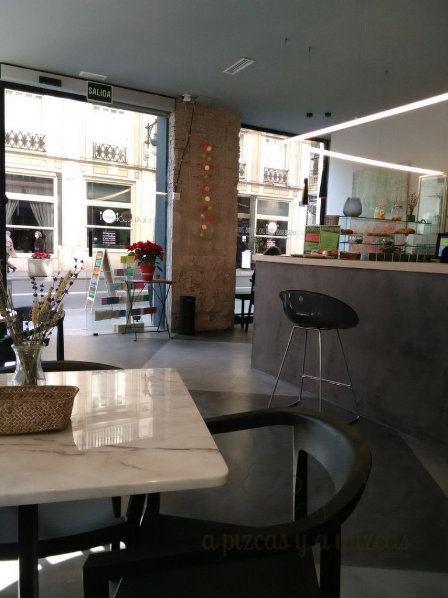
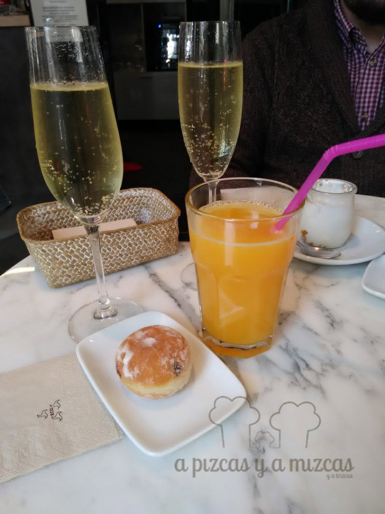
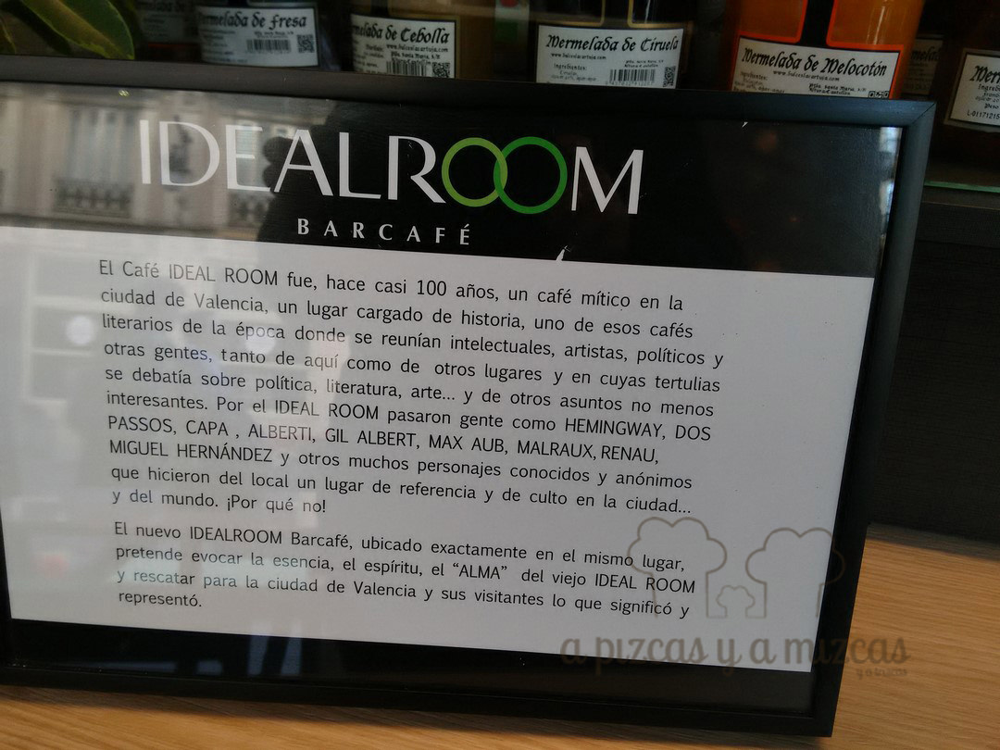

Ahora que ya hemos vuelto a la rutina... aprovechamos para contaros algunas de las cosas que hicimos estas navidades. A los que nos seguís en instagram... seguro que algo ya sabéis... pero a nosotros nos gusta explicaros todo... Aprovechamos uno de los días de vacaciones de Pizcas para ir a probar el brunch de [Idealroom](http://idealroom.es/ideal-room/), situado en el centro de Valencia, en la calle de la Paz, 19, esquina con la Calle ComediasLlegamos sobre las 12.00 y cómo ya habíamos visto que todos los días preparaban brunch.... no pensamos en otra opción. Nos informaron que incluía el brunch del día y ya está. Ofrecen brunch todos los días de la semana!

Fuímos entre semana y con Trizcas... que estuvo todo el rato por ahí revoloteando y cantando... ji ji ji. Ese día el brunch estaba compuesto de:

## El brunch de Idealroom

- **Comida**: ⭐⭐⭐
- **Local**: ⭐⭐⭐⭐
- **Servicio**: ⭐⭐⭐⭐

- Zumo de naranja o yogur con mermelada y cereales
- Té o café
- Copa de cava
- Una pelotita rellena de chocolate
- Y ratatouille de verdura con huevo acompañado de tostas de pan

 IdealRoom Valencia

 Nuestro brunch en IdealRoom

Un almuerzo muy completo y muy rico en un lugar muy agradable en el centro de Valencia. Además nos enteramos que es un lugar lleno de historia.

 La historia de IdealRoom

Idealroom fue durante una época lugar de reunión de intelectuales, artistas, periodistas, diplomáticos...Fue un lugar de referencia en la ciudad. Se dieron cita Hemingway o Max Aub, Alberti...

Han conseguido recrear aquella imagen de Idealroom tal y como lo describía Max Aub "Los veladores de mármol lechoso, el piso de baldosines blancos y negros, los espejos que recubren las paredes, los ventiladores que cuelgan del techo"

Así se describen ellos mismos "el nuevo IDEALROOM es un lugar cosmopolita y ecléctico, un lugar de encuentro de la gente de aquí y de la gente allá, abierto a todos y para todos en un ambiente agradable y distendido, al tiempo que se degusta una amplia selección de comidas y bebidas, un poco de todo, bueno y sencillo, a la vez que se contempla el devenir de la gente a través de sus amplios ventanales mientras se hojea alguna revista internacional o se lee la prensa de aquí."

Estuvimos muy bien rodeados de tanta historia!
