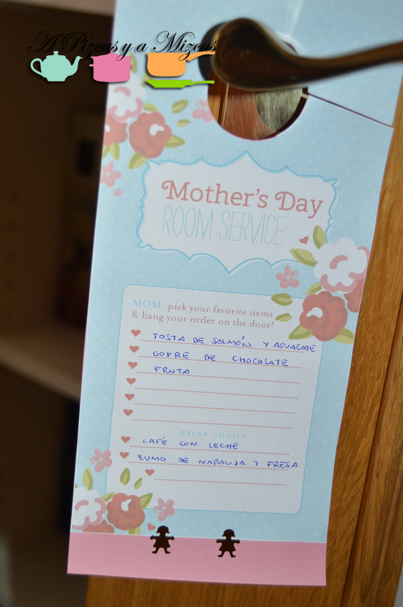
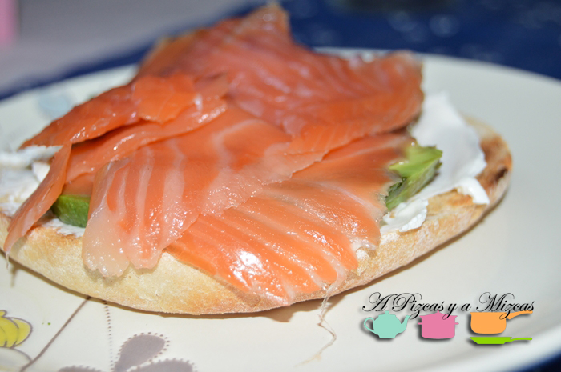
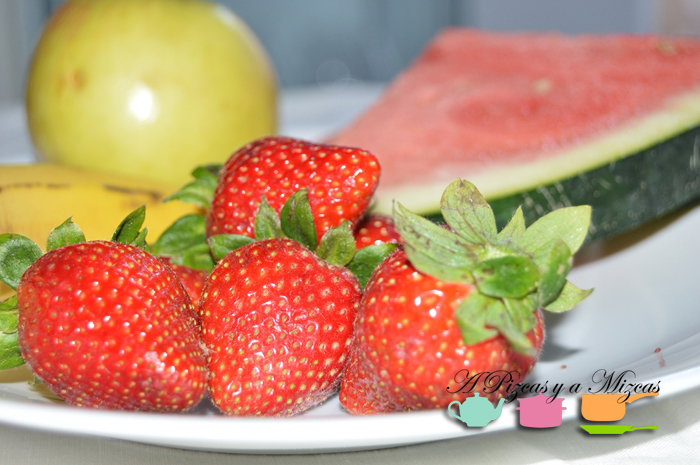
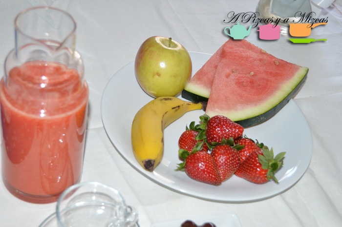
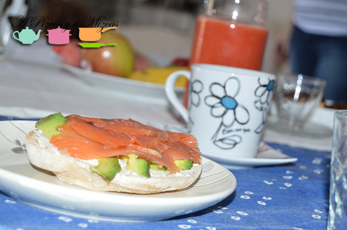
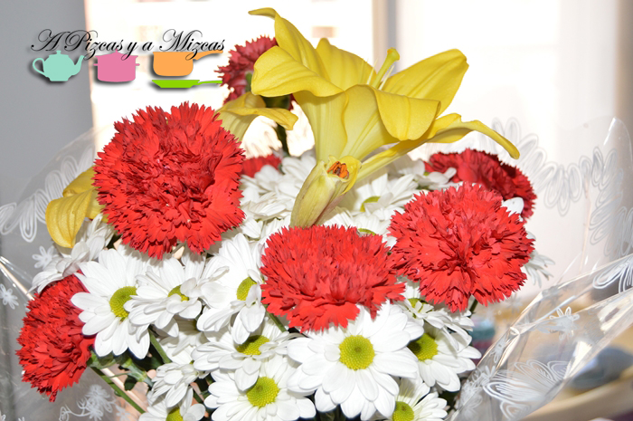

En este Día de la Madre, Pizcas y Trizcas le hemos preparado a Mizcas un brunch muy especial, con todo nuestro cariño, para decirle la mamá tan maravillosa que es. Además, al ser un brunch nos hemos saltado la comida y hemos estirado unas horitas más este domingo de mayo.

## Nuestro brunch para mamá

Lo primero que hicimos fue preguntarle unos días antes a mamá qué le apetecería desayunar en su día, para ir teniendo previsión. Tras las indagaciones pertinentes obtuvimos nuestra "comanda" para el brunch, que iba a consistir en:

- Una tosta de mollete con salmón, queso de untar y aguacate

- Un gofre de chocolate

- Fruta natural (fresas, manzana y sandía)

- Zumo de naranja y fresa

- Café con leche

Como veis, un brunch de lo más completo.

Para que quedara todo más bonito, utilizamos estos imprimibles (el que tiene forma de cartel de puerta de habitación de hotel y el cartelito del día de la madre), que se pueden descargar [aquí](http://blog.hwtm.com/2013/05/free-mothers-day-printables-from-hwtm-web-round-up/ "descargables") (lo vimos en el blog de [Escarabajos, bichos y mariposas](http://www.escarabajosbichosymariposas.com "Escarabajos, bichos y mariposas")). Nosotros los pegamos en una cartulina rosa, recortamos con tijeras de zig-zag y perforamos con un perforador en forma de niña. Así nos quedó, perfecto para decorar la mesa del brunch de mamá.

Para la tosta utilizamos, medio pan de mollete, lo tostamos ligeramente. Lo untamos con queso Philadelphia, colocamos unas rodajas de aguacate maduro y varias lonchas de salmón ahumado.

El gofre con chocolate lo compramos ya preparado.

El zumo que preparamos es muy sencillo: naranja exprimida, y un buen puñado de fresas, dos cucharaditas de azúcar y... a la batidora.

El ingrediente secreto  para mamá fue un ramó de floretes que compró Pizcas y mil besos y risas de la peque Trizcas, que disfrutó de la sandía.

A veces los detalles convierten un domingo en un Día de la Madre de lo más fantástico!!
