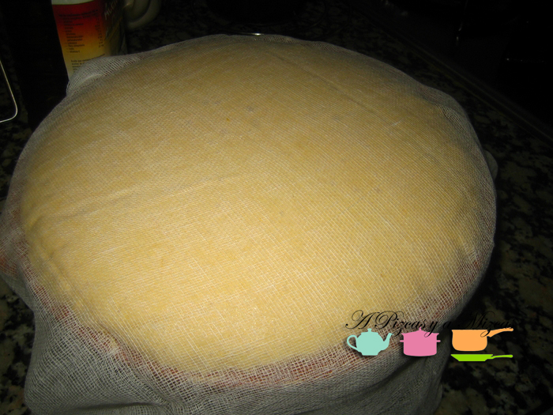
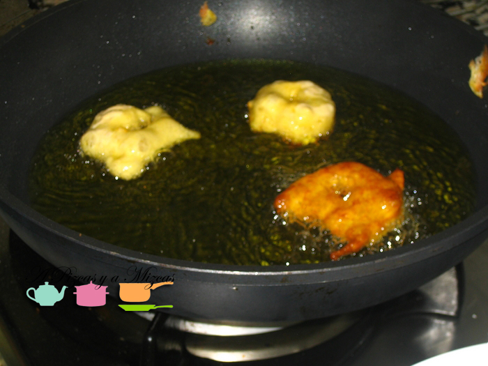
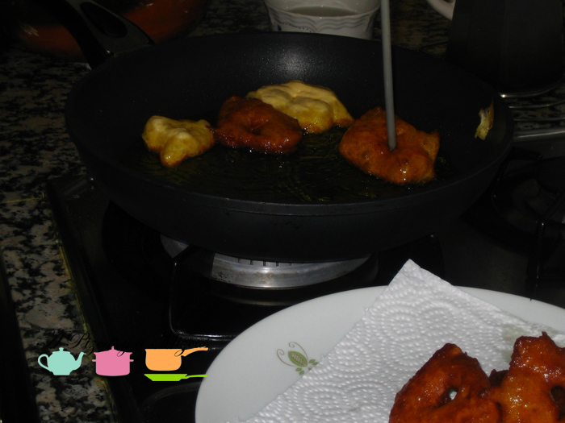
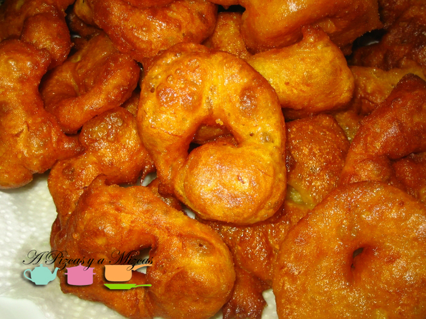
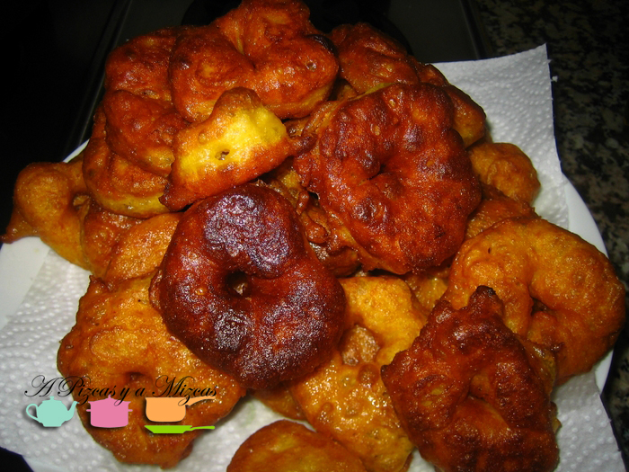

Ahora que se han acabado las Fallas, hemos conseguido la auténtica receta de los buñuelos de calabaza. Así que como dice el dicho "más vale tarde que nunca".

Después de pasear por todos los puestos de churros/buñuelos durante estos días de fallas no hemos encontrado ningún sitio que los hagan como en Alginet (el pueblo de Mizcas). Cuando pegas un bocadito puedes ver con tus ojos que lleva calabaza y el sabor es inconfundible.

La receta la hemos sacado de una recopilación que ha hecho Mª Carmen García (una vecina de Alginet) de las recetas de cocina casera que hacía su madre (Receptes de cuina casolana valenciana. Carmen la Beniopa. Alginet).

## Ingredientes

- 750 gramos de calabaza asada (la calabaza cruda pesa el doble)
- 400 gramos de harina
- 120 gramos de levadura panadera
- 125 ml de agua
- 2 litros de aceite de girasol
- azúcar

Ya tenemos listos los ingredientes... ahora vamos al lío.

En primer lugar separamos la carne de la calabaza quitándole las pepitas, la cáscara y los hilos. La ponemos en un recipiente grande y alto, añadimos la harina y lo mezclaremos todo bien con las manos.

En un cazo, ponemos medio vaso de agua templada y desmenuzamos la levadura. Lo añadimos a la masa y removemos durante unos 8 minutos.

A continuación tapamos el recipiento con un paño de cocina, ahora la masa aumentará al doble de lo  que era. La textura de la masa tienen que quedar blandita (ni caldosa, ni apretada). El tiempo que cuesta en subir la masa dependerá de la temperatura ambiente, costará aproximadamente unos 45 minutos.

En una sartén honda pondremos bastante aceite, cuando esté caliente, empezaremos a freír los buñuelos. Con una mano cogeremos la masa y sacaremos un poquito de masa por arriba con la mano cerrada, con la otra mano, nos la mojamos con agua, y cogemos la masa poniéndole el dedo gordo en el centro para hacer el agujerito, y lo introducimos en la sartén para freír. Tienen que quedar doraditos. También os podeís ayudar de una aguja de punto para moverlos en la sartén y darle la forma al agujero del buñuelo... aunque para eso cada maestrillo tiene su librillo.

Tenéis que tener cuidado con el fuego, si está demasiado fuerte no se harán bien por dentro, y si está poco caliente, cogerán demasiado aceite.

A disfrutar de los auténticos buñuelos de calabaza

