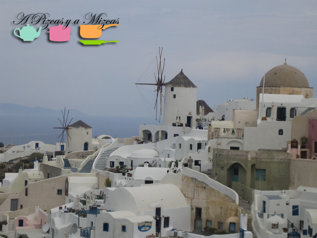
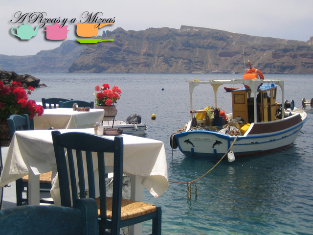
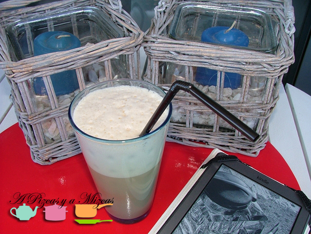

Ahora que parece que el buen tiempo está al caer.... ha llegado el momento de estrenar la terraza! Y lo hemos celebrado con un café frappé y recordando nuestro viaje a Grecia que fue cuando descubrimos este café helado.

Aún me acuerdo la terracita donde nos tomamos ese primer café frappé en Santorini ... son unas islas preciosas y seguro que volveremos para que Trizcas pueda conocerlas.

Si queréis saber un poquito la historia de este café podéis encontrarla [aquí](http://es.wikipedia.org/wiki/Caf%C3%A9_frapp%C3%A9). Hay veces que las cosas se descubren por casualidad... je je je.... Esta casualidad se ha convertido en la bebida más popular de Grecia. Ha sido calificado de café nacional griego y se sirve en las cafeterías acompañado de un vaso de agua.

## Ingredientes para preparar café frappé:

- Un sobrecito de nescafé (nosotros elegimos descafeinado)
- Medio vaso de leche desnatada
- Medio vaso de agua muy fría
- Dos cubitos de hielo
- Azúcar al gusto

La preparación es muy sencilla. Ponemos el hielo, la leche y el agua en el vaso de la batidora, añadimos el azúcar y batimos todo hasta que salga bastante espuma.

Lo pasamos a un vaso alto de boca ancha y con una pajita... ya tenemos preparado nuestro café frappé para disfrutarlo y trasladarnos a Grecia desde nuestra terraza.

Nosotros lo hemos preparado con leche pero también lo podeis preparar solo... eso ya según el gusto de cada uno.

De esta forma... queda inagurada oficialmente nuestra terraza... esperamos que el buen tiempo nos acompañe.
