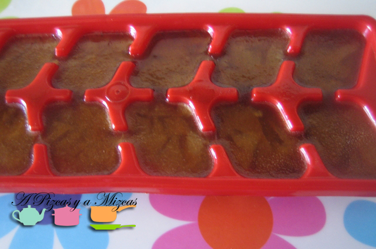
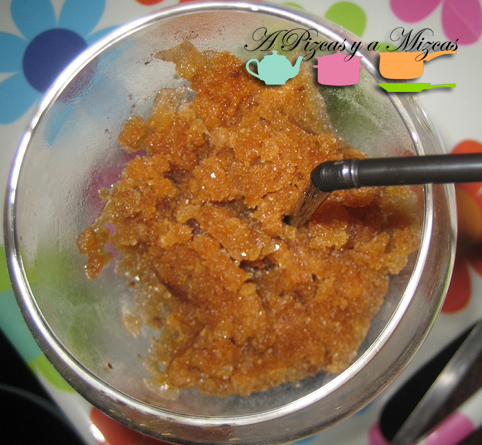
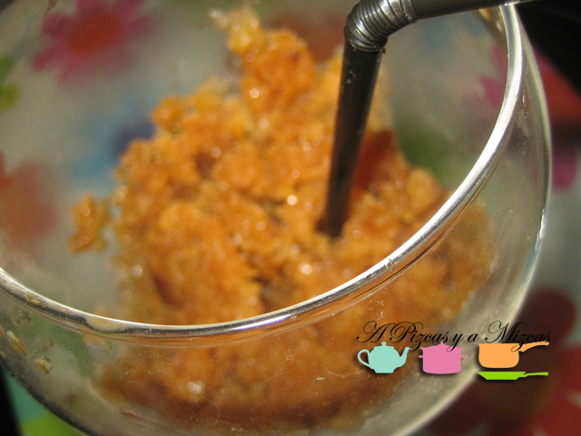
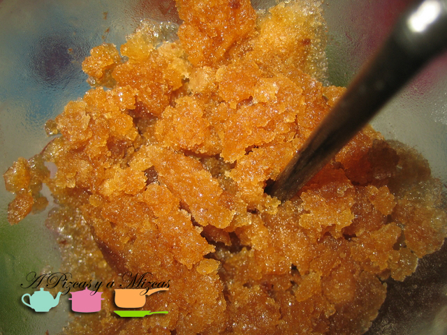

Esta semana ha llegado el calorcito.... llevábamos tiempo esperándolo y al final ha llegado a nuestras vidas. Y algo tenemos que pensar para refrescarnos cada día... así que ahí va nuestra propuesta para enfriar el verano. El café granizado con el truquito que os vamos a contar es rápido de preparar y lo podéis tener en el congelador y en unos minutos en la terracita disfrutando de un café granizado como el de la horchatería.

## Ingredientes para preparar el café granizado

- 4 cafés expresos
- 1/2 litro de agua mineral
- 100 ml de azúcar
- cáscara de un limón
- 1/2 cucharadita de canela en polvo

Preparamos los cafés de forma tradicional. Verter el agua mineral en un cazo grande al fuego, agregar el azúcar y la cáscara de un limón y calentar hasta que se disuelva. Añadir los cafés y 1/2 cucharadita de canela, remover bien.

Hasta aquí no os hemos descubierto nada nuevo...

Y aquí es nuestro pequeño truqui. Vertemos la preparación de café en bandejas de cubitos de hielo. Introducimos las bandejas en el congelador y , cuando ya estén congelados (una hora aproximadamente), colocar los cubitos en la picadora y triturar.

Más fácil de preparar... asi nos evitamos tener que remover hasta conseguir la textura de granizado... De esta forma conseguimos la textura perfecta de granizado... contadnos cuando lo preparéis!

A disfrutar del verano. Viva el verano!

