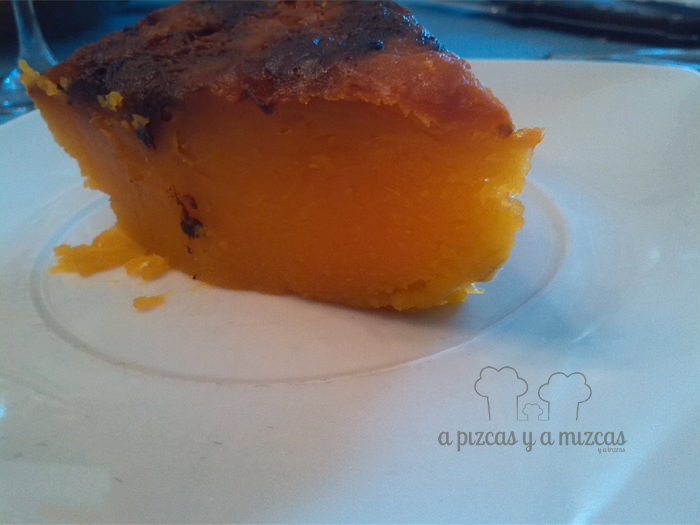

Cuando empieza el otoño llegan las calabazas... y nosotros siempre esperamos que el iaio Mizcas venga cargado de calabazas para hacer un montón de recetas ricas con ella. Aunque la más sencilla y nuestra preferida es la calabaza asada...

En casa de A Pizcas y a Mizcas nos encanta preparar platos con calabaza, tanto dulces, como salados y éstos son algunos de los que hemos preparado:

\- [Crema de calabaza](/crema-de-calabaza/)

\- [Coca de calabaza](/coca-de-calabaza/) (una de nuestras favoritas)

\- [Buñuelos de calabaza](/bunuelos-de-calabaza/)

\- [Couscous de calabaza y zanahoria](/couscous-con-calabaza-y-zanahoria/)

Ahora incorporamos la calabaza asada... ya veis nos encanta la versatilidad de este fruto!

## Ingredientes para preparar la calabaza asada

- una calabaza
- azúcar
- canela
- miel

Primero lavamos bien y secamos la calabaza. Después cortamos con cuidado ya que la piel de la calabaza es un poco dura.

Cortamos la calabaza en dos mitades a lo ancho.

Precalentamos el horno a 200º.  Y ponemos los trozos de calabaza en una bandeja apta para el horno con papel de hornear.

Hornearemos durante unos 50 minutos aproximadamente. La calabaza estará lista cuando esté dorada y al pincharla esté blandita. Si transcurrido el tiempo no está suficientemente dorada podéis subir un poco la temperatura del horno (por la parte de arriba) hasta que esté más dorada.

Si queréis comerla de postre podéis acompañarla con un chorrito de miel o un poco de azúcar y canela.

A la rica calabaza...

Un dulce muy sencillo de preparar y riquísimo!
