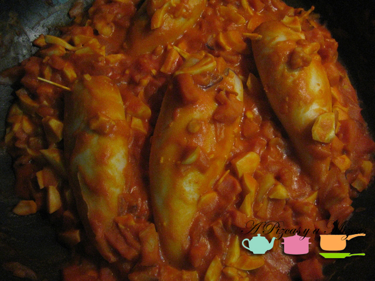
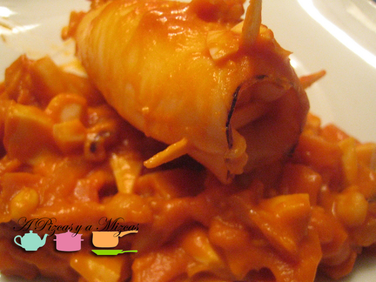

Esta receta se la tomamos prestada a la madre de Mizcas. Y de paso tenemos que decir que los calamares rellenos es una de los platos preferidos de Mizcas... pero sólo los que prepara la yaya Mizcas. Y es que como mamá no cocina nadie... y los calamares no iban a ser menos.

Tenemos que decir que la yaya Mizcas cogió prestada la receta hace unos cuantos años de un libro de cocina (200 recetas seleccionadas de la cocina familiar) aunque con algunas modificaciones. Ahora os lo explicamos...

## Ingredientes para preparar los calamares rellenos (para 4 personas)

- 8 calamares medianos
- 200 gramos de taquitos de jamón york
- 2 huevos cocidos
- una cebolla mediana
- un ajo
- aceite de oliva virgen extra
- un vasito de vino blanco
- tomate frito

Limpiamos los calamares y los enjuagamos bien. Y a continuación prepararemos el relleno de nuestros calamares. En una sartén ponemos la cebolla a pochar y un ajito laminado. Después incorporamos las patitas del calamar, los taquitos de jamón york y el huevo picado. Rehogamos todo un poco y después echamos el tomate frito y la medio vasito de vino blanco que dejaremos hasta que se evapore el alcohol.

Ahora vamos a por los calamares, los pondremos en una cacerola con un vaso de agua y el medio vaso de vino blanco y un ajito. Los dejaremos durante 10 minutos aproximadamente. Asi los calamares estarán más blanditos.

Llegó el turno de los trabajo manuales... a rellenar los calamares. Con la ayuda de una cuchara vamos rellenando los calamares y ponemos unos palillos para cerrarlos para que no se salga el relleno. Asi con todos vuestros calamares. Después los ponemos todos en un recipiente apto para el horno y echamos por encima el relleno que haya sobrado.

Precalentamos el horno a 180º e introducimos la fuente con los calamares durante 15 minutos aproximadamente.

Ya tenemos listos nuestros calamares rellenos... ahora sólo toca disfrutar... Bon profit!

