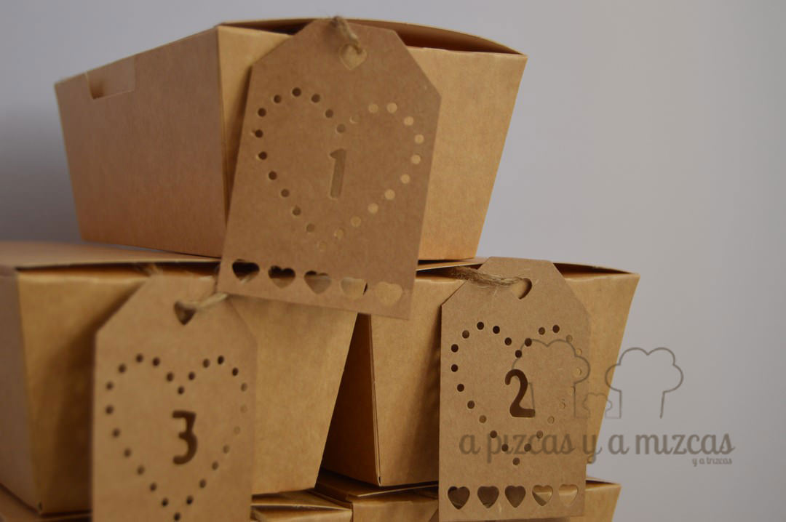
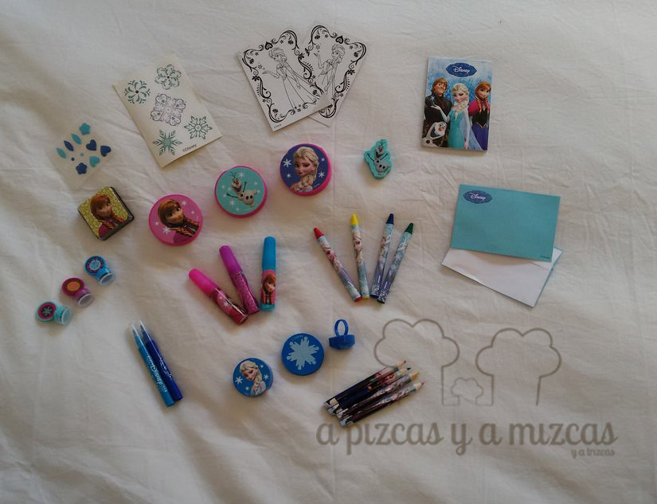
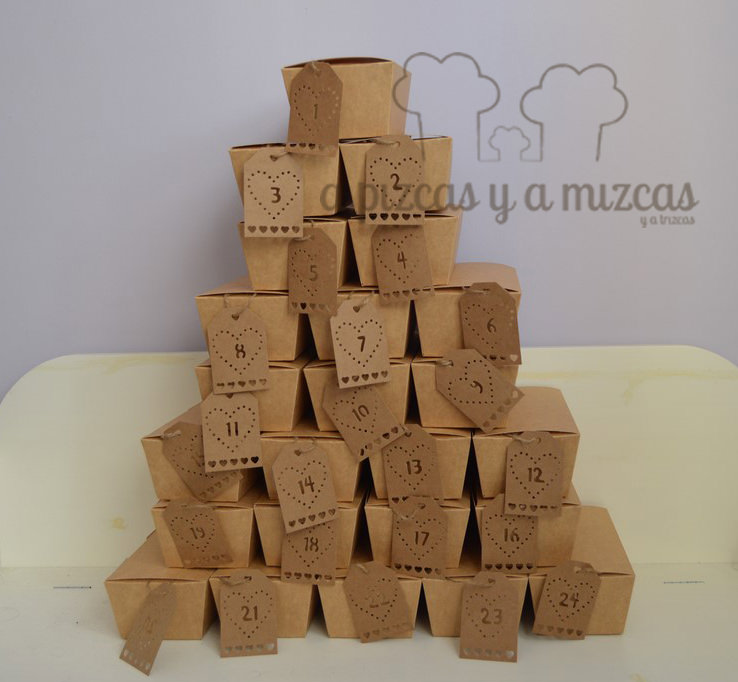

En apenas tres días tenemos que tener preparado el [calendario de adviento](/calendario-de-adviento/). Y después del éxito del que preparamos las navidades pasadas este año Trizcas ya está reclamando el suyo... y es que a Trizcas le encantan las sorpresas... ji ji ji

El calendario de adviento de este año lo vamos a montar en menos de cinco minutos, así que este fin de semana lo podéis preparar...

## Materiales para el calendario de adviento

- 24 cajitas
- 24 etiquetas numeradas
- cuerda
- sorpresitas

Nosotros escogimos 24 cajitas iguales y las colocamos formando un arbol de navidad. Pero como siempre os decimos la imaginación al poder y ya sabéis hay un montón de opciones.

En cada una de las cajitas pusimos el número correspondiente al día que compramos en [Tiger](http://www.tiger-stores.es/), si echaís un vistazo en su [catálogo de navidad](http://www.tiger-stores.es/tiger_flyer.html) encontraréis un montón de ideas para vuestro calendario de adviento y también para toda la decoración navideña. Y es que es muy difícil salir de Tiger sin comprar nada... ji ji

Las etiquetitas de Tiger

Por último, y lo más importante, rellenar todas las cajas del calendario. Para eso recurrimos a Lidl donde a principio de noviembre sacaron un calendario de adviento de Frozen con un montón de cositas para rellenar nuestras cajitas.

sorpresitas de Frozen para Trizcas... shhh que no se entere

Aunque seguro que no faltarán en nuestro calendario chocolatinas y caramelos... y vosotros que sorpresas ponéis?

Así la cuenta atrás para la navidad se pasa más rápido :)
