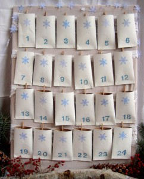
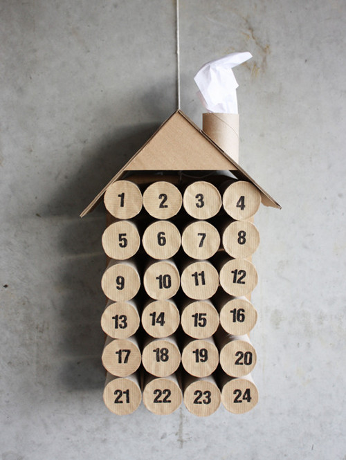
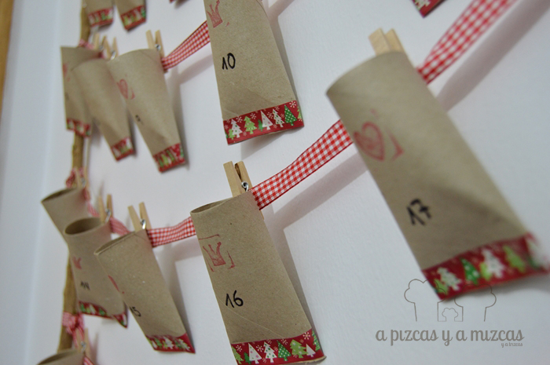
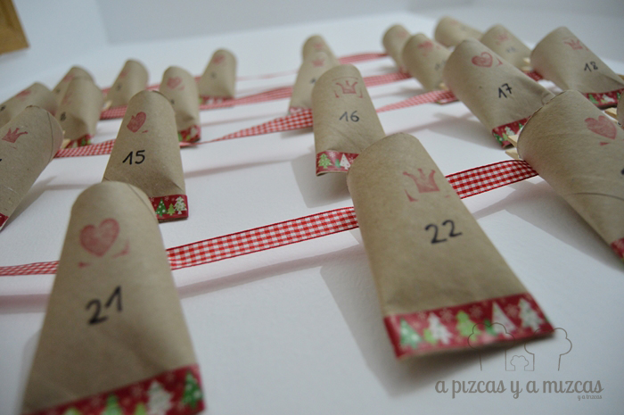
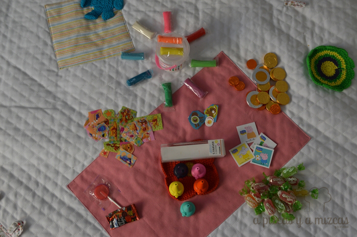

Nos quedan menos de 15 días para finalizar noviembre... y recibir diciembre y las navidades!! Que en dos días estamos cantando villancicos y comiendo polvorones. Este año para que la cuenta atrás sea más divertida hemos hecho un calendario de adviento, seguro que a Trizcas le encanta tener cada día un pequeña sorpresa hasta el día de Nochebuena.

Es el primer año que hacemos un calendario de adviento. Teníamos claro que lo queríamos hacer nosotros mismos y que no llevara mucho tiempo de elaborar.  Así que nos dimos un paseíto por las redes para buscar el que más se acoplara a nosotros. Estos son algunos de los ejemplos que más nos gustaron

Al final nos decidimos por hacer un calendario de adviento reutilizando los rollos de papel higiénico y dándole nuestro propio estilo. A ver qué os parece?

## Materiales para hacer el calendario de adviento

- 24 rollitos de papel higiénico
- 2 ramas de árbol
- una cinta decorativa
- rotulador permanente
- washi tape navideño
- pinzas de madera pequeñas
- regalitos para cada día

Es una manualidad muy sencilla de realizar. Encontramos las ramas en un parque, intentad que sean ramas del mismo grosor y cortadlas con una longitud de unos 80 cm. Estuvimos dudando entre pintarlas o no y finalmente nos decantamos por dejarlas al natural.

Para conseguir los rollos de papel higiénico necesarios para el calendario y  hacerlo además en un tiempo record movilizamos a todos los familiares. Así en unos días reunimos los necesarios. Para realilzar los 24 paquetitos de nuestro calendario de adviento grapamos la parte inferior de cada rollo de papel higiénico, lo decoramos con sellos de goma en forma de corazón y de corona, y disimulamos la grapa con un trocito de washi tape con motivos navideños. En cada rollo indicamos el número del día (del 1 al 24) con un rotulador permanente.

Ahora atamos la cinta decorativa a los palos nosotros hicimos cuatro filas y colgamos seis rollos en cada una con las mini pinzas de madera.

Ya está listo el calendario de adviento ahora toca rellenarlo para que los peques encuentren una mini sorpresa cada día. Nosotros lo vamos a rellenar con: caramelos blanditos, monedas de chocolate, pegatinas, lápices de colores que se colocan en los dedos, plastelinas y alguna figurita del belén....

Además hemos pensado conforme Trizcas vaya descubriendo las sorpresillas sustituiremos los rollos de papel higiénico por fotos navideñas. De esta forma convertimos el calendario en un adorno navideño.
