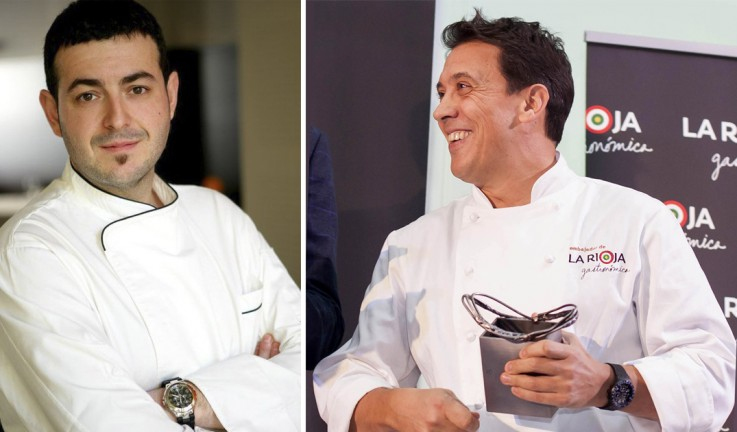

La entidad de promoción agroalimentaria del Gobierno de La Rioja, La Rioja Capital, ha organizado una nueva visita de ‘La Rioja Gastronómica’ el martes 23 y el miércoles 24, en esta ocasión a Valencia, con la ‘Conversación en torno a la Gastronomía’, que contará con  presencia del cocinero valenciano Ricard Camarena (1 Estrella Michelín en Ricard Camarena Restaurant) y el riojano Francis Paniego (2 estrellas Michelín en El Portal del Echaurren, 1 Estrella Michelín en Marqués de Riscal), y la ‘Experiencia sabores de La Rioja’, dirigida por el periodista José Ribagorda y que es una de las novedades de este año dentro del programa.

Ambas iniciativas, destinadas al público profesional, se celebrarán a partir de las 19.30  horas en el restaurante Alto de Colón, ubicado en Mercado de Colón y previamente se ofrecerá un vermú de Martínez Lacuesta.

‘La Rioja Gastronómica’ es una campaña con la que La Rioja Capital pretende promocionar los Alimentos de La Rioja, dentro y fuera de la Comunidad Autónoma, con el fin de proyectar los principales valores con los que cuenta la región a través de la gastronomía para, después, promover su disfrute en origen.

En la ‘Conversación en torno a la Gastronomía’, dirigida por el experto gastronómico Mikel Zeberio, recientemente este año Premio Nacional de Gastronomía, los cocineros disertarán sobre las materias primas y sus aplicaciones culinarias, mientras el centenar de asistentes degustará tres pinchos acompañados de tres vinos.

Los pinchos que se catarán en Valencia son Cucurucho de ensaladilla ‘Ricard Camarena’, Pastiset de boniato y foie, y Galleta oreo de parmesano y bacon al maridaje de Rioja, maridados con los vinos Ad Libitum Maturana tinta 2016, Peña El Gato Garnacha Centenaria 2016 y Peña el Gato natural, de Bodegas Juan Carlos Sancha.

En la ‘Experiencia Sabores de La Rioja’, que se celebrará el miércoles, los 150  asistentes podrán degustar las principales, y diferenciales, condiciones organolépticas que aporta La Rioja a la cultura culinaria. Para ello, y de la mano del periodista José Ribagorda y del experto gastronómico Mikel Zeberio, se ofrecerá un recorrido guiado por los Alimentos de La Rioja, amparados por un distintivo de calidad, que dan personalidad a la cocina riojana. Los ‘Sabores de La Rioja’ están coordinados por el cocinero Ventura Martínez (Chef Nino, Delicatto)

Los asistentes podrán degustar sabores peculiares de la cocina riojana como el ‘Cremoso de Coliflor de Calahorra’, el ‘Champiñón’, la ‘Alegría riojana rellena’, la Alubia de Anguiano, la ‘Ternera de Ternoja con Pimiento Riojano sobre sofrito tradicional’, las ‘Chuletillas de Cordero Chamarito al sarmiento’, las Peras de Rincón de Soto con zurracapote, el Chorizo Riojano, el Queso Camerano y el Aceite de La Rioja, entre otros. Los pinchos estarán maridados en esta ocasión con vinos de Bodegas Tobía (Alma de Tobía Rosado Fermentado en Barrica, Óscar Tobía Tinto Reserva 2014 y Tobía Selección de Autor Tinto 2015).

## **La Rioja Gastronómica**

‘La Rioja Gastronómica’ es una campaña de promoción de los Alimentos de La Rioja y de la gastronomía de esta Comunidad Autónoma que se inició el año pasado, con el nombramiento de Francis Paniego como embajador de esta iniciativa, de la que son ‘Amigos’ Sergio y Javier Torres (2017) y Elena Arzak (2018).

Además de Galicia, ‘La Rioja Gastronómica’ ha visitado Zaragoza en marzo, Gijón en mayo y La Coruña en junio y está previsto que se celebre en Málaga en noviembre, completando así los mercados objetivo que se iniciaron el año pasado con actividades promocionales en Madrid, Santander, San Sebastián, Bilbao y Barcelona, con cocineros de prestigio en destino (Javier Estévez, Sacha Hormaechea, Jesús Sánchez, Sergio Bastard, Aitor Arregi, Ramón Roteta, Jesús Santamaría, Josemi Olazabalaga, Ion Gómez, José Santiago y Sergio y Javier Torres) acompañados de representantes de la culinaria riojana (Francis Paniego, Ignacio Echapresto, Ventura Martínez, Ramón Piñeiro y Pedro Masip).

Más de un millar de prescriptores culinarios y agroalimentarios asistieron a estas jornadas en 2017, un número que se pretende superar en esta edición. Para ello, se sigue contando con la presencia de cocineros de la talla de Roberto Alfaro en Zaragoza, Nacho Manzano en Gijón, Pepe Solla en Galicia y Ricard Camarena en Valencia y José Carlos García en Málaga. Todos ellos se convierten, por un día, en representantes de la cocina riojana en sus lugares de origen, siempre acompañados de representantes de nuestra tierra como Francis Paniego, Ramón Piñeiro, Pedro Masip y Ventura Martínez, entre otros cocineros riojanos.

Además de las actividades señaladas, ‘La Rioja Gastronómica’ incluye el Concurso de Pinchos de La Rioja, que este año ha celebrado su XVII edición; colaboraciones con el Basque Culinay Center y otros centros educativos, y diversas catas maridadas en diversas localidades riojanas.

‘La Rioja Gastronómica’ propone, de esta forma, un recorrido por la identidad riojana volcada en la culinaria y todo su contexto, como principal reclamo para disfrutar de una región que, como indica el eslogan de la campaña, ‘invita a la mesa’.
