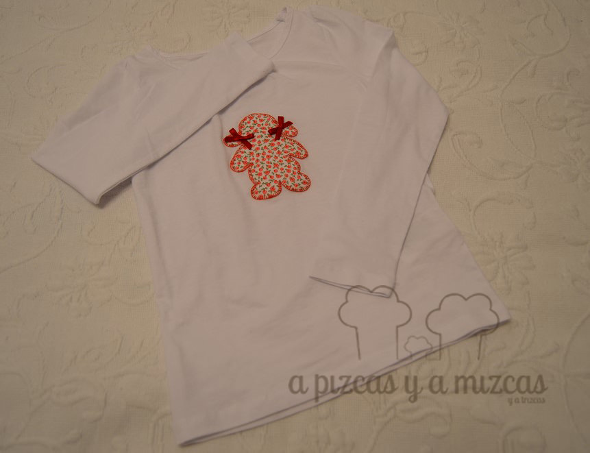

Como ya os conté en el post de [personaliza los vaqueros de los peques](/personaliza-los-vaqueros-de-los-peques/) antes de empezar el cole compramos unas cuantas camisetas básicas. Y cuando voy teniendo algo de "tiempo" voy dándole otro rollito a todas esas camisetas... y con una de ella se me ocurrió hacer la silueta de una niña... sigue leyendo y descubre cómo ha quedado la camiseta niña...De la parte del dibujo se encargó Pizcas... que para eso tiene más gracia. De lo demás me encargué yo (y un poquito la iaia Mizcas) busqué un retalito de flores rojas (me encantan las flores) y a recortar! Busqué un hilo a juego y a coser!

Busqué una cinta de raso rojo para hacer unos lacitos para las coletas de la "niña" y aquí viene la ayuda de la iaia Mizcas (que hace los lazos más bonitos del mundo mundial) le cosí los dos lacitos y así de bonita nos ha quedado la camiseta niña.

Camiseta niña para Trizcas

Y es que no todo va a ser Frozen y la Patrulla Canina... ji ji ji.... aunque muchas mañana me toque pelearme con Trizcas por la ropa que hay que ponerse. Yo creo que este camiseta va a ser una de sus favoritas... ji ji ji

Además puede ser una buena idea de regalo low cost para estas navidades... además hecho con tus manitas! Si os animais a customizar alguna camiseta... queremos foto! ji ji ji

Y si os ha gustado nuestra camiseta niña pero sois de los que no os lleváis bien con la aguja o queréis preguntarnos o contarnos cualquier cosa podeís poneros en contacto con nosotros a través de nuestro [formulario de contacto.](/contacto/)
