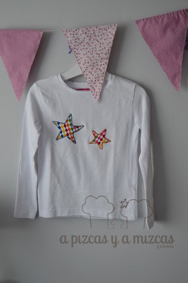

Por aquí ya estamos pensando en las fallas... y desde que Mizcas era universitaria (ya han pasado unos añitos) cogimos como tradición que en la primera mascletà de Fallas teníamos que estrenar una camiseta de Fallas... y a día de hoy se ha convertido en una tradición familiar. Desde que nació Trizcas intentamos con la ayuda de la iaia Mizcas que la camiseta de Trizcas sea la más molona.

Ya quedan muy poquitos días para que los petardos suenen a todas horas y Valencia huela a pólvora. Y el domingo pasado fue la "cridà", que para los que no seaís de aquí, os explicamos en que consiste. Es el primer acto de las Fallas en el que la fallera mayor de Valencia anuncia el inicio de las fallas. Se hace el último domingo de febrero en las Torres de Serrano. Se realizan una serie de discursos por parte de las falleras y se invita a todos los valencianos y a todo el mundo a la fiesta de las fallas:

> _"Valencians, fallers, visquen les falles i visca València" ( Valencianos, falleros, vivan las fallas y viva Valencia)_

Este año la "cridà" ha sido un poco polémica con el [discurso de la alcaldesa y su "caloret](http://www.huffingtonpost.es/2015/02/23/rita-barbera-video_n_6733402.html "Huffington Post. El Caloret de Rita Barberá")"... ji ji ji

Y ahora que sabeís un poquito más de las fallas... vamos con nuestras camisetas de fallas. Este año Trizcas no se puede quejar... va a tener donde elegir. Compramos camisetas básicas y hemos hecho unas aplicaciones tipo patchwork que han quedado chulísimas. En una de las camisetas hemos hecho la cara de un fallerito con su pañuelo en la cabeza que irá a juego con el blusón fallero.

Las otras camisetas en una hemos cosido una manzanita y en la otra unas estrellas a todo color.

Ya sabéis si os gustan y queréis tener una camiseta de fallas podeís poneros en contacto con nosotros a través de nuestro [formulario de contacto](/contacto/ "Contacto A Pizcas y a Mizcas")

