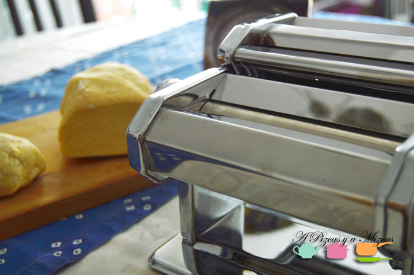
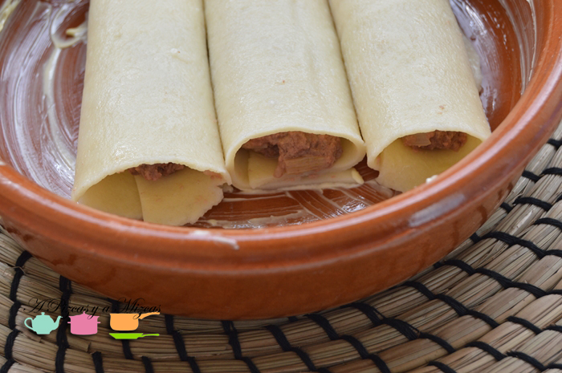
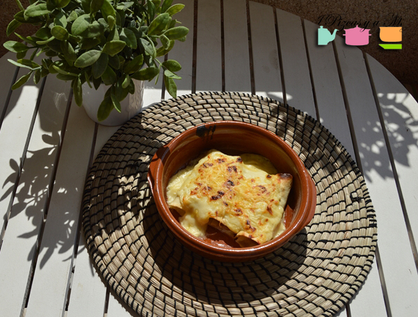
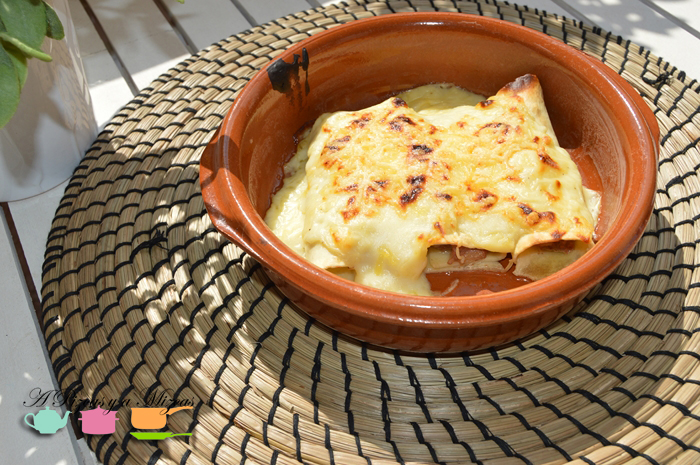
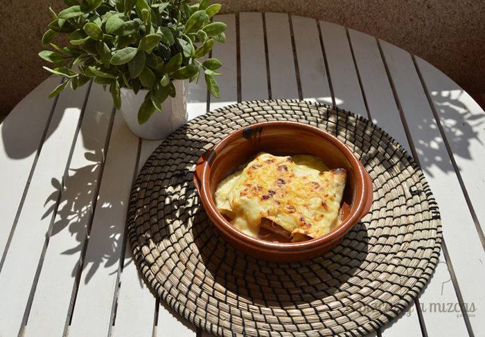

Hacer pasta fresca casera era una de nuestras asignaturas pendientes. Teníamos desde hace tiempo la máquina para hacer la pasta al huevo, pero por hache o por be nunca encontrábamos el tiempo necesario para ponernos manos a obra. El otro día nos animamos a preparar nuestra pasta fresca casera y con ella preparamos unos ricos canelones rellenos de ternera y foie gras. Nos encantó hacer pasta y nos dimos cuenta de que es más rápido y cómodo de lo que parece. Además, no se ensucia tanto como creíamos.

## Ingredientes canelones de pasta fresca casera (cinco raciones)

- Para la pasta fresca (un huevo fresco por cada 100 gramos de harina de trigo, en este caso nosotros utilizamos 500 gramos de harina y cinco huevos, pues queríamos que nos sobrara pasta para otra receta).
- 500 gramos de carne picada de ternera.
- 2 latas de paté/foie gras.
- 1 cebolla tierna.
- Sal.
- Pimienta.
- Aceite de oliva virgen extra.
- Medio vaso de cognac
- Salsa bechamel.
- Queso rallado.

Lo primero y más novedoso para nosotros fue hacer la pasta fresca casera. Para ello, en un bol amplio ponemos la harina y hacemos un hueco en el centro, donde colocaremos los huevos (mejor si están a temperatura ambiente). Con un tenedor mezclamos estos dos ingredientes, y luego seguimos amasando con las manos, hasta que quede una masa homogénea y con consistencia elástica, pero que no se pegue nada en absoluto a las manos.

Cortamos una porción (el resto lo dejamos cubierto por un paño para que no se seque) y la metemos por la máquina de pasta en su máxima apertura. La pasamos varias veces, y vamos reduciendo la apertura hasta que obtengamos la pasta con el grosor deseado. La dejamos sobre un paño y así sucesivamente. Es importante que os deis cuenta de que a la pasta fresca casera no se le pone ni una pizca de sal. La dejamos reposar.

Mientras descansa la pasta fresca casera, en una sartén pochamos la cebolla tierna cortada en daditos finitos. Salpimentamos la carne y la freímos junto con la cebolla. Cuando esté casi hecha, añadimos el cognac y cocinamos durante cinco minutos para que se evapore el alcohol. Ponemos la farsa en un bol y añadimos el foie gras y dejamos que repose un poco.

Precalentamos el horno. Y preparamos una bechamel.

Como nosotros queríamos hacer canelones con la pasta fresca casera, cortamos la pasta que habíamos elaborado para obtener 15 láminas de pasta.

En abundante agua con sal hervimos durante 3 minutos la pasta, en tandas cortas para que no se rompa ni se apelmace. Vamos sacando los canelones hervidos y los rellenamos con la carne que hemos preparado.

Cuando los tenemos todos rellenos, los cubrimos con bechamel y con queso rallado. Al horno con ellos hasta que estén dorados y gratinados.

Otro día os contamos qué hicimos con el resto de la pasta fresca. Si os animáis a preparar vuestra pasta fresca casera nos encantará ver vuestros resultados, o que nos déis ideas para futuras recetas. Ahora la máquina de pasta no para!

