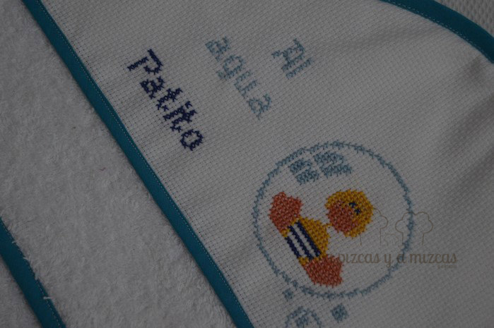
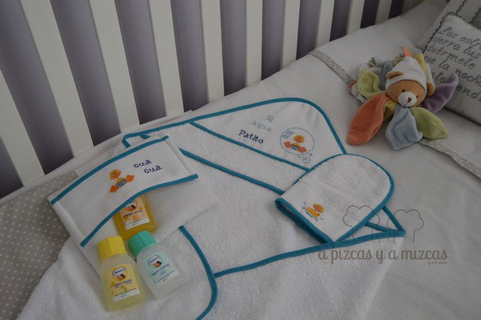

La primavera ya está aquí, el sol brilla cada día más y ya estamos pensando en el veranito, la playa y la piscina. Por eso hoy os enseñamos un conjunto para los más peques de capa de baño para bebé , neceser y manopla.Nosotros preparamos este regalito para un peque que está en camino que tenemos muchas ganas que nos tenga presentes durante su momento baño o cuando sus papás decidan venir a la "terreta" a darse sus primeros chapuzones en el mar.

Ya le he cogido gustillo a esto del punto de cruz... y la verdad es que relaja. Así que esta vez ha sido "coser y cantar"... como se suele decir.

Una vez más, elegimos rizo blanco y un ribete azul que no pareció muy veraniego y alegre. Mizcas se encargó del bordado a punto de cruz de los patitos y la frase "al agua patito".

Cortamos el rizo para hacer la capa de baño, una manopla y un necéser para llevar los productos de baño para el bebé. Encajamos todas las piezas y ahora le toca el turno a la iaia Mizcas (que es una artista) y el resultado ha sido éste...

Ahora estamos deseando ver al bebé con la capa del patito... que ganas de verle la carita.

Ya sabéis si os gustan y queréis un conjunto de baño para vuestros peques o queréis preguntarnos o contarnos cualquier cosa podeís poneros en contacto con nosotros a través de nuestro [formulario de contacto](/contacto/ "Contacto A Pizcas y a Mizcas")
