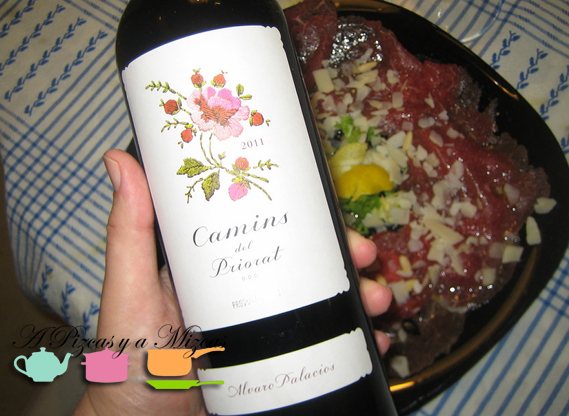
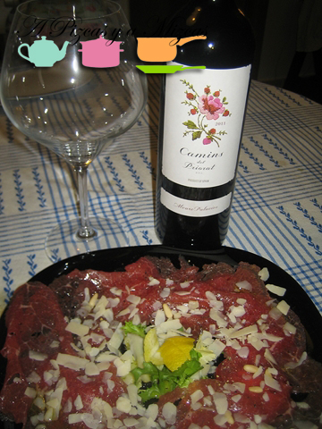

En esta entrada, los pizqueros no hemos cocinado en absoluto. Pero eso no quita que hayamos disfrutado como enanos de lo que comimos y de lo que bebimos. El carpaccio de ternera es perfecto en cualquier época del año, pero ahora que llegan los calores, disfrutar de él fresquito y en una terraza con una buena copa de vino es un placer contra el que muy pocos pueden competir.

## Ingredientes para disfrutar de un carpaccio de ternera

- Un paquete de carpaccio ya preparado. Nosotros utilizamos los de la casa [Skare](http://www.skare.com "carpaccio de ternera skare"), pero podéis utilizar cualquier otro, o animaros a cortarlo vosotros a cuchillo, como se explica más adelante.
- Queso parmesano en lascas (viene con el paquete)
- Aceite de oliva virgen extra
- Pimienta
- Zumo de limón
- Piñones
- Unos brotes tiernos de lechugas variadas

Abrimos el paquete del carpaccio de ternera. Mientras se oxigena, en un plato amplio colocamos una camita de brotes tiernos. Vamos colocando las lonchas de carpaccio de ternera sobre la ensalada. Hacemos una vinagreta con limón, vinagre y una pizquita de sal. La echamos por encima de la carne y le espolvoreamos pimienta rallada y unos piñones en crudo. Terminamos con las lascas de queso parmesano. Dejamos que maride unos 5/10 minutos en la nevera y ya tenemos el carpaccio de ternera listo para tomar.

Nosotros lo acompañamos en esta ocasión con el vino tinto Camins del Priorat 2011, (D.O.Ca. Priorat), elaborado por Álvaro Palacios. Fue perfecto.

Si queréis preparar vosotros mismos el carpaccio de ternera, aquí tenéis los pasos. Lo fundamental es utilizar un solomillo de calidad y que esté bien limpio de grasa. Ayudándoos de un papel film, envolved la carne y enroscando bien los extremos lo dejamos bien prieto. Lo congelamos durante 45 minutos. Con un cuchillo bien afilado cortamos los filetes lo más finos que podemos. Luego golpeamos con el cuchillo para aplastarlos y dejarlos todavía más finos. Luego podéis proceder al igual que hemos hecho nosotros

