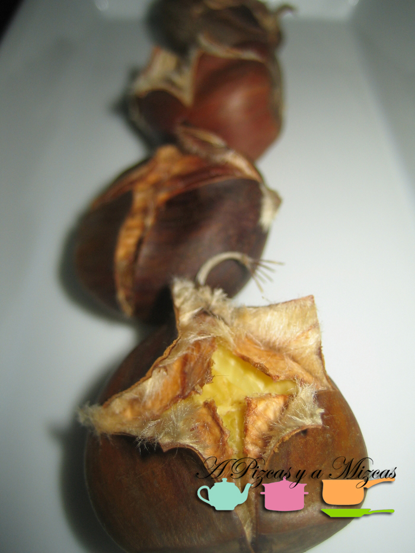
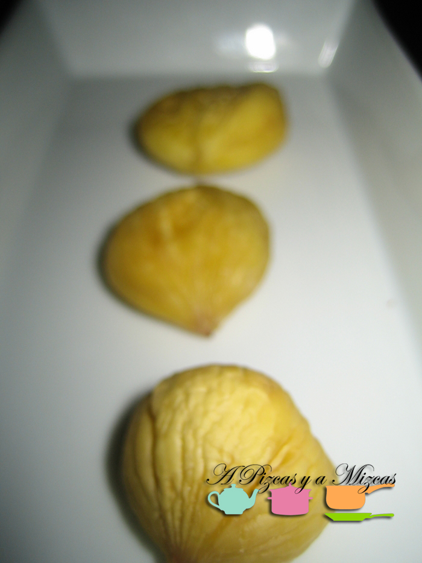

Parece que este año 2013 el otoño meteorológico se resiste a llegar, al menos por tierras valencianas. Uno de los alimentos que más asociamos a esta estación es la castaña. ¡Qué agradable es pasear con un cucurucho de castañas asadas por la calle, bien abrigaditos del frío! Hoy os traemos una forma muy rápida de tomar castañas asadas en microondas, pues hoy en día para hacerlas en casa es casi la única manera, ya que cada vez menos gente tiene fuego de llama en casa o una barbacoa donde hacerlas al carbón.Veréis como las hacéis más de una vez. Las castañas asadas en microondas son perfectas para tomar tal cual, pero también tienen muchas posibilidades como parte de otros platos.

## Ingredientes para las castañas asadas en microondas

- Castañas
- Sal al gusto

Tomamos las futuras castañas asadas en microondas y las limpiamos bien. Con un cuchillo (mejor si es de sierra), hacemos un corte en forma de cruz por la parte más plana de la castaña. Es importante que os aseguréis de que el corte que realicéis traspase primero la corteza marrón de la castaña y luego la piel con pelusilla del interior. Es fundamental para que podamos pelar con facilidad las castañas asadas en microondas.

En un recipiente adecuado, colocamos las castañas (no hagáis tandas muy largas, con unas 10 castañas por golpe va bien) con el corte que hemos hecho hacia arriba. Cocinamos a máxima potencia durante 3,5 minutos. Veréis como la castaña se ha compactado por el calor y que los cortes se han abierto. Ahora, con cuidado, porque quemarán, vamos pelando las castañas asadas en microondas. Hay que tomarlas calentitas. A nosotros nos gustan con un poco de sal e incluso unas gotitas de aceite de oliva virgen extra.

¿Quién quiere un cucurucho de castañitas?
