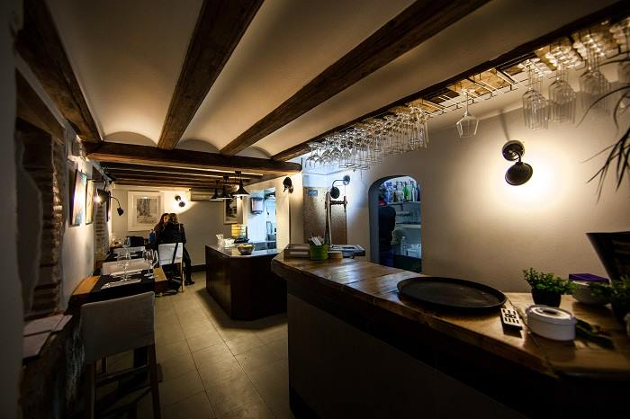
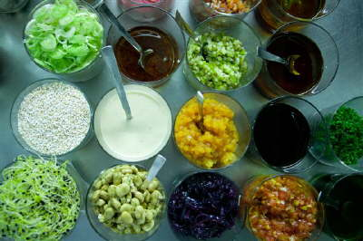
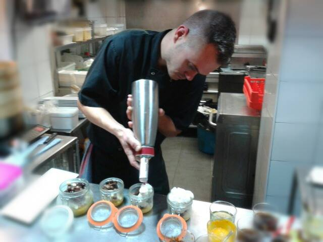
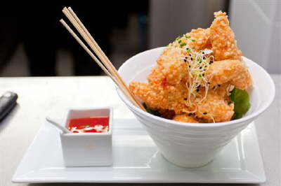
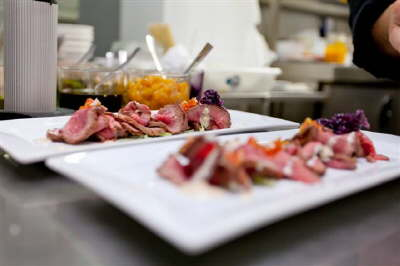
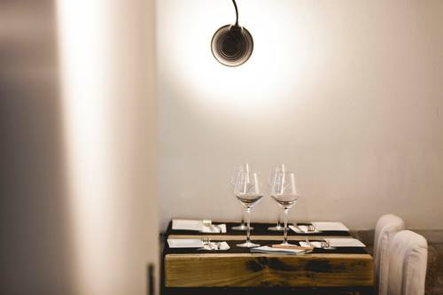
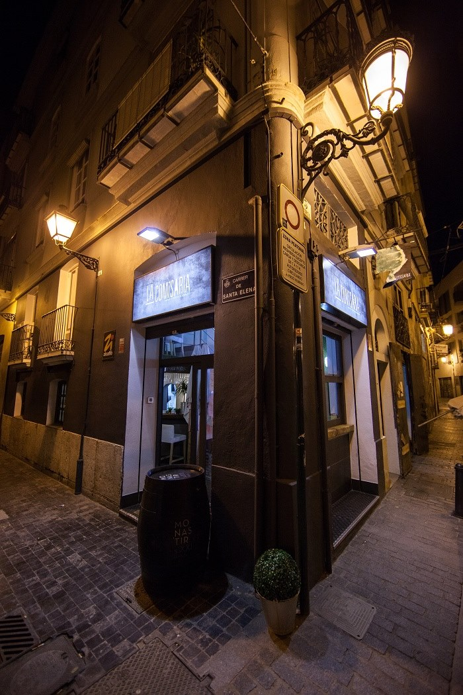

Aprovechando la visita de unos amigos nos fuimos Pizcas, Mizcas y Trizcas de cena. Tras realizar algunas consultas nos recomendaron que fueramos a [La Comisaría](http://www.restaurantelacomisaria.com/index.html). Así que en esta entrada os contamos nuestra cena en La Comisaría, está situado en el barrio del Carmen, en la Plaza del Arbol - 5 (por la calle Baja) .

Como se definen ellos: "La filosofía de "La Comisaria: Tapas y Copas Ilegales" es la de ofreceos un espacio con terraza, donde la gastronomía se encuentra en equilibrio entre las preferencias del cliente y las propias sugerencias del chef. Para finalizar, hemos desarrollado una extensa carta de espirituosos y cocktails que son el punto final a una agradable comida o cena o, simplemente, la excusa perfecta para pasar un rato en la Comisaría."

## Nuestra cena en la Comisaría

Al realizar la reserva avisamos que iríamos con Trizcas (por el espacio para el carro). Al llegar nos acomodaron a nosotros y al carro. A pesar de que los locales del Carmen son pequeños y no es normal acudir con peques nos acomodaron bien... Trizcas tenía su espacio para jugar... aunque ella prefirió estar de aquí para allí... je je je

En el local hay varias pantallas y puedes ver en todo momentos como preparan los platos, justo antes de que salgan a las mesas.

El servicio es bastante eficiente y amable. A nosotros nos aconsejó muy bien y, finalmente, nos decantamos por los siguientes platos:

- Empanadilla de arroz crujiente , rellena de queso manchego, espinacas y maíz dulce.
- Chupa chup de langostino

- Sau mai "La Comisaría", rellenos de gambas y hortalizas
- Calamar gigante (fuera de carta)
- Pollo blanco al estilo Tandoori adobo de especies, ajo y curry, calabaza y zanahoria, tzaziki ahumado y chutney fresco de mango
- Crispí de Ternera Thai, tiras de ternera maceradas en aroma thai, rebozados en panko y servidos con emulsión de trufa blanca
- Y de postre un brownie para compartir

Nos encantó esa fusión de técnicas orientales, con productos más conocidos o reconocibles para el paladar occidental y salimos muy satisfechos. Sin duda, volveremos, pues nos quedan bastantes cosas por probar en una nueva cena en la Comisaría.

\* Todas las imágenes son de la página de [Facebook](https://www.facebook.com/lacomisariarestaurante?fref=ts "Facebook La Comisaría") de La Comisaría y de su [página web](http://lacomisaria.com/ "La Comisaría")
