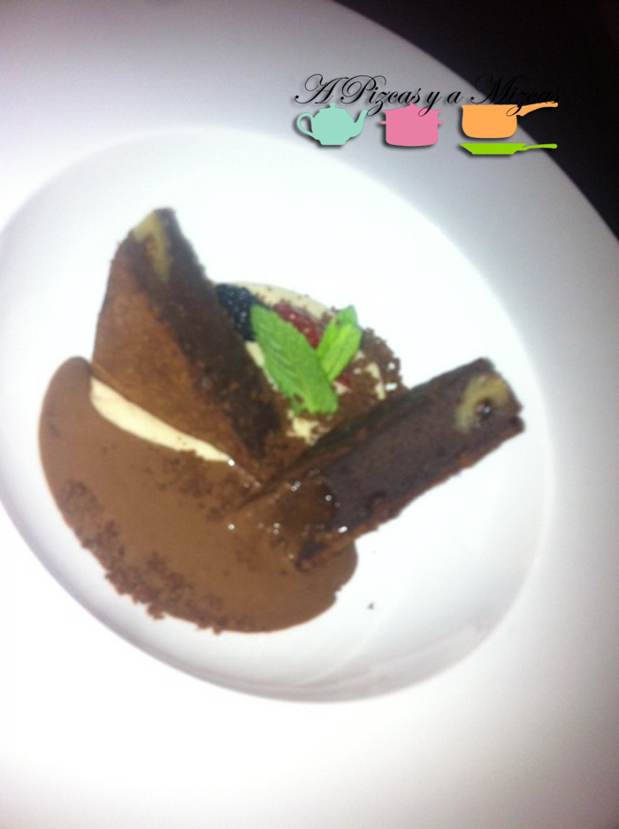

Aprovechando el ambiente fallero pero antes de que lleguen las aglomeraciones decidimos saldar una "cuenta pendiente" y reservamos para cenar en uno de los locales de moda en Valencia. Os contamos nuestra cena en [Lotelito](http://www.lotelitovalencia.com/). Está situado en pleno centro de Valencia, en la calle Barcas junto al Teatro Principal. Su nombre responde a su función, porque además de ser restaurante y lugar de copas cuenta con habitaciones y apartementos turísticos.

Ellos definen su cocicna como: "Perfecta fusión entre tradición mediterránea y nuevas tendencias culinarias".

## Nuestra cena en Lotelito

Nos reunimos cuatros personas y decidimos cenar de picoteo. Pedimos lo siguiente:

Patatas bravas con all i oli y salsa especial

Crujiente de pato y foie con manzana asada

Croquetas caseras de jamón y pollo rústico con romesco

Sandwich roll caliente de rabo de toro guisado al vino tinto

Coca de queso de cabra gratinado, avellanas, cebolla roja y tomate dulce

Postre:

Brownie con pistacho, ganache de chocolate y cremoso de gianduja

Tarta de queso con frutos rojos estofados y crumble de almendra

Al llamar para hacer la reserva al Lotelito como uno de nosotros salía tarde de trabajar nos indicaron que sólo habían dos turnos de cena, uno a a las 21:00 y el otro a las 23:00.  Nos tocó cenar en el segundo turno, no tuvimos que esperar nada en cuanto llegamos nos acomodaron en nuestra mesa que estaba preparada. Una vez nos tomaron nota de la comanda nos servieron los platos muy rápido y todos a la vez, lo que nos agobió un poco. Tal vez sea un precio que hay que pagar por cenar en Lotelito, un local que es restaurante y que a partir de las 00:00 se convierte en un pub.

Las patatas bravas de Lotelito fueron de lo mejor de la cena inspiradas en las que popularizó Sergi Arola. El crujiente de pato estaba presentado en una cesta de bambú asiática y estaba correcto el foie era escaso. En cuanto a las croquetas sirvieron tres unidades de cada, cuando éramos cuatro en la mesa. No dijimos nada y las repartimos como buenos hermanos... je je

La gran decepción fue el sandwich roll caliente, nos esperábamos una "explosión" de sabor.

Dejamos sitio para el postre... que también lo compartimos. Todos coincidimos en que nos gustaba más el brownie de Lotelitlo que la tarta de queso (tal vez dominaban demasiado los frutos rojos)

En total contando una bebida por persona la cuenta subió a 59 € por lo que la relación calidad precio es bastante buena, teniendo en cuenta su ubicación y que ofrece platos que intenta alejarse de lo convencional.

Volveremos a Lotelito!
