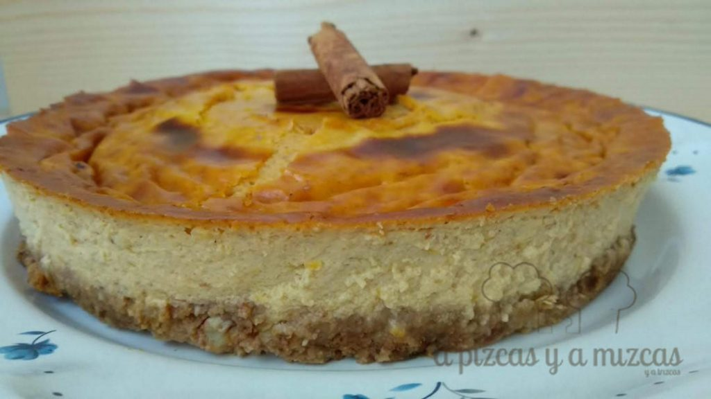
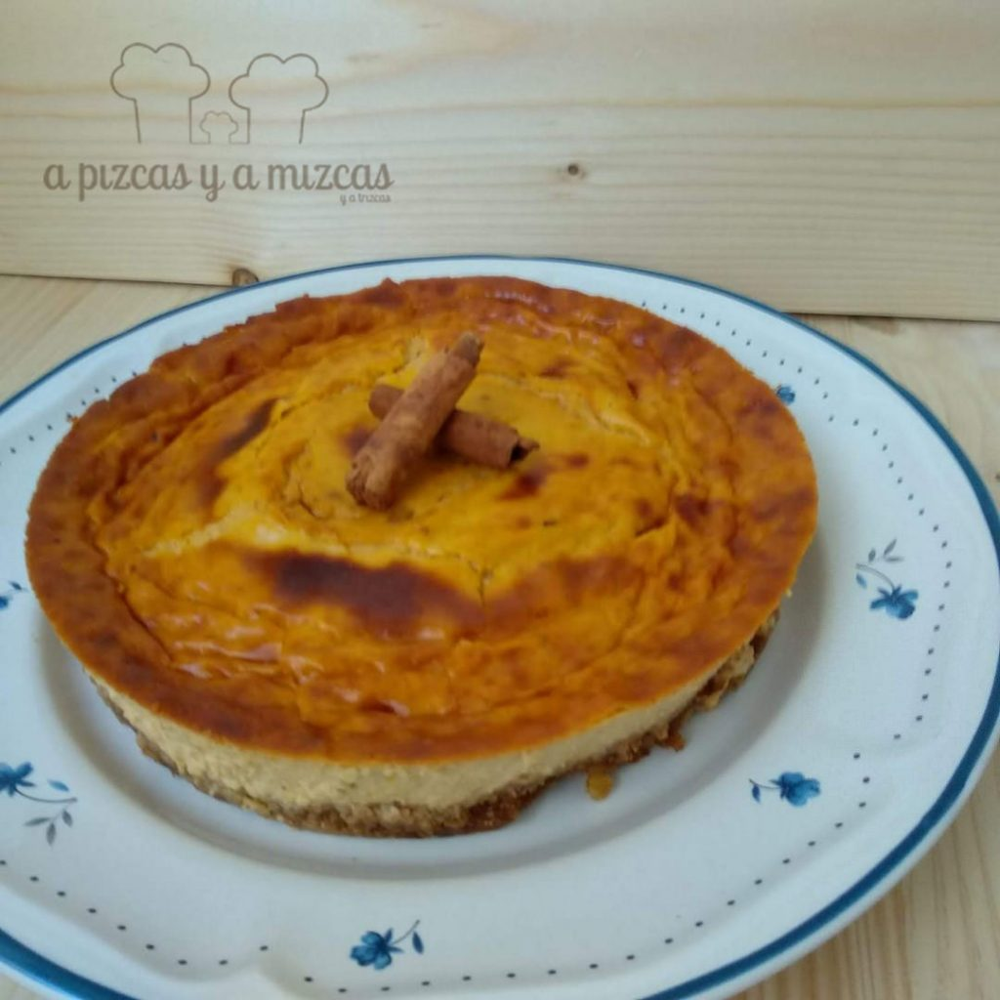
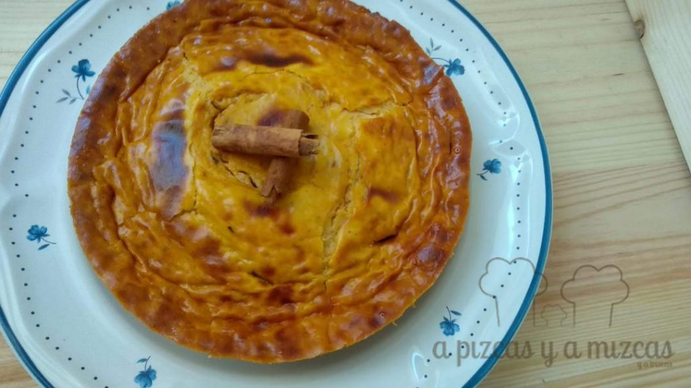

La primera receta de A Pizcas y a Mizcas del 2019!! Queríamos que la primera entrada fuera especial y algo que nos gustara a toda la familia Pizcas. Después de darle algunas vueltas nos decidimos por la CALABAZA. Ya sabéis que nos encanta. Recibimos en casa a unos buenos amigos y les preparamos de postre este delicioso cheesecake de calabaza. No te vayas y te enseñamos como lo hicimos...

En otras ocasiones hemos preparado tartas de queso (cheesecake) distintos, pero con la calabaza no nos habíamos atrevido y la mezcla del queso con la calabaza nos ha parecido una combinación ganadora. Os dejo por aquí los enlaces de los cheesecake que hemos preparado en A Pizcas y a Mizcas:

[Tarritos de cheesecake clásico](/tarritos-de-cheesecake-clasico-tarta-de-queso/)

[Tarta de queso con galletas](/tarta-de-queso-con-galletas/)

[Tarta de requesón](/tarta-de-requeson/)

Y también en salado: [tarta de salmón y requesón](/tarta-salada-salmon-requeson/), [cheesecake salado](/cheesecake-salado/)

## Ingredientes para preparar el cheesecake de calabaza

**Para preparar la base del cheesecake**

- 100 gramos de galletas (mejor sin azúcar)
- 50 gramos de mantequilla
- 1 puñado de nueces peladas

**Para preparar el relleno:**

- 250 gramos de queso mascarpone
- 250 gramos de calabaza asada
- 100 ml de leche
- 100 gramos de azúcar
- 8 gramos de azúcar avainillado
- 3 huevos
- media cucharadita de canela en polvo

En primer lugar asaremos la calabaza (nosotros ya la teníamos asada del día anterior). Podeís consultar [aquí](/calabaza-asada/) como asarla.

Precalentamos el horno a 180ºC. Mientras preparamos la base del cheesecake de calabaza. Ponemos las galletas y las nueces en el vaso de la picadora. Trituramos hasta que se quede textura arena, y añadimos la mantequilla, que habremos fundido en el microondas unos segundos. Mezclamos hasta que se quede textura arena mojada, lo ponemos en un molde desmontable de 18 cm de diámetro. Extendemos las galletas haciendo presión con una cuchara para que se quede adherido al molde. Lo ponemos en la nevera mientras preparamos el relleno.

Para preparar el relleno empezaremos triturando la calabaza (que la tendremos templada o a temperatura ambiente). Con la ayuda de un tenedor iremos chafando la calabaza hasta que se quede como un puré.

A continuación, ponemos el mascarpone (a temperatura ambiente) en un bol amplio. Agregamos la canela, el azúcar avainillado y los 100 gramos de azúcar, mezclamos con una cuchara con movimientos envolventes para que se mezcle todo. Añadimos la leche poco a poco  y seguimos removiendo hasta que se nos quede una crema lisa. Agregamos los tres huevos a la vez y batimos pra que se integren por completo.

Por último, vertemos el puré de calabaza asada y removemos hasta que quede todo homogéneo. Ponemos el relleno en la base de galletas que teníamos en la nevera. Lo ponemos en el horno 10 minutos.

Transcurrido ese tiempo, bajamos la temperatura del horno a 150ºC, y lo dejaremos otros 60 minutos más. Despues apagaremos el horno y dejaremos que se enfríe dentro.

Pondremos el cheesecake de calabaza en la nevera unas horas (aunque como mejor está es de un día para otro).

¿Qué os ha parecido la primera receta del año?

