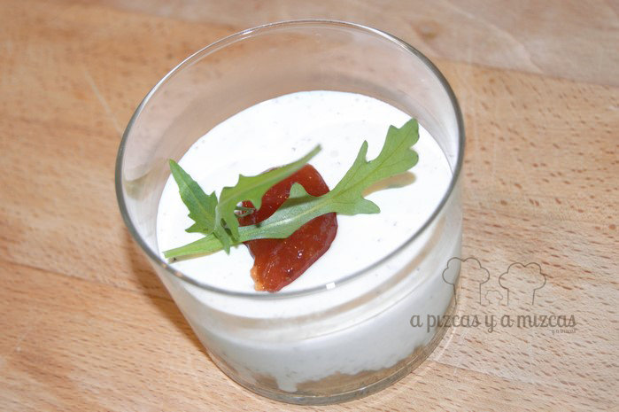
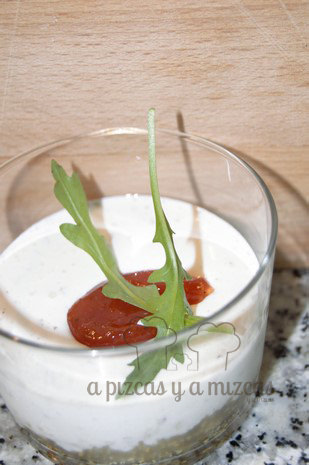
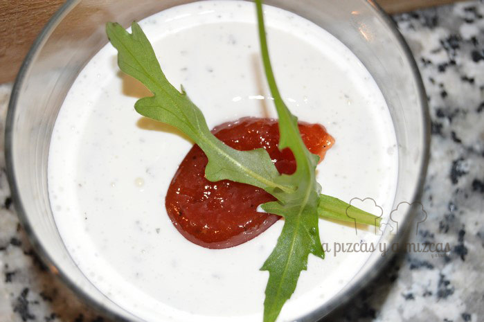

El otro día nos apetecía jugar un poco en la cocina. Así, jugando, jugando, se nos ocurrió darle una vuelta al tradicional cheesecake o tarta de queso que solemos hacer a base de queso crema y elaborar un cheesecake salado. Lo presentamos en unos vasitos de ración, como entrante en una cena con amigos. Son muy sencillos de hacer. ¿Te animas?

Tradicionalmente, el cheesecake clásico se compone de una base de galleta molida con mantequilla, sobre la que se coloca el queso crema (tipo Philadelphia) con un poco de gelatina para que coja cuerpo y se remata con mermelada de fresa o de frutos rojos o negros. Partiendo de esa premisa, buscamos los paralelismos para nuestro cheesecake salado.

## Ingredientes para el cheescake salado

- Una tarrina de queso crema tipo Philadelphia
- Galletas tipo crackers salado (utilizamos las de la marca TUC)
- Mermelada de tomate
- Aceite de oliva virgen extra variedad Arbequina
- Sal
- Pimienta
- Albahaca seca
- Unas hojas de rúcula para decorar

¿Ya véis por dónde vamos no? En esta ocasión, los preparamos sin gelatina, para que el queso quedara más cremoso.

En primer lugar preparamos la base del cheescake salado. Machacamos las galletas saladas. Un truco consiste en meterlas en una bolsa hermética (de las de congelación) y pasar el rodillo por encima. Ese polvillo lo introducimos en un bol y añadimos una cucharada de aceite de oliva virgen extra. Nosotros empleamos el de Arbequina porque es el que más nos gusta. Mezclamos bien la galleta molida con el aceite y si vemos que hace falta algo más de aceite se lo añadimos. Debe quedar una textura húmeda. Esta pasta la colocamos en vasitos de ración y los metemos en la nevera mientras preparamos el relleno.

> En esta preparación buscamos el paralelismo salado del clásico cheesecake

En un recipiente colocamos el queso crema, lo salpimentamos, añadimos un poco de albahaca y con un tenedor lo batimos hasta que quede súper cremoso. Probamos y rectificamos si es necesario. Colocamos el relleno del cheesecake salado en los vasitos y los coronamos con una cucharadita de mermelada de tomate.

Cómo nos gusta el queso! ñam

Perfecto para compartir en una cena entre amigos

 

Luego, a la hora de servirlo (mejor si reposa un par de horas en el frigo) sólo tenéis que decorar cada cheesecake salado con unas hojas de rúcula.

También somos de salado... ji ji ji

¿Fácil, no?
