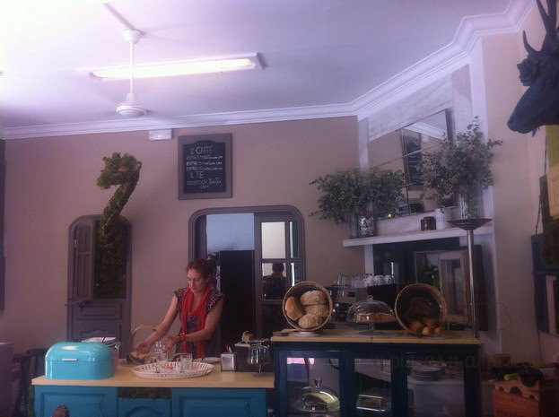
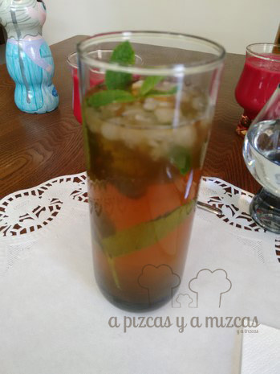

El barrio valenciano de Ruzafa es un lugar inspirador y en el que hay ocasiones en las que descubres rincones y gentes maravillosas. Os presentamos hoy un lugar que no te puedes perder en este barrio de Valencia, [Circa Almacén](https://www.facebook.com/circadulcesyhelados?fref=ts), en la calle Cuba, número 30 (teléfono 960 044 765). Si te gusta el pan artesano, la comida casera, las tartas y los helados… Circa Almacén es tu paraíso.

Es un local con alma, la que le proporcionan Rodrigo y Ana. Él argentino, ella española. Ahora mismo Circa Almacén está en plena “reinvención”. Arrancaron como panadería/repostería y ofrecían el que, posiblemente, sea el brunch más completo de toda Valencia. Seguro que en cuanto solucionen los trámites burocráticos seguro que es posible volver a disfrutar de los brunches de Circa Almacén.

A Trizcas le encantó la jirafa... ji ji ji

Y a nosotros la decoración de Circa

Para muestra, nuestro botón particular, un brunch que pudimos disfrutar a mediados de mayo y que consistió en:

\- Gazpacho de remolacha

Gazpacho de remolacha... riquísimo!

\- Panecillo artesano relleno de huevos revueltos

\- Ensalada verde con naranja, fresas, aguacate y jamón de Teruel

\- Té helado con hierbabuena

\- Leche fermentada con muesli y miel

\- Café, té o leche

\- Tarta

Todo riquísimo y por 8 euros. Además, a Trizcas le prepararon una tortilla fantástica para que pudiera compartir brunch con nosotros. También nos llevamos una tarta de plátano caramelizado, con nueces, dulce de leche y chocolate blanco que estaba para enmarcar.

La tarta estaba más que buena

Estamos ansiosos por poder volver a sentarnos en las mesas de Circa y en ese particular mundo que han creado Rodrigo y Ana, en el que animales de colores salen de las paredes, como si quisieran compartir mesa contigo. Hay mil detalles con un toque de realismo mágico realmente encantador.

Pero, como decíamos Circa Almacén se está reinventando. Por el momento despachan sus productos para llevar. No puedes dejar de probar sus panes: pan de campo con harina blanca, pan integral, panes especiales… Su repostería salada: empanadillas criollas, focaccias, quiches…

Y lo último de Circa Almacén son sus helados caseros y con combinaciones súper sugerentes.

Al margen de sus delicias, Rodrigo ofrece su sabiduría a través de varios cursos: de sushi, de pasta y cómo no, de pan.

No puedes perderte una visita a Circa Almacén. El gusto es nuestro.
