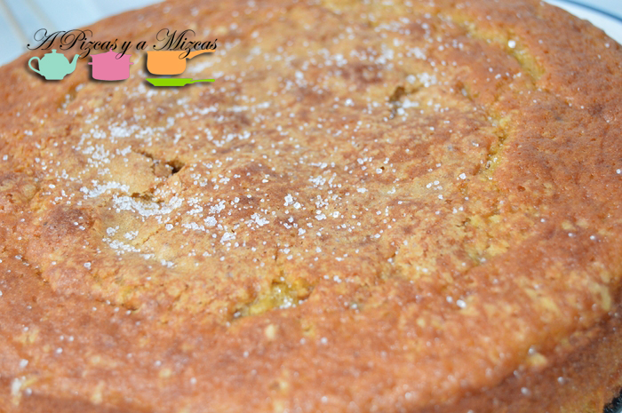
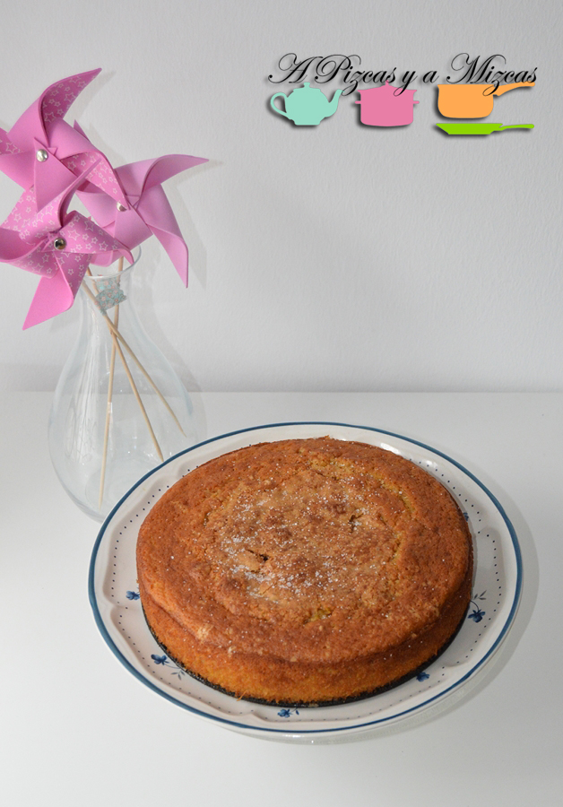
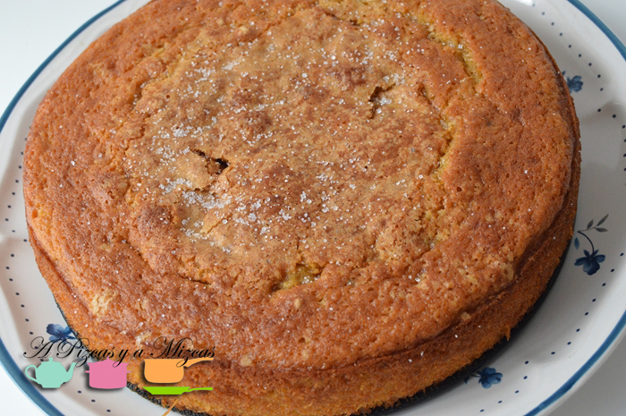

Es tiempo de calabazas... ja ja ja... eso ya lo sabeís todos! Pues aprovechando que las calabazas están ahora mismo buenísimas preparamos esta coca de calabaza.

Es muy fácil de preparar y muy parecida a la [coca de llanda](/bizcocho-de-yogur-con-limon-y-mandarina/ "Coca de llanda") (sí sí la del yogur). En esta ocasión sustituimos el yogur por la calabaza. El resultado es un bizcocho muy jugoso.

## Ingredientes para preparar la coca de calabaza

- cuatro huevos
- un vaso de calabaza asada
- un sobre levadura
- la rayadura de un limón
- 250 gr de azúcar
- 150 gr de harina
- 125 ml de aceite de girasol
- canela

Primero asaremos la calabaza. Lavamos y secamos la calabaza. A continuación cortamos la calabaza longitudinalmente. Y le quitamos todas las semillas que pueda tener. Cubrimos la bandeja del horno con papel de hornear y ponemos  nuestra calabaza y metemos en el horno, que previamente tenemos precalentado a 160º, durante aproximadamente 2 horas, dependiendo de nuestro horno y del tamaño de la calabaza.

Cuando lleve una hora de cocción aproximadamente espolvoreamos un poco de azúcar y canela por encima de la calabaza.

La calabaza estará lista cuando veamos que esta doradita, y al pincharla esté blandita.

Ahora ya podemos empezar a preparar nuestra coca de calabaza.

En un recipiente batimos los huevos, añadimos la calabaza asada, la rayadura del limón y el medio vaso de aceite y removemos. Después tamizamos la harina y la levadura y por último agregamos el azúcar y un poquito de canela. Removemos bien todos los ingredientes.

Untamos un molde con mantequilla o margarina y echamos la masa. Y al horno a una potencia de 180 º C durante 30 minutos aproximadamente (dependerá de  la potencia del horno y del tamaño de la coca de calabaza). De todas formas podeís comprobar si ya está lista cuando pinchemos con un cuchillo y éste salga seco.

Espolvorearemos un poquito de azúcar por encima y listo!

