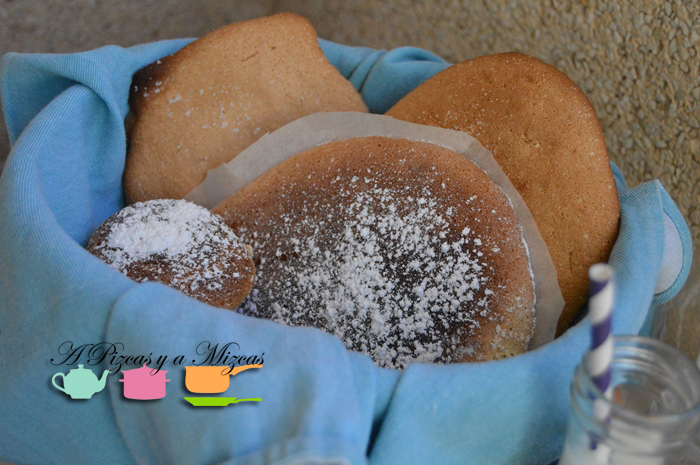
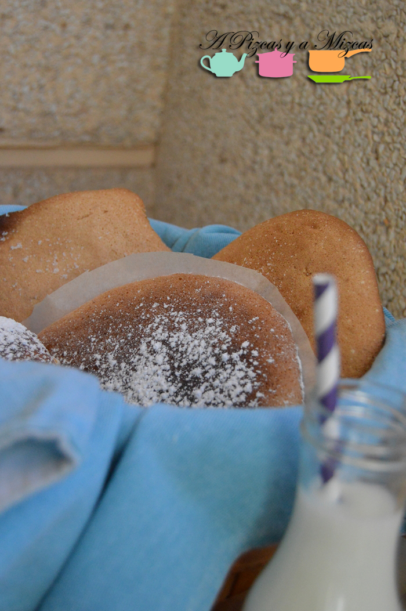
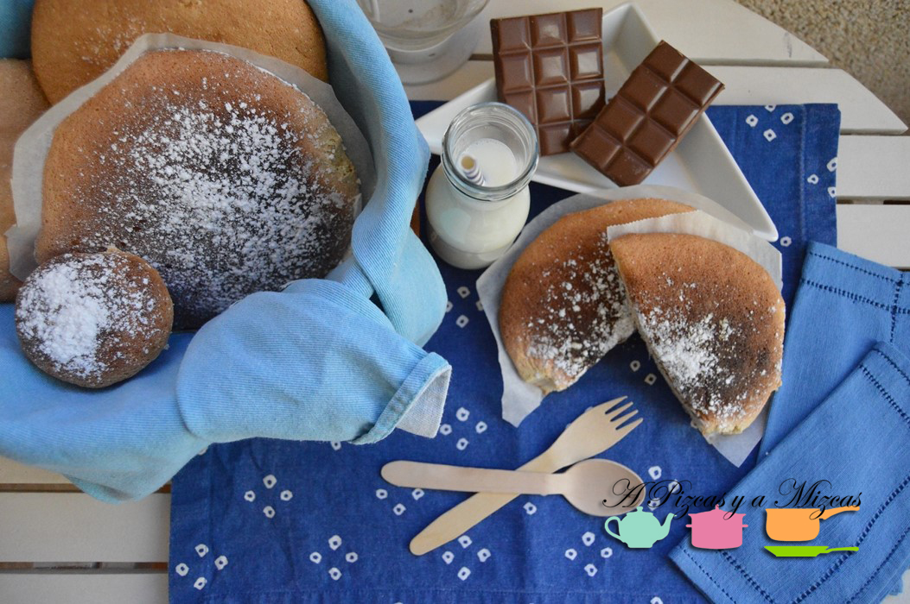
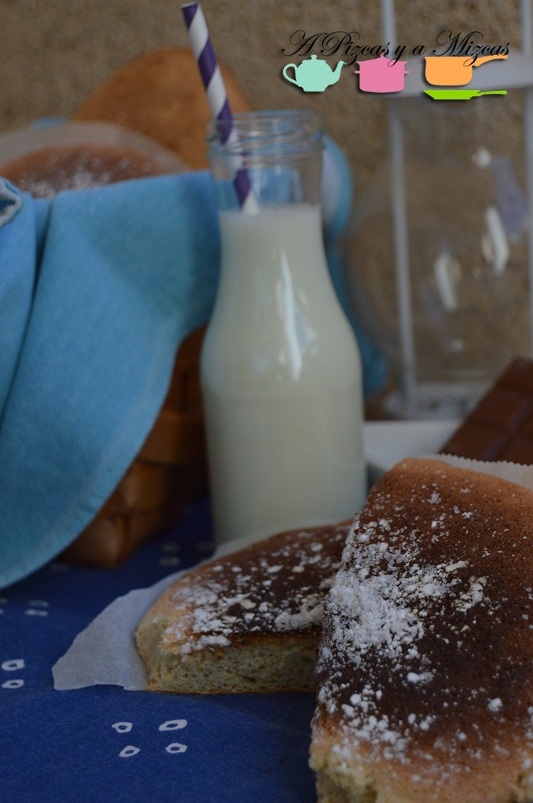

Esta receta lleva a Mizcas hasta su infancia... recuerdo cada vez que iba a ver a mis yayos tenía preparada mi bolsita con la coca de mostatxó. Cada domingo que iba a visitar a mi yayos a Alginet, mi yaya me compraba tres o cuatro cocas de mostatxó para que tuviera para toda la semana. Luego continuó con la tradición mi tía...y ahora que hemos conseguido la receta seguro que se la prepararemos a Trizcas.... Me encantaba poder llevármelas de almuerzo para el cole o desayunar con el cola-cao.... que recuerdos!

Cuando ya crecí un poco más... la coca de mostatxó pasó a ser otro dulce más en los días de Pascua... Así que este año nosotros queremos recordar un poquito los sabores de la infancia de Mizcas preparando la auténtica coca de mostatxó.

Buscando un poquito por la red nos hemos encontrado con esta descripción de la palabrá mostatxó que no has encantado... porque explica perfectamente lo que nos recuerda la coca de mostatxó.

Mostatxó:Peça de pasta dolça, de forma circular, composta de farina, oli, sucre i ou, i cuita al forn. L'àvia sempre ens feia mostatxons per berenar i esmorzar. Quan tornava de l'escola i pujava a al pis, ja sentia la olor i corrents entrava a la cuina, on els mostatxons estàven ja a punt per menjar. Una presa de xocolata, un parell de mostatxons.Uns moments del dia que molt sovint em vénen a la memòria. ([Diccionari afectiu de la llengua catalana](http://diccionariafectiu.blogspot.com.es/2008/12/mostatx.html "Mostatxó"))

Por otra parte, tenemos que deciros que es uno los dulces típicos de [Alginet](http://www.alginet.es/guia "Gastronomía Alginet") y que forman parte de su gastronomía: "Per Sant Josep es fa coca de mostatxó i els tradicionals [bunyols de carabassa](/bunuelos-de-calabaza/ "Buñuelos de calabaza")"

La receta la hemos sacado de una recopilación que ha hecho Mª Carmen García (una vecina de Alginet) de las recetas de cocina casera que hacía su madre (Receptes de cuina casolana valenciana. Carmen la Beniopa. Alginet)

Ahora que ya os hemos situado un poco... vamos con los ingredientes

## Ingredientes para preparar la coca de mostatxo

- seis huevos
- 250 gramos de harina
- medio cáscara de limón rayado
- 300 gramos de azúcar
- medio sobre de levadura
- un poquito de canela en polvo

Manos a la masa. Separamos las claras de las llemas. En un bol ponemos las claras y las montaremos a punto de nieve. Sin parar la batidora, añadiremos el azúcar. Ahora con las manos mezclaremos las llemas de los huevos, el limón, la canela y por último la harina y la levadura (la harina la tamizados antes, la pasamos por un colador para evitar posteriormente los grumos). Movemos poco a poco para evitar que el merengu se desinfle.

Con la ayuda de una cuchara de servir vamos poniendo montoncitos sobre papel de horno. Introducimos al horno a 200º. El tiempo de cocción será de 15 -20 minutos controlando que no se queme. Cuando las sacemos del horno espolvoreamos un poquito de azúcar por encima y listo.

