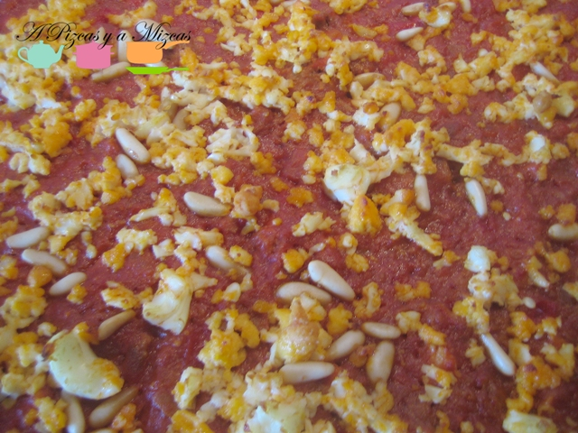

Nuestra amiga **Eva** nos dio las pistas para hacer una coca de tomate de forma muy rápida y quedar de maravilla a la hora de ir de "gorroncillos" a casas ajenas. Nos liamos la manta a la cabeza y seguimos sus consejos. La clave son los nuevos botes de relleno para empanadilla de Hacendado. El resultado es una coca de tomate que, la verdad, está muy buena. Nosotros la hicimos "descubierta", pero con más mezcla y otra lámina de pasta brisa puede quedar como una empanada perfecta. Los rellenos pueden variar... ya los iremos probando y os los contamos.

_Ingredientes:_

- 1 lámina de masa brisa
- 2 botes de relleno para empanadas y empanadillas de Hacendado
- 1 lata de atún
- 1 huevo duro
- Piñones

Se extiende la lámina de masa brisa y con un tenedor se agujerea la masa y lo ponemos sobre la placa del horno. Doblamos un poco los bordes para que el relleno no se desborde.

Echamos el contenido de los dos botes de relleno para empanadas, la lata de atún, rallamos el huevo duro y añadimos los piñones. Introducimos al horno, previamente precalentado a 180º, durante unos 30 minutos.

En menos de 40 minutos, tenéis una empanada con la que picotear o incluso cenar algún día. El sabor es muy bueno y las latas de Hacendado cumplen bien con su papel, aunque es recomendable aportar algo más de atún para que no queden tan pobres. En el envase pone que se pueden emplear también para canelones... Habrá que probarlo!!
