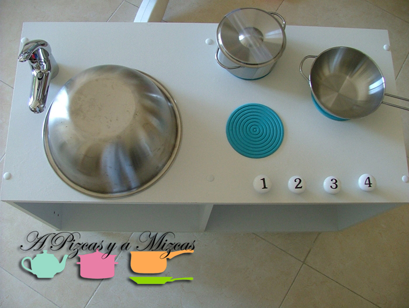
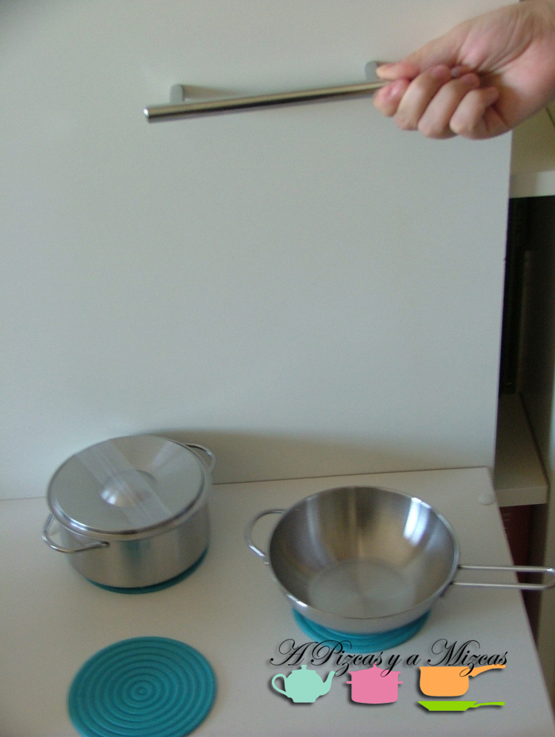
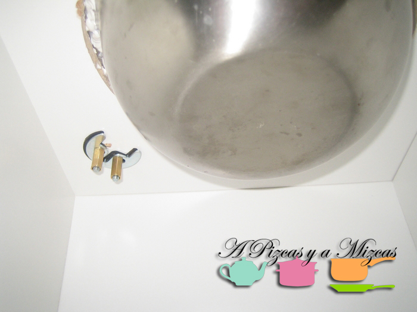
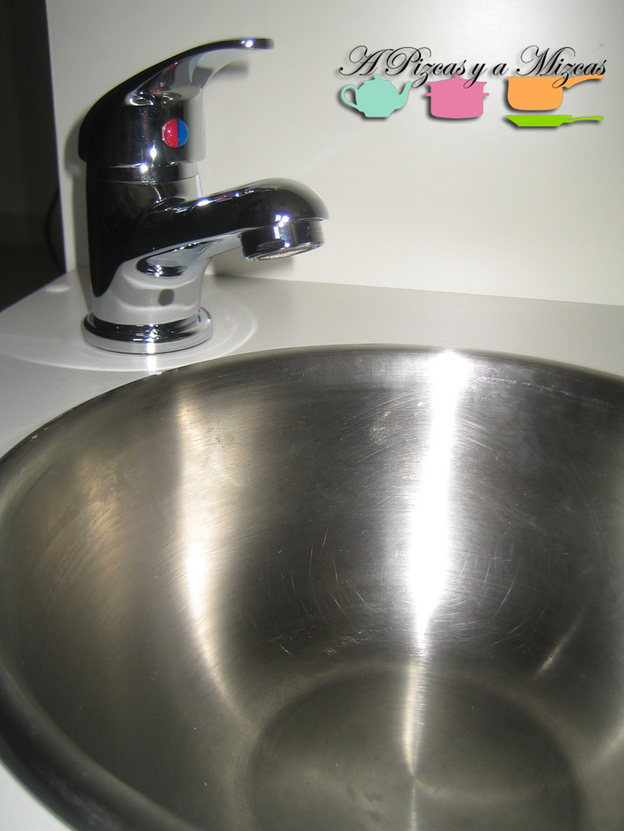
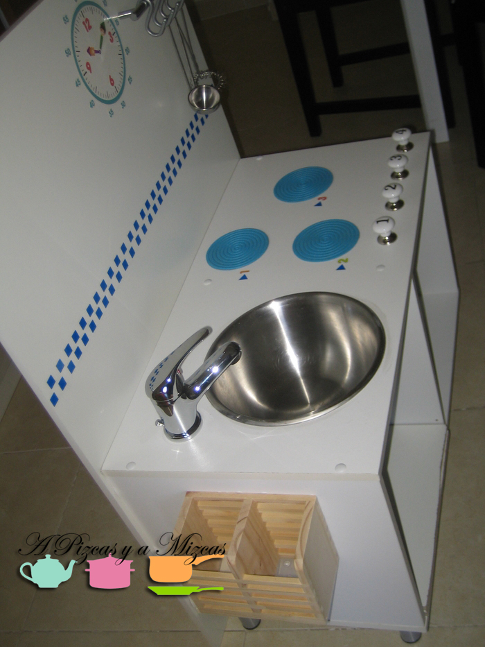
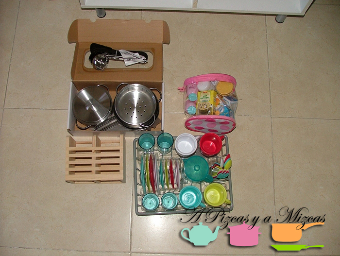
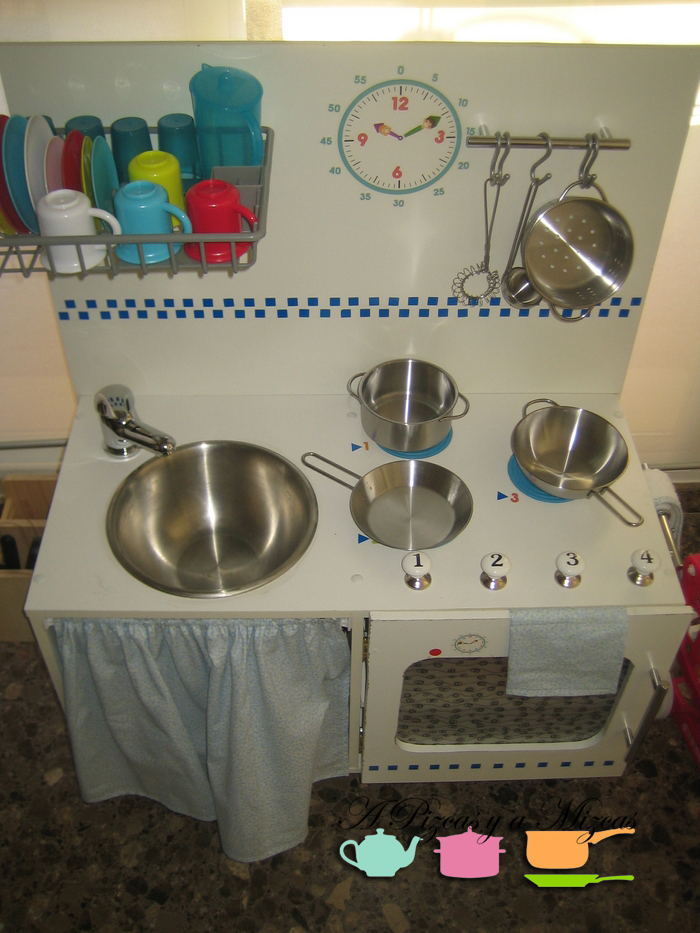
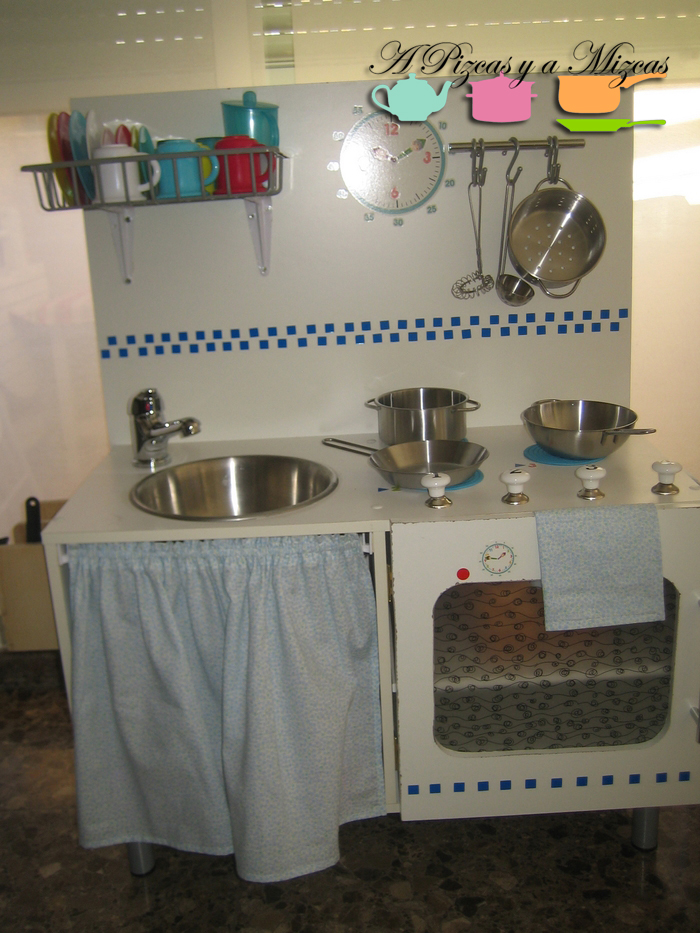

Ahora que ya han pasado los Reyes el regalo que más ilusión le ha hecho a Trizcas ha sido su cocinita infantil handmade. Este año contrataron a los duendes Pizcas y Mizcas para realizar la cocinita a medida de la peque Trizcas.

En este post os desvelamos como hacer (diy) una fantástica cocinita infantil. Os esperamos vuestras fotos por si os animáis como regalo de cumple o para los Reyes del próximo año.

## Materiales necesarios para realizar la cocinita infantil handmade:

- estantería de dos módulos (el nuestro es de Leroy Merlín)
- 4 patas
- madera para la trasera y para la "puerta del horno"
- 3 posavasos (los nuestros son del ikea) pero podéis utilizar fieltro, goma EVA...
- 4 pomos
- 3 tiradores
- un bol o ensaladera metálica
- un grifo pequeño
- un escurre cubiertos de madera
- pegatinas de reloj (nosotros utilizamos de Apli que son para aprender las horas)
- pegatinas para la cenefa
- dos escuadras para el escurreplatos
- un mantel individual de plástico transparente (para la puerta del horno)
- dos bisagras
- 6 ganchos de cocina en forma de ese

Como complementos hemos utilizado:

- Una cortinita de tela estampada en florecitas
- un mini delantal
- una agarradera
- dos trapos
- escurreplatos con vajilla infantil (lo compramos en Alcampo)
- set de cacerolas y sartenes (Ikea)
- set de cucharones metálicos (Ikea)
- set utensilios de teflón

Para montar nuestra cocinita infantil reutilizamos una estantería modular (de dos módulos) que antes teníamos como mesita y que teníamos ya con cuatro patas cortitas. Para ello, cortamos un tablero del mismo ancho y de la altura que consideramos (hasta el suelo). Con este madero tendremos el frontal de la cocina. Lo cortamos a las medidas que necesitemos y canteamos tres lados (dejamos sin cantear el que irá en el suelo).

Vamos a instalar el fregadero/ensaladera. Medimos el diámetro de la ensaladera y a esa medida le restamos un centímetro. Trasladamos esa nueva medida con un compás al lugar en el que vaya el fregadero (tened en cuenta que debéis dejar espacio para el grifo). Con un taladro hacemos un agujero lo bastante grande como para que entre la sierra de calar y ale, a cortar, con cuidado. Adherimos la ensaladera con pegamento de montaje.

Para el grifo de nuestra cocinita infantil empleamos un grifo de bidé. Solo hay que hacer dos agujeros con el taladro, pasar los tornillos y enroscar el grifo y los topes.

Una cocina, aunque sea una cocinita infantil, necesita de sus fogones y su horno. Para los primeros utilizamos unos posavasos que teníamos ya desparejados, de goma, pero podéis emplear también fieltro, goma EVA o incluso pintarlos directamente. Los pegamos con adhesivo de montaje.

En la parte de los "fuegos" colocamos cuatro pomos que vimos en Tiger, nos gustaron porque iban numerados. Así, asignamos del 1 al 3 para los fuegos y dejamos el 4 como "mando" de l horno. Luego con pegatinas identificamos tanto los fogones como el horno. Para la puerta del horno es necesario cortar un tablero a la medida necesaria. Como queríamos que tuviera aspecto de horno real le hicimos un vano que cubrimos con un mantel individual de plástico semitransparente. Con un tirador metálico le hicimos la puerta. Colocamos dos bisagras y la instalamos.

Adherimos el escurrecubiertos de madera a un lateral y colocamos otro tirador en el otro lado. El tercer tirador lo colocamos en el tablero grande que hará de frontal. Unimos el módulo con el tablero con tirafondos y pegamento de montaje. Ahora decoramos nuestra cocinita infantil con las pegatinas del reloj y hacemos la cenefa.

Solo nos queda colocar las escuadras sobre las que irá el escurreplatos y ya podemos colocar toda la cacharrería. La abuela Mizcas se encargó de todos los complementos de tela ( los trapos, agarradera para el horno y el delantal que no podía faltar)

Nosotros estamos enamorados de nuestra cocinita infantil y da gusto ver a Trizcas manejarse en ella. Esperamos que os sirva de inspiración.

